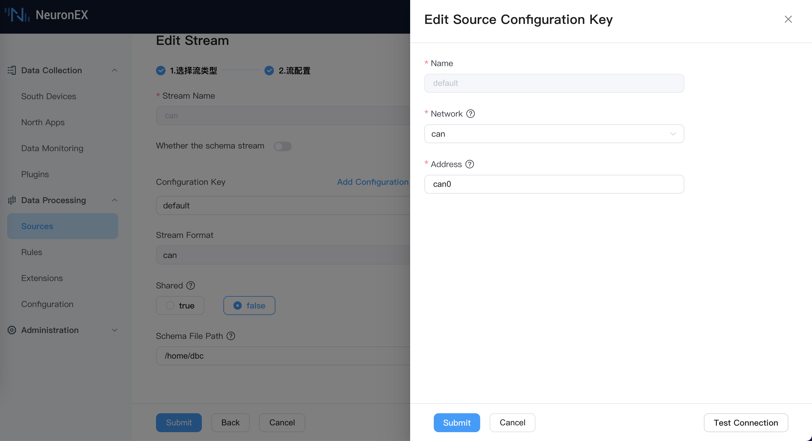

# CAN

Stream Scan Table

The NeuronEX data processing module can receive data from the CAN bus and parse the raw data into structured data. The CAN type can be used as the data source of streams and scan tables.

## Create stream

Log in to NeuronEX and click **Data Processing** -> **Sources**. On the **Stream** tab, click **Create Stream**.

On the **Create Stream** page that pops up, enter the following configuration:

- **Stream Name**: Enter the stream name
- **Whether the schema stream**: Check to confirm whether it is a structured stream. If it is a structured stream, you need to add further stream fields. It can be unchecked by default.
- **Configuration key**: You can use the default configuration key. If you want to customize the configuration key, you can click the Add Configuration key button and make the following settings in the pop-up dialog box.
    - **Name**: Required, enter the name of configuration key.
    - **Network**: Required, the network type of the CAN bus. CAN is selected by default.
    - **Address**: Required, the physical interface address of the CAN bus.
- **Stream Format**: Only the CAN format can be selected and cannot be modified.
- **Shared**: Check to confirm whether to share the source.
- **Schema File Path**: The path where the dbc file is located. The dbc file is a file that describes the data structure of the CAN bus.

Taking the following figure as an example, NeuronEX receives data through the network card can0 and parses the CAN data into structured json data based on the .dbc file in the `/home/dbc` directory.

