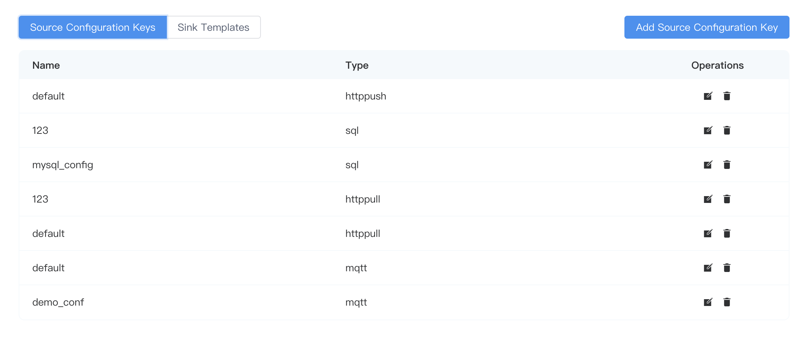
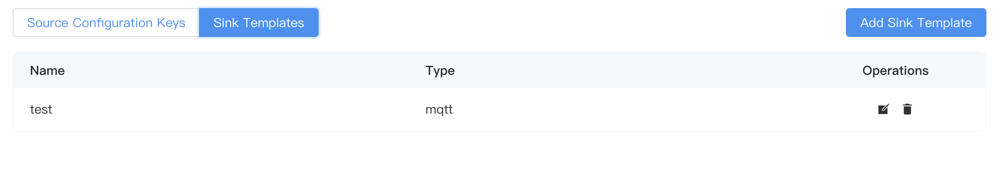

# Configuration

This page describes how to do resources and mode configuration.

## resource

Resources include two parts: `source configuration keys` and `Sink Templates`.

### Source configuration keys

Each source will have its own configuration file, and users can configure it accordingly when creating streams/tables. You can view the added configuration, edit related operations, or delete the configuration group on the **Source Configuration keys** tab of **Data Processing** -> **Configuration** -> **Resource**. You can click the **Add Source configuration keys** button in the upper right corner to add it.



### Sink Templates

The Sink template can be viewed on the **Sink Templates** tab of **Data Processing** -> **Configuration** -> **Resources**. To add the configuration, edit related operations, or delete the configuration group, you can also click the **Add Sink Template** button in the upper right corner to add it.



## Schema

A schema is a set of metadata that defines the structure of the data. For example, the Protobuf format uses .proto files as the schema to define the transmitted data format. Currently, NeuronEX only supports protobuf and custom modes.

You can determine whether you need to define a schema based on your business scenario. This feature is suitable for scenarios where the input data type is fixed and strong validation is required.

For example, when the format of the data source is json, defining the schema information of the stream will help only the data in the schema definition to be parsed when parsing the json data. When the structure of a single piece of information in the data source is complex or large and the information required in the schema definition is clear and simple, parsing only json data will greatly reduce the processing time of a single piece of data, thus improving performance.

This section takes the Protobuf format as an example to explain how to set the codec format in NeuronEX.

### Preparation

Before starting the hands-on operation, you need to prepare the following environment:

- MQTT broker for data transmission. This tutorial uses the MQTT server located at `tcp://broker.emqx.io:1883`. `broker.emqx.io` is a public MQTT provided by [EMQ](https://www.emqx.com/en) server.
- MQTT client for observing results, such as [MQTTX](https://mqttx.app/)
- Mode .so file, NeuronEX supports both dynamic analysis and static analysis. When using dynamic parsing, users only need to specify the proto file when registering the Schema. Under conditions with higher parsing performance requirements, users can use static parsing. Static analysis requires the development of a parsing plugin. 

### Add Schema

Compared with the schemaless JSON format, Protobuf requires the data structure, that is, the schema, to be defined in advance. In the proto file, you can contain multiple message and other entity definitions, but in the configuration of the codec format, only the message definition can be used. This tutorial will use the following schema for the definition of data structures. This file defines a message structure named Book, which contains a string type title and an integer price. The transmitted data will encode and decode the binary data of the book data according to this structure.

```bash
message Book {
   required string title = 1;
   required int32 price = 2;
}
```

1. In the NeuronEX interface, click **Data Stream Processing** -> **Configuration** -> **Mode**, and click the **Create Mode** button in the upper right corner.
2. In the pop-up dialog box, follow the instructions below to make settings.
    - Schema Name: Enter the schema name, for example schema1
    - Schema Type: currently supports protobuf and custom, select protobuf
    - Schema binary file: In static parsing mode, please upload the Schema .so file
    - Schema content: Enter the Schema content through a file or directly in the text input box.

3. Click **Submit** and the newly created Schema will appear in the Schema list below.

::: tip

You can define multiple messages in a Schema. For example, the following message defines two messages: HelloRequest and HelloReply

```bash
message HelloRequest {
string name = 1;
}

message HelloReply {
string message = 1;
}
```

:::