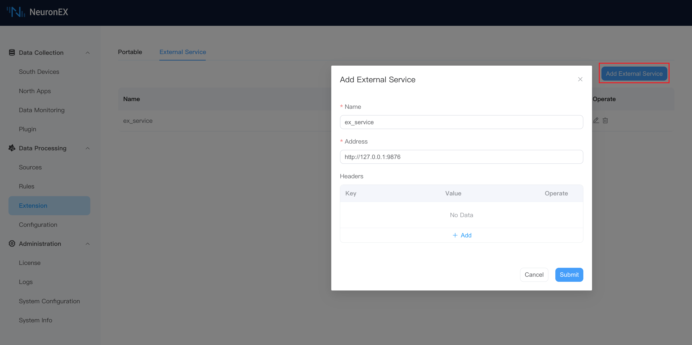
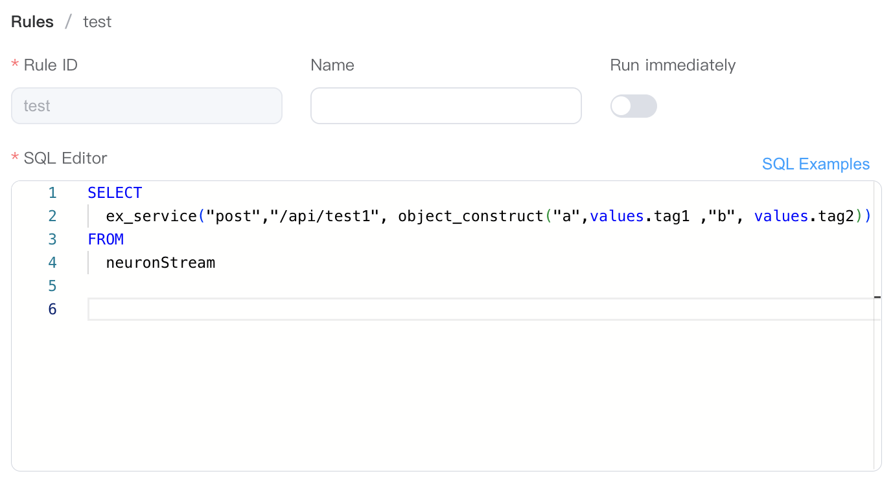
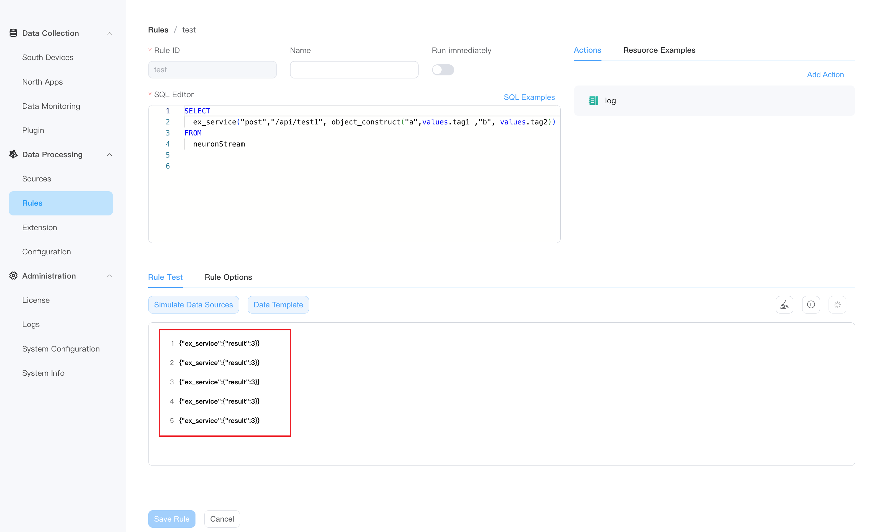

# External algorithm function example

This example selects two data points `tag1` and `tag2` from the `neuronStream` data source, sends them to the external HTTP service through HTTP POST, and returns the result after addition.


## Start an external service

Start an external service locally through the following Python code. The port is `9876` and provide an API interface `/api/test1` to receive the `POST` method. The external service obtains the `a` and `b` fields in the requested JSON data. The result is returned after addition.


```python
from flask import Flask, request, jsonify

app = Flask(__name__)

@app.route('/api/test1', methods=['POST'])
def test1():
    try:
        data = request.get_json()  
        a = data['a']
        b = data['b']
        result = a + b
        return jsonify({'result': result}), 200  
    except Exception as e:
        return jsonify({'error': str(e)}), 400  

if __name__ == '__main__':
    app.run(host='0.0.0.0', port=9876)
```

## Create an external service in NeuronEX

Click **Data Processing** -> **Extensions**, on the **External Service** tab, click **Add External Service**.

- **Name**: ex_service
- **Address**: `http://127.0.0.1:9876`
- **Headers**: Leave blank



:::tip
  Ensure that NeuronEX’s network and the Python external service’s network are connected.
:::

## Using external service in rules

Enter the following in the rule:



Among them, the `neuronStream` used in the rules, the data input is as follows:

```json
  {
    "timestamp": 1701134996987, 
    "node_name": "modbus1", 
    "group_name": "group1", 
    "values": {
      "tag1": 1,
      "tag2": 2,
      "tag3": 3,
      "tag4": 4,
      }, 
    "errors": {},
    "metas": {},
  }
```

`ex_service("post","/api/test1", object_construct("a",values.tag1 ,"b", values.tag2))` means that the function `object_construct("a", values.tag1, "b", values.tag2)` results are sent to the HTTP Server address `http://127.0.0.1:9876/api/test1`, and the processing result of the external service are sent to the Sink.

The reason why we choose to use the built-in function `object_construct` here is that the data format of the original stream `neuronStream` do not match the input parameter requirements of the external function. The calculation result of `object_construct("a",values.tag1 ,"b", values.tag2)` is `{"a":1,"b":2}`, and the result is passed to the external service.

## View result

Enable rule test and check that the output result is correct `{"ex_service":{"result":3}}`.

