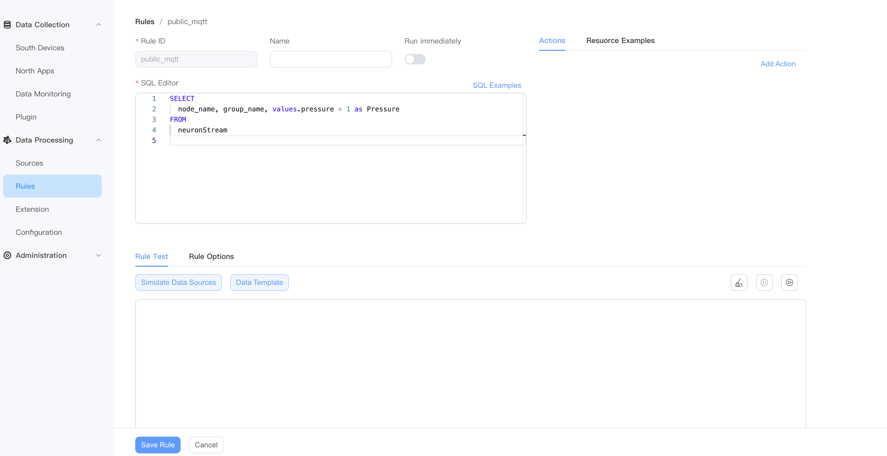
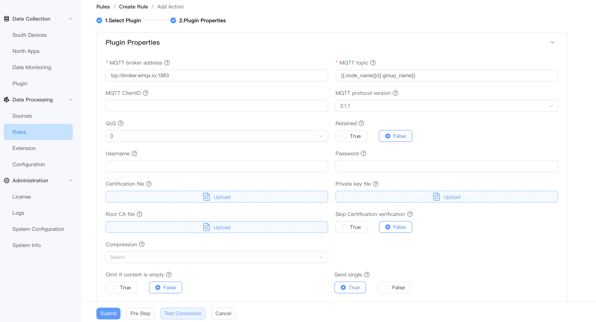
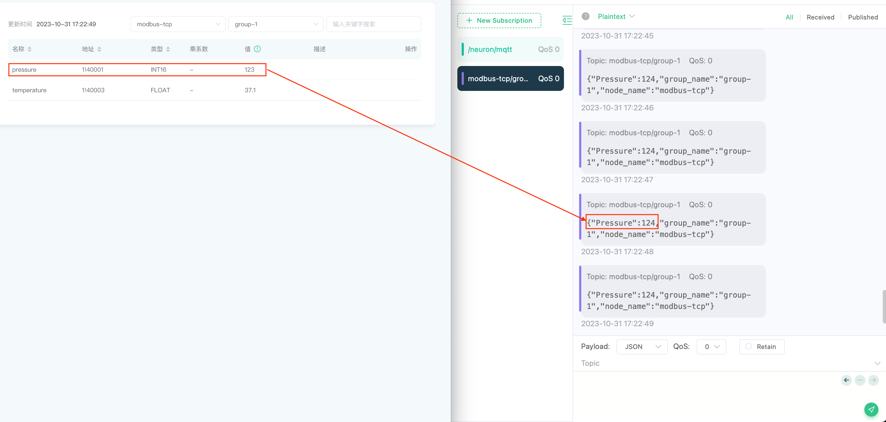

# Your First Rule

This page picks up where the [Quick Start](../quick-start/quick-start.md) left off. There, device data was collected and forwarded to MQTT unchanged. This page adds one edge-processing step: increment the collected value by 1 and publish it to a dynamic topic.

It assumes the `modbus-tcp` southbound driver and the `group-1` collection group from the Quick Start are already configured.

## Step 1 · Feed data into the rules engine

The rules engine receives southbound data as a northbound application, so the first thing to do is subscribe it to a group.

On **Data Collection → North Apps**, find the **Rules Engine Application** that exists by default, click `View Subscriptions` → `Add Subscription`, and select `group-1` under `modbus-tcp`.

Once subscribed, collected tags flow into the engine's `neuronStream` stream, where SQL can read them.

## Step 2 · Create a rule

On **Data Processing → Rules**, click `Create Rule` and write a SQL statement that adds 1 to `pressure`:

```sql
SELECT pressure + 1 AS pressure FROM neuronStream
```



## Step 3 · Add an action

In the **Actions** area, click `Add` and choose **MQTT**:



| Field | Value |
| --- | --- |
| MQTT broker address | `broker.emqx.io` |
| Port | `1883` |
| MQTT topic | Use the dynamic topic <code v-pre>{{.node_name}}/{{.group_name}}</code> so results are split by source |

Submit, and the rule starts running.

## Step 4 · Check the result

In this example the data comes from the `group-1` group on the `modbus-tcp` node, so the dynamic topic resolves to `modbus-tcp/group-1`. Subscribe to it in MQTTX:



The `pressure` value you receive should be 1 higher than the raw value shown on the [Data Monitoring](../admin/monitoring.md) page — proof that the rule is applied.

## Where to go next

This rule does a single addition. The engine can do considerably more:

- **Sources** — besides device data, it can ingest MQTT, HTTP, SQL databases, files, and video streams. See [Source](./source.md).
- **SQL** — 160+ functions for filtering, type conversion, aggregation, and time windows. See [SQL Reference](./sqls/overview.md).
- **Destinations** — write to MySQL, InfluxDB, Redis, Kafka, AWS S3, and more. See [Sink](./sink/sink.md).
- **Custom logic** — what SQL cannot express, extend with Python or C/C++. See [Extensions](./extension.md).
