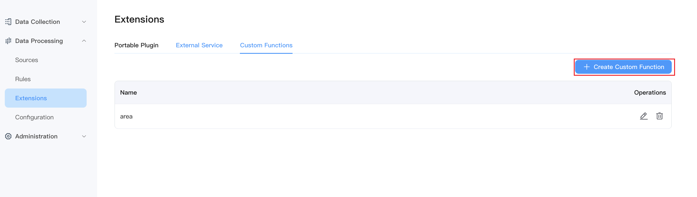
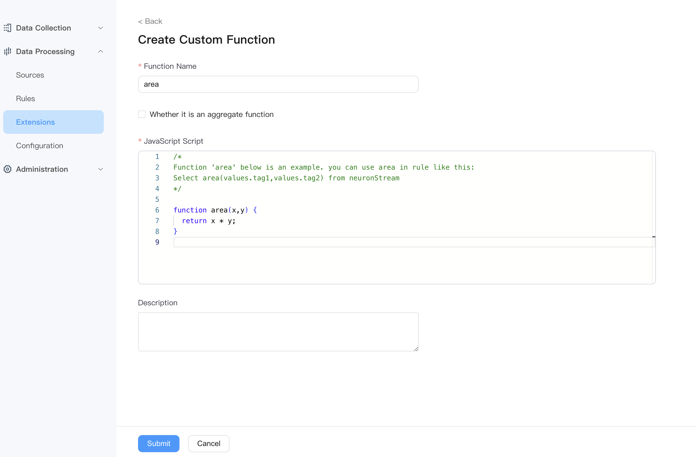

# Custom JavaScript Function

NeuronEX supports creating custom JavaScript functions on the Dashboard. By creating JavaScript functions and using them in rules, you can quickly implement logical calculations and format conversions of data.

## Create a custom JavaScript function

On the **Data Processing -> Extensions** page, select the **Custom Functions** tab and click the **Create Custom Function** button.



After entering the function name and Javascript code, you can create a custom JavaScript function. Note that the function name must be consistent with the main function name in the function code. The Javascript code provides sample functions by default, as well as how to use them in rules.



## Use of Aggregate Functions

If you want to create aggregate functions through Javascript code, check the `Whether it is an aggregate function` option when creating the function. And the parameter passed into the Javascript function must be of array type. The Javascript function example is as follows:

```javascript
function sum_js(collection){

let sum = 0;
for (let i = 0; i < collection.length; i++) {
sum += arr[i];
}
return sum;
}
```

Used in rules, the example is as follows:

```sql
SELECT sum_js(temperature) FROM stream Group By TumblingWindow(ss, 10)
```