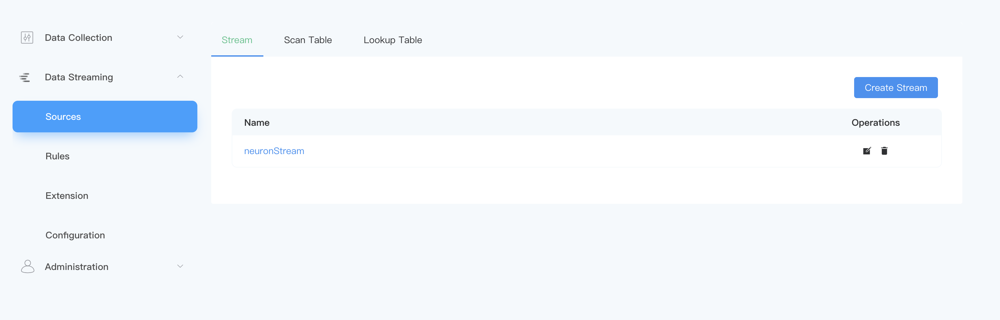
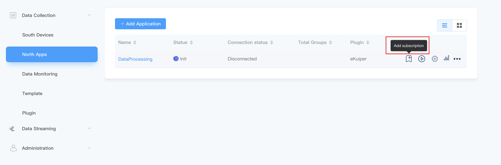

# Neuron 

<span style="background:green;color:white;">Stream</span>        <span style="background:green;color:white">Scan table</span>

The NeuronEX data processing module can receive data from the NeuronEX data collection module through `Neuron` type data sources and process and analyze them through rules.


In NeuronEX **Data Processing** -> **Sources**, under the **Stream** tab, NeuronEX has configured the `Neuron` type data source neuronStream by default.




To send data from the NeuronEX data collection module to neuronStream, you need to add and subscribe the driver data to the `DataProcessing` node under the NeuronEX **Data collection** -> **North Apps** tab, as shown in the following figure:




Then, users can directly select `neuronStream` as the data source in **Data Processing** -> **Rules** -> **Create Rule** to create rules.
```sql

SELECT * FROM neuronStream
```

## Message format

The message sent by Neuron is in a fixed json format, as shown below:

```json
{
   "timestamp": 1646125996000,
   "node_name": "node1",
   "group_name": "group1",
   "values": {
     "tag_name1": 11.22,
     "tag_name2": "string"
   },
   "errors": {},
   "metas":{}
}
```


## Create stream

Create a stream of type `Neuron`. Log in to NeuronEX and click **Data Processing** -> **Sources**. On the **Stream** tab, click **Create Stream**.

In the pop-up **Sources**/**Create** page, enter the following configuration:

- **Stream Name**: Enter the stream name
- **Whether the schema stream**: It can be unchecked by default.
- **Stream Type**: Select neuron.
- **Configuration key**: You can use the default configuration key. If you want to customize the configuration key, you can click the Add Configuration key button and make the following settings in the pop-up dialog box. 

   - **Name**: Enter the configuration key name.
   - **Path**: The URL connecting to the NeuronEX data mining module service. The default is tcp://127.0.0.1:7081, which needs to match the URL of the NeuronEX data mining module.
- **Stream format**: Select `json` format.
- **Shared**: Check whether to share the source, you can check it or not.

:::tip Tips
A `Neuron` type data source named neuronStream has been configured by default and can be used directly by users. After neuronStream is deleted, it can be created through the above steps.
:::

## Create scan table

Create a scan table of type `Neuron`. Log in to NeuronEX and click **Data Processing** -> **Sources**. On the **Scan Table** tab, click **Create Scan Table**.

- **Table Name**: Enter the table name
- **Whether the schema stream**: It can be unchecked by default.
- **Table Type**: Select neuron.
- **Configuration key**: You can use the default configuration key. If you want to customize the configuration key, you can click the Add Configuration key button and make the following settings in the pop-up dialog box. 

   - **Name**: Enter the configuration key name.
   - **Path**: The URL connecting to the NeuronEX data mining module service. The default is tcp://127.0.0.1:7081, which needs to match the URL of the NeuronEX data mining module.
- **Table Format**: Select `json` format.
- **Retain Size**: Specify the Retain size, default is 1.

