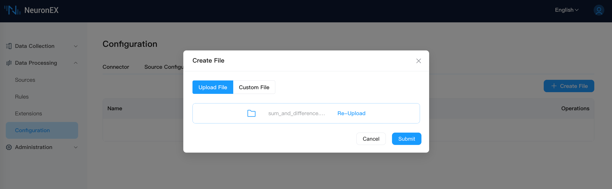
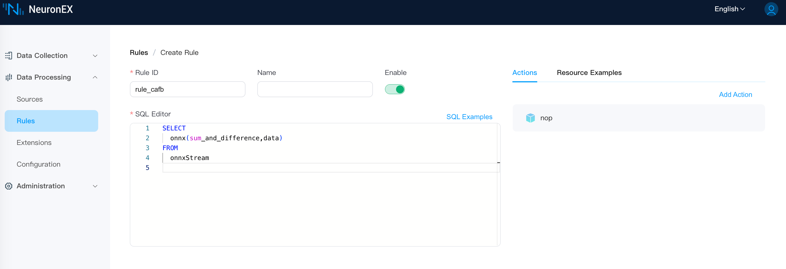

# ONNX Plugin 

ONNX is an open format designed for machine learning that stores trained models. It allows different AI frameworks to store model data in the same format and interact with each other.

By integrating NeuronEX and ONNX, users only need to upload pre-built ONNX models, and then use the model to analyze data in the rule. In this tutorial, we will demonstrate how to quickly call a pre-trained ONNX model using NeuronEX.

 

## Prerequisites

- NeuronEX Official Docker Image
    ```shell
    docker pull emqx/neuronex:3.5.0
    ```

- Model File

    [sum_and_difference](https://github.com/yalue/onnxruntime_go_examples/blob/master/sum_and_difference/sum_and_difference.onnx)

    `sum_and_difference` model is used to process input data, calculating the approximate sum of input data and the approximate maximum difference between any two input data.


- Model Upload

    Please download the above model to your local machine, then upload it to NeuronEX using the file upload function of NeuronEX. Click `Data Processing` -> `Configuration` -> `File Management` to upload the file.

    

 

## Rule 

In the data processing **Rule** page, call the ONNX model using SQL rules, and use the above model to process data. The first parameter is the model name without the `onnx` suffix (here, you don't need to add the path of sum_and_difference.onnx), and the second parameter is the data to be processed.

 
 

## Test

Send the data to be processed to onnxStream, and then observe the data processing results. The data to be processed is as follows:
```json
{
  "data": [
    0.2,
    0.3,
    0.6,
    0.9
  ]
}
```

The processing results are as follows:
```json
[{"onnx":[[1.9999883,0.60734314]]}]
```
 

## Others

In this example, the official NeuronEX Docker image includes the ONNX dependency library. If you deploy NeuronEX using deb/rpm or binary form, you need to refer to the following steps to manually build the ONNX dependency environment.

1. Download [ONNX dependencies](https://github.com/lf-edge/ekuiper/tree/master/extensions/functions/onnx/lib).

::: tip
For convenience, you can download all .so files. NeuronEX will automatically select the appropriate .so file.
:::

2. Create a directory `/usr/local/onnx/lib/` on the machine where NeuronEX is running, and then copy the above .so files to the directory. 

