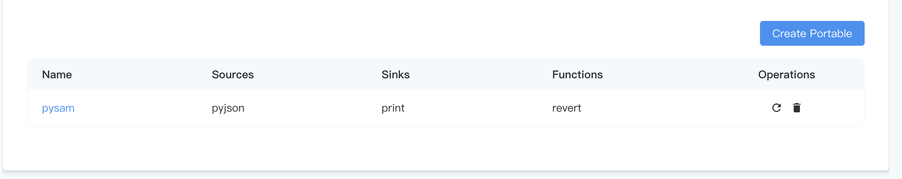

# Python portable plugin example

The following is the introduction and packaging process of the pysam plugin example.The pysam plugin can be obtained through the **Portable Plugin** tab of **Extensions** and click **Download Example**.


## Deployment requirements
To use the Python portable plugin, Python3 environment is required.
- Required if you install NeuronEX through the installation package
  
   1. Manually install the python 3.x environment.
   2. Install the `ekuiper` and `pynng` libraries through pip
   ```shell
   pip install ekuiper pynng
   ```

- If you install NeuronEX through docker, please use the NeuronEX image of type [neuronex:3.x.x](../installation/docker.md#docker-container-python-runtime-environment), which is already included Python3 environment, as well as some related function libraries.

## Overall introduction of pysam plugin

The directory of the pysam plugin contains the following files:

- `pysam.json`: required, plugin metadata file, used to describe the metadata information of the plugin.
- `pysam.py`: required, plugin main program executable file.
- `pyjson.py`: optional, a data source Source plugin in the plugin.
- `sources folder, pyjson.json, pyjson.yaml`: Optional, the configuration information of the data source Source plugin `pyjson.py` in the plugin.
- `print.py`: optional, an action Sink plugin in the plugin.
- `sinks folder, print.json`: Optional, the configuration information of the action Sink plugin `print.py` in the plugin.
- `revert.py`: optional, a function plugin in the plugin.
- `functions folder, revert.json`: Optional, the configuration information of the function plugin `revert.py` in the plugin.


::: tip tip
A plugin can contain one or more data source Source, action Sink and function plugins. In the pysam example, it includes a data source Source plugin `pyjson`, an action Sink plugin `print` and a function plugin `revert`.
:::

## Introduction to plugin metadata files
The `pysam.json` file is the metadata file of the plugin, which is used to describe the metadata information of the plugin. The following is an introduction to the key information in the metadata file:
- `language`: This field specifies the language implemented by the plugin. The plugin must be implemented in a single language. For python type plugins, fill in `python`.
- `executable`: The field needs to specify the name of the plugin main program executable file. In this case the `pysam.py` file.
:::tip Tips
This `pysam.py` file name does not need to have the same name as the plugin's metadata file `pysam.json`. For example, you can fill in `main.py` in the `executable` field, or rename `pysam.py` to `main.py`.
:::
- `sources`: This field is in array format and contains all data source Source plugin information in the plugin.
- `sinks`: This field is in array format and contains all action sink plugin information in the plugin.
- `functions`: This field is in array format and contains all Function plugin information in the plugin.

```json
{
   "version": "v1.0.0",
   "language": "python",
   "executable": "pysam.py",
   "sources": [
     "pyjson"
   ],
   "sinks": [
     "print"
   ],
   "functions": [
     "revert"
   ]
}
```
:::tip Tips
The `pysam.json` file is the metadata file of the plugin. The file name `pysam` must be the same as the **Data Processing** -> **Extension** -> **Portable plugin** tab on the NeuronEX Dashboard, click **The `plugin name` filled in when creating a portable plugin** is the same.
:::


## Introduction to the plugin main program
In this example, the `pysam.py` file is the main program executable file of the plugin. This file contains the main program logic of the plugin, and configures and registers the specific data source Source, action Sink and function plugin.

```python
from ekuiper import plugin, PluginConfig
from print import PrintSink
from pyjson import PyJson
from revert import revertIns

if __name__ == '__main__':
     c = PluginConfig("pysam", {"pyjson": lambda: PyJson()}, {"print": lambda: PrintSink()},
                      {"revert": lambda: revertIns})
     plugin.start(c)
```

## Specific plugin implementation introduction

In this example, the `pyjson.py` file is a data source Source plugin in the plugin, the `print.py` file is an action Sink plugin in the plugin, and the `revert.py` file is a Function plugin in the plugin. . Taking the Function plugin `revert.py` as an example, customized functional requirements can be achieved through the `exec` function in the `revert.py` file.
    
```python

from typing import Any, List
from ekuiper import Function, Context

class RevertFunc(Function):

     def __init__(self):
         pass

     def validate(self, args: List[Any]):
         return ""

     def exec(self, args: List[Any], ctx: Context):
         return args[0][::-1]

     def is_aggregate(self):
         return False

revertIns = RevertFunc()
```

## plugin packaging and installation

After completing the plugin development, we need to package the results into a zip for installation. In the directory of the same level as `pysam.json`, execute the following command to package:

```shell
zip -r pysam.zip ./*

```
Through the above command, the `pysam.zip` file will be generated in the current directory. This file is the plugin package we need to install. On the **Portable plugin** tab, click **Create Portable plugin**. Enter the plugin name `pysam` in the pop-up window and upload the plugin `pysam.zip` to complete the plugin installation.

After the plugin is installed, the detailed information of the plugin will be displayed in the plugin list, as follows:


::: tip tip
After installing the plugin, NeuronEX does not need to be restarted to use the plugin function normally.
:::

## plugin usage example

### Use the plugin in the data source Source
On the **Source** page, click **Create Stream** to select the **pysam** plugin to use as a custom data source.

### Using plugins in SQL

On the **Rules** page, click **Create Rule** to directly call the custom function `revert` in the rule SQL. In this example, the `revert` function obtains `device_name` from the `demoStream` stream. The value of the field, and implements the function of string reversal and outputs it to the `result` field.

```sql
SELECT revert(device_name) as result FROM demoStream
```
Assume that the input data in the `demoStream` stream is as follows:
```json
{
   "device_name": "abcdefg"
}

```
Then, the rule output data is as follows:
```json
{
   "result": "gfedcba"
}

```

### Using plugins in action sinks

On the **Add Action** page, you can select the **print** plugin to use as a custom action.


## other

### Other plugin options
Users can add the `install.sh` file and the `requirements.txt` file in the plugin directory. When the plugin is installed, the `install.sh` script will be automatically executed to install the dependent libraries required by the plugin.

An example of the `install.sh` file is as follows:

```shell
cur=$(dirname "$0")
echo "Base path $cur"
pip install -r $cur/requirements.txt
echo "Done"
```

An example of the `requirements.txt` file is as follows:

```shell
numpy==1.22.3
scipy==1.8.0
```

::: tip tip
Users can add corresponding algorithm model files, such as `model.pkl` files, in the plugin directory, and the model file can be directly called in the plugin python code.
:::
