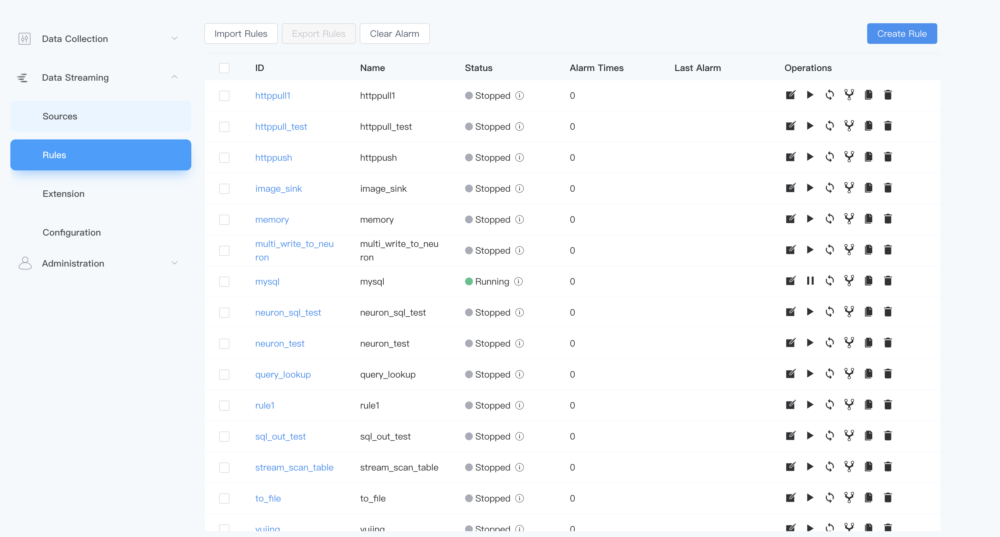
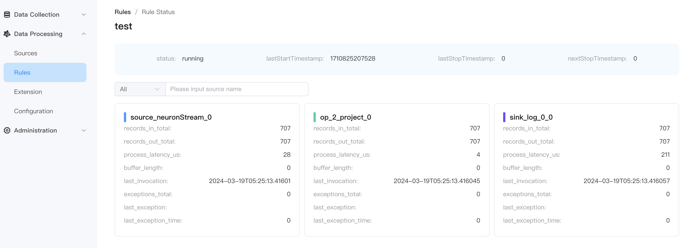

# Rule management

We can manage rules on the rules page, including operating rules, importing rules, viewing rule status information, etc.

## View rule information

- **ID**
  
   The unique identifier of the rule, defined by the user.

- **Name**

   The description of the rule is customized by the user.

- **state**

   The running status of the rule, including `running` and `stopped`.

- **Number of alarms**
  
     The number of alarms during rule operation.

- **Last Alarm**
    
     The last alarm information during rule running.

- **operate**

   Including rules `edit`, `start/stop`, `restart`, `topology`, `copy` and `delete`.

## Rule Status

 Click the `Status` of the rule to view the rule's status information as follows:

Among them, `status` represents the current running status of the rule, and `running` represents that the rule is running.

The subsequent monitoring items represent the operation status of each operator during the rule running process, and the monitoring items are composed of `operator type_operator information_operator index_specific monitoring items`.

Take `source_neuronStream_0_records_in_total` as an example, where `source` represents the read data operator, `neuronStream` is the corresponding stream, `0` represents the index of the operator instance in the concurrency, and `records_in_total` interprets the actual The monitoring item, that is, how many records the operator has received.

