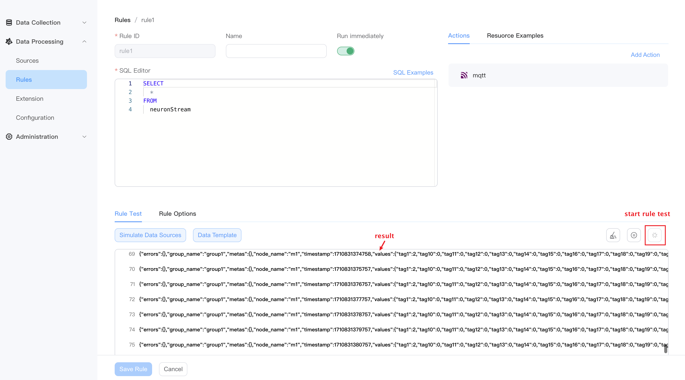
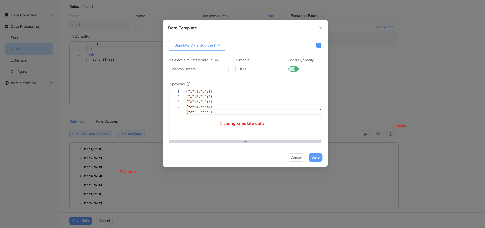
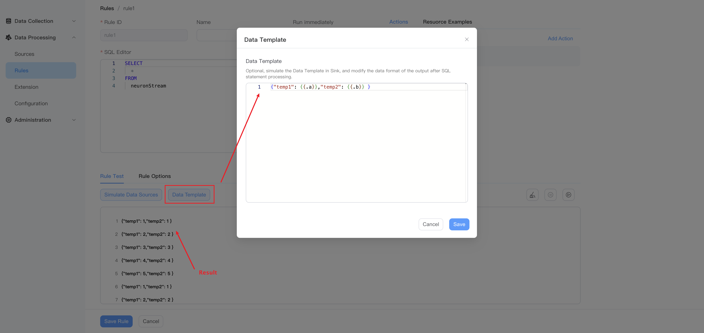

# Rule Test

When creating rules, rule test allows you to view the output results of rules after SQL processing in real-time, ensuring that SQL syntax, built-in functions, and data templates meet the expected output results.

Additionally, NeuronEX supports debugging rules with simulated data sources, where you can replace the original data source in the SQL editor with a custom simulated data source, providing a more flexible way to simulate data sources.

## Start rule test

If there is data flowing into the data source in the SQL editor, you can directly click the `Run Test` button in the figure below to start rule test, and you will see the rule test output directly in the current interface.



## Start rule test with simulated data source

If there is no data flowing into the data source in the SQL editor and you still want to debug the rules, you can edit the `Simulated Data Source`.
- Select simulated data in SQL: Select a data source in the SQL editor
- Interval: simulate the sending interval of the data source
- Send Cyclically: whether to send cyclically
- payload: JSON data sent

Simulated data supports "one json output in multiple lines", "one json ouput in single line", and "multiple lines,every single line is one json output".

  - one json output in multiple lines
  ```json
  {
    "ts" : 1672545661000,
    "tag1" : "area1",
    "value1" : 123
  }
  ```
  - one json ouput in single line
  ```json
  {"ts" : 1672545661000, "tag1" : "area1", "value1" : 1}
  ```
  - multiple lines,every single line is one json output
  ```json
  {"ts" : 1672545661000, "tag1" : "area1", "value1" : 1}
  {"ts" : 1672545662000, "tag1" : "area1", "value1" : 2}
  {"ts" : 1672545663000, "tag1" : "area1", "value1" : 3}
  {"ts" : 1672545664000, "tag1" : "area1", "value1" : 4}
  {"ts" : 1672545665000, "tag1" : "area1", "value1" : 5}
  ```

The following figure introduces the configuration and output examples of the simulated data source：




## Data Template Configuration

`Data template` simulates the data template in Sink, and modifies the data format before outputting the results after SQL statement processing. The following figure shows an example of the output results of adding a data template after enabling the simulated data source configuration based on the previous step:



For more usage of data templates, please see [Data Template](./sink/data_template.md)。