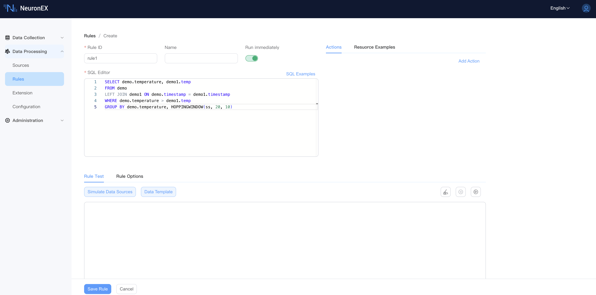
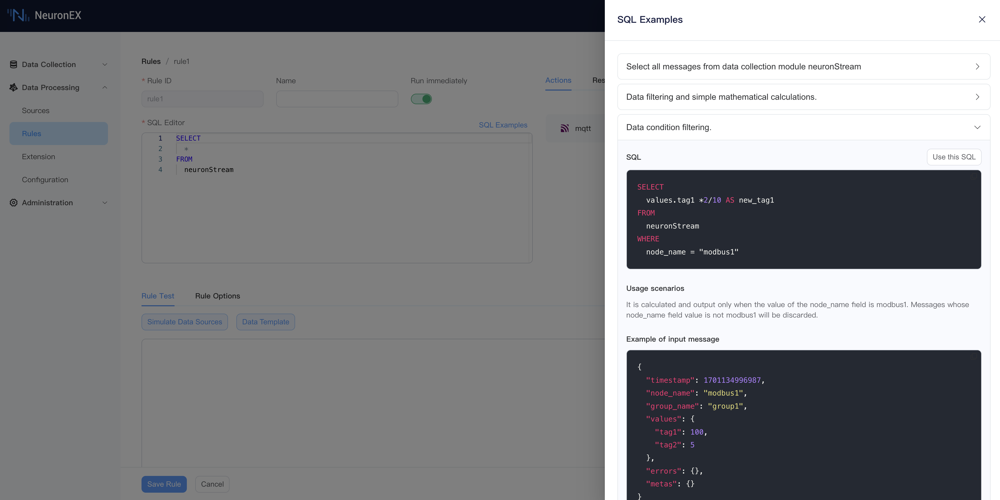
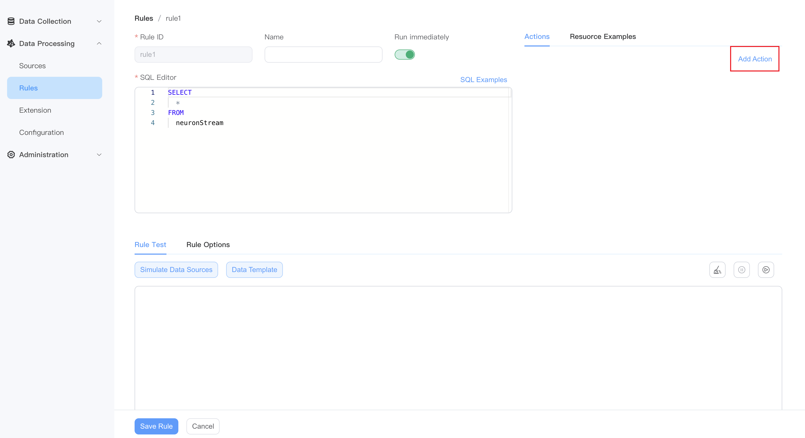
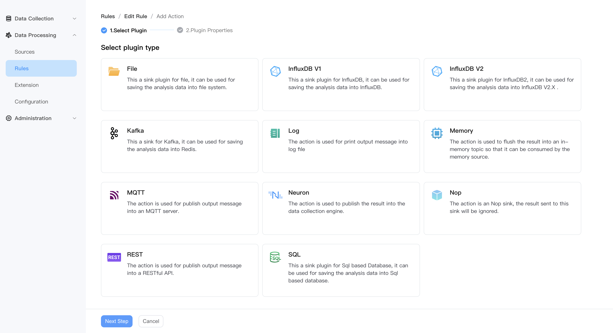
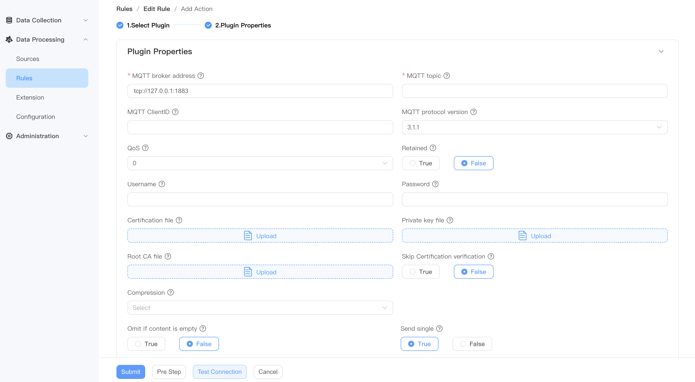
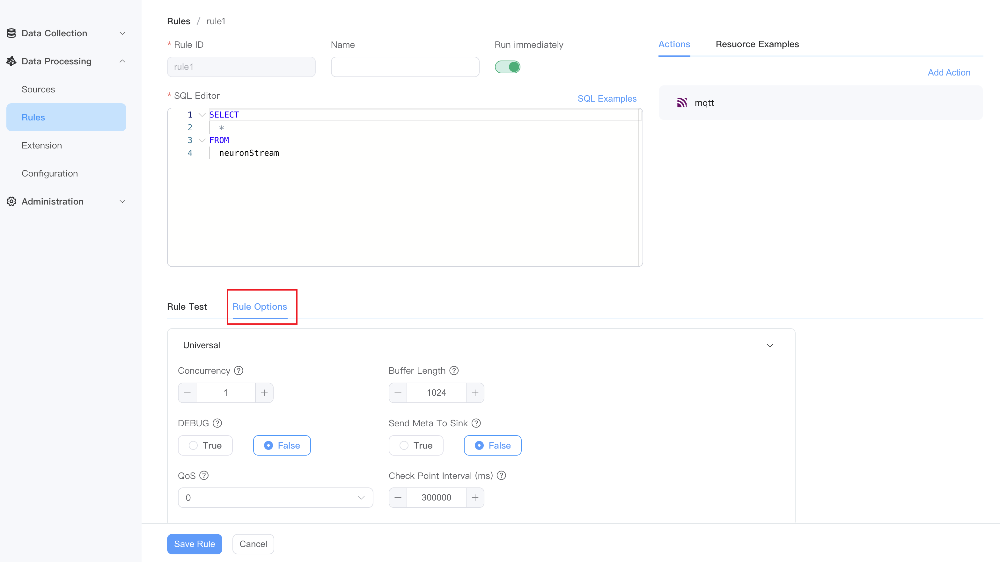
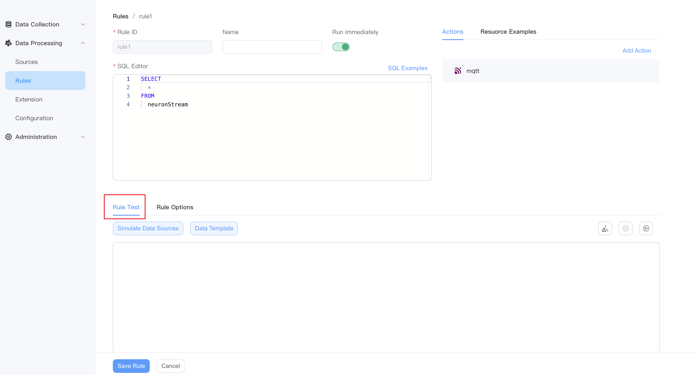

# rule

All calculation logic is handled through **Rules** in NeuronEX. The rules take the data source as input, define the calculation logic through **SQL**, and output the results to **Sink (Action)**. Once a rule definition is submitted, it will continue to run. It will continuously obtain data from the source, perform calculations based on SQL logic, and trigger **Sink (Action)** in real time based on the results.

NeuronEX supports running multiple rules simultaneously. These rules run in the same memory space and share the same hardware resources. Multiple parallel rules are separated at run time, and an error in one rule will not affect other rules.

::: tip

NeuronEX rules that at least one data source in SQL should be of type `Stream`. For information on how to create a stream, please refer to [Stream](./stream.md).

:::


## Create rules

In the NeuronEX dashboard, click **Data Processing** -> **Rules**. Click the **Create Rule** button:

- Rule ID: Enter the rule ID, which must be unique within the same NeuronEX instance.

- Name: Enter the rule name

- Enable：Run the rule immediately after creating it

- Enter rule SQL,for example:

   ```sql
   SELECT demo.temperature, demo1.temp
   FROM demo
   LEFT JOIN demo1 ON demo.timestamp = demo1.timestamp
   WHERE demo.temperature > demo1.temp
   GROUP BY demo.temperature, HOPPINGWINDOW(ss, 20, 10)
   ```



## Rules SQL

Rules `sql` define the streams or tables to be processed and how to process them. The rule SQL is and sends the processing results to one or more actions (Sink). You can use built-in functions and operators in rules `sql`, or you can use custom functions and algorithms.

The simplest rule SQL is `SELECT * FROM neuronStream`. This rule will get all the data from the `neuronStream` data stream. NeuronEX provides a wealth of operators and functions. For more usage, please see the [SQL](./sqls/overview.md) chapter.

Click the **SQL Examples** button to view commonly used SQL examples, where you can get SQL statements, application scenarios, input message examples, and processing results.



## Add action (Sink)

The action (Sink) part defines the output behavior of a rule. Each rule can have multiple actions.

- In the **Actions** area, click the **Add Action** button.



- Select sink plugin type.



- Fill in the plugin configuration and submit it.




::: tip
Sink are used to write data to external systems. You can go to the [Action(Sink)](./sink/sink.md) page to get detailed configuration information.
:::


## Resource Examples
You can view the created data sources and usage examples.


## Rule options (optional)

Click the **Options** section to continue configuring the current rule:

| Option name        | Type & Default Value | Description                                                  |
| ------------------ | -------------------- | ------------------------------------------------------------ |
| concurrency        | int: 1               | A rule is processed by several phases of plans according to the sql statement. This option will specify how many instances will be run for each plan. If the value is bigger than 1, the order of the messages may not be retained. |
| bufferLength       | int: 1024            | Specify how many messages can be buffered in memory for each plan. If the buffered messages exceed the limit, the plan will block message receiving until the buffered messages have been sent out so that the buffered size is less than the limit. A bigger value will accommodate more throughput but will also take up more memory footprint. |
| debug              | bool: false          | Specify whether to enable the debug level for this rule. By default, it will inherit the Debug configuration parameters in the global configuration. |
| sendMetaToSink     | bool:false           | Specify whether the meta data of an event will be sent to the sink. If true, the sink can get te meta data information. |
| isEventTime        | boolean: false       | Whether to use event time or processing time as the timestamp for an event. If event time is used, the timestamp will be extracted from the payload. |
| lateTolerance      | int64:0              | When working with event-time windowing, it can happen that elements arrive late. LateTolerance can specify by how much time(unit is millisecond) elements can be late before they are dropped. By default, the value is 0 which means late elements are dropped. |
| qos                | int:0                | Specify the qos of the stream. The options are 0: At most once; 1: At least once and 2: Exactly once. If qos is bigger than 0, the checkpoint mechanism will be activated to save states periodically so that the rule can be resumed from errors. |
| checkpointInterval | int:300000           | Specify the time interval in milliseconds to trigger a checkpoint. This is only effective when qos is bigger than 0. |
| attempts        | int: 0          | Maximum number of retries. If set to 0, the rule will fail immediately without retrying. |
| delay        | int: 1000          | Default retry interval in milliseconds. If the multiplier is not set, the retry interval will be fixed to this value. |
| maxDelay        | int: 30000          | The maximum interval between retries, in milliseconds. This only takes effect if the multiplier is set so that the delay is increased for each retry. |
| multiplier        | float: 2          | Multiplier for the retry interval. |
| jitterFactor        | float: 0.1         | Adds or subtracts a random value coefficient to the delay to prevent multiple rules from being restarted at the same time. |


:::tip Tips
In most scenarios, the default values for rule options are sufficient.
:::

After completing the settings, click **Save Rule** to complete the creation of the current rules. The new rule will appear in the rules list. Here you can view rule status, edit rules, stop rules, refresh rules, view rule topology map, copy rules or delete rules.



## Rule test

When creating rules, rule test allows you to view the output results of rules after SQL processing in real-time, ensuring that SQL syntax, built-in functions, and data templates meet the expected output results.

Additionally, NeuronEX supports debugging rules with simulated data sources, where you can replace the original data source in the SQL editor with a custom simulated data source, providing a more flexible way to simulate data sources.

For more details, please refer to [Rule Test](./rule_test.md).




## Import and export rules

In the NeuronEX dashboard, click **Data Processing** -> **Rules**. Click the **Import Rules** button. In the pop-up window, you can choose:

- Paste file content directly
- Import file contents by uploading files

After clicking **Submit**, the new rule will appear in the rules list. Here you can view rule status, edit rules, stop rules, refresh rules, view rule topology map, copy rules or delete rules.

::: tip

When importing rules, if there are rules with the same ID, the original rules will be overwritten.

:::

In the NeuronEX dashboard, click **Data Processing** -> **Rules**, click the **Export Rules** button, and the JSON file of the current rules will be exported.

## [Rule Status](./rule_status.md)

When a rule is run in NeuronEX, we can understand the current rule running status through the rule indicators. See [Rule Status](./rule_status.md) for details.

## [Rule Pipeline](./rule_pipeline.md)

Multiple rules can form a processing pipeline by specifying sink/source union points. For example, the first rule produces results in an memory sink, and other rules subscribe to the topic in their memory sources. For more usage, please see the [Rule Pipeline](./rule_pipeline.md) chapter.

## Incremental Computation

When using data processing functions to perform aggregate calculations on data within a window, the default implementation method is to segment the continuous stream data into windows according to the window definition and cache it in memory. After the window ends, all data in the window is aggregated for calculation. One problem with this method is that when the data has not been aggregated for calculation, caching in memory can easily cause memory expansion and lead to OOM (Out of Memory) issues.
For detailed information about incremental computation, please refer to [Incremental Computation](https://ekuiper.org/docs/en/latest/guide/rules/incremental.html)

To enable incremental computation in rules, please enable it in the rule options.

