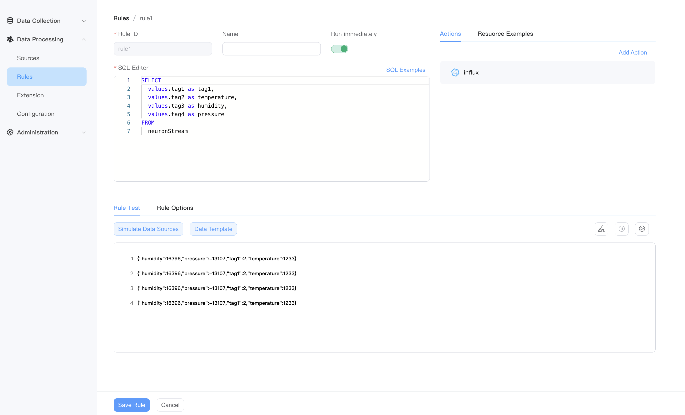

# InfluxDB Sink

The sink will write the result into InfluxDB `V1`.

## Properties

Connection properties:

| Property name        | Optional | Description                                                                                                                                                                                                                                                                                                                                                |
|----------------------|----------|------------------------------------------------------------------------------------------------------------------------------------------------------------------------------------------------------------------------------------------------------------------------------------------------------------------------------------------------------------|
| addr                 | false     | The addr of the InfluxDB                                                                                                                                                                                                                                                                                                                                   |
| username             | true    | The InfluxDB login username                                                                                                                                                                                                                                                                                                                                |
| password             | true    | The InfluxDB login password                                                                                                                                                                                                                                                                                                                                |
| database             | false     | The database of the InfluxDB                                                                                                                                                                                                                                                                                                                               |
| certificationPath    | true     | The certification path. It can be an absolute path, or a relative path. If it is an relative path, then the base path is where you executing the `kuiperd` command. For example, if you run `bin/kuiperd` from `/var/kuiper`, then the base path is `/var/kuiper`; If you run `./kuiperd` from `/var/kuiper/bin`, then the base path is `/var/kuiper/bin`. |
| privateKeyPath       | true     | The private key path. It can be either absolute path, or relative path, which is similar to use of certificationPath.                                                                                                                                                                                                                                      |
| rootCaPath           | true     | The location of root ca path. It can be an absolute path, or a relative path, which is similar to use of certificationPath.                                                                                                                                                                                                                                |                                                                                                                                                                                                     |
| insecureSkipVerify   | true     | If InsecureSkipVerify is `true`, TLS accepts any certificate presented by the server and any host name in that certificate.  In this mode, TLS is susceptible to man-in-the-middle attacks. The default value is `false`. The configuration item can only be used with TLS connections.                                                                    |

Write options:

| Property name | Optional | Description                                                                                                                                                                                                                                                                                                                                                     |
|---------------|----------|-----------------------------------------------------------------------------------------------------------------------------------------------------------------------------------------------------------------------------------------------------------------------------------------------------------------------------------------------------------------|
| Measurement   | false    | The measurement of the InfluxDb (like table name)                                                                                                                                                                                                                                                                                                               |
| Tags          | true     | The tags to write, the format is like {"tag1":"value1"}. The value can be dataTemplate format, like <span v-pre>{"tag1":"{{.temperature}}"}</span>                                                                                                                                                                                                              |
| Fields        | true     | The fields to write, the format is like ["field1", "field2"]. If fields is not set, all fields selected in the SQL will all written to InfluxDB.                                                                                                                                                                                                                |
| Precision     | false     | The precision of the timestamp. Support `ns`, `us`, `ms`, `s`. Default: `ms`.                                                                                                                                                                                                                                                                                   |
| Timestamp Field Name   | true     | The field name of the timestamp. If set, the written timestamp will use the value of the field. For example, if the data has {"ts": 1888888888} and the tsFieldName is set to ts, then the value 1888888888 will be used when written to InfluxDB. Make sure the value is formatted according to the precision. If not set, the current timestamp will be used. |

Other common sink properties including batch settings are supported. Please refer to
the [sink common properties](../overview.md#common-properties) for more information.


## Example

- The data format after SQL processing is as follows：

```json
{
  "temperature":1233,
  "humidity":16396,
  "pressure":-13107,
  "tag1":2
}
```



- InfluxDB V1 Sink Configuration


-  InfluxDB Results

