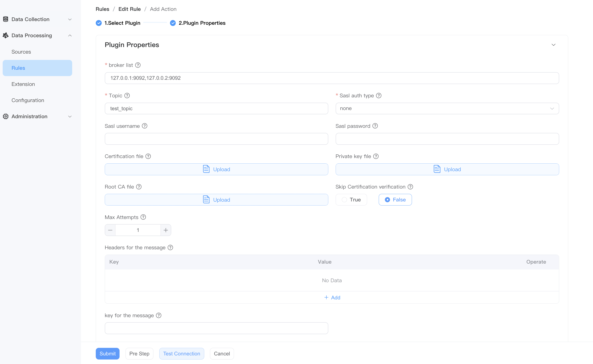

# Kafka 目标（Sink）

This plugin sends the analysis results into Kafka.


## Property

| Property Name     | Options | Description                                    |
| ------------ | -------- | --------------------------------------- |
| Broker List      | no       | kafka broker list            |
| Topic        | no       | kafka topic                              |
| Sasl auth type | no       | support none，plain，scram |
| Sasl username | yes       | -                             |
| Sasl password | yes      | -                               |


## Example

Select data with a temperature greater than 50 degrees from the `demo_stream` data source and forward it to Kafka.

- SQL configuration


- kafka sink configuration




## Precautions

If NeuronEX and kafka are deployed in the same container network through docker compose, the brokers address can be configured in NeuronEX through the kafka host name.

But kafka needs special attention. `` KAFKA_CFG_ADVERTISED_LISTENERS `` needs to be configured as the host IP address, as shown below

```yaml
    zookeeper:
     image: docker.io/bitnami/zookeeper:3.8
     hostname: zookeeper
     container_name: zookeeper
     ports:
      - "2181:2181"
     volumes:
      - "zookeeper_data:/bitnami"
     environment:
       - ALLOW_ANONYMOUS_LOGIN=yes
    kafka:
     image: docker.io/bitnami/kafka:3.4
     hostname: kafka
     container_name: kafka
     ports:
      - "9092:9092"
     volumes:
      - "kafka_data:/bitnami"
     environment:
      - KAFKA_CFG_ZOOKEEPER_CONNECT=zookeeper:2181
      - ALLOW_PLAINTEXT_LISTENER=yes
      - KAFKA_CFG_LISTENERS=PLAINTEXT://:9092
      - KAFKA_CFG_ADVERTISED_LISTENERS=PLAINTEXT://122.9.166.75:9092
     depends_on:
      - zookeeper
```
