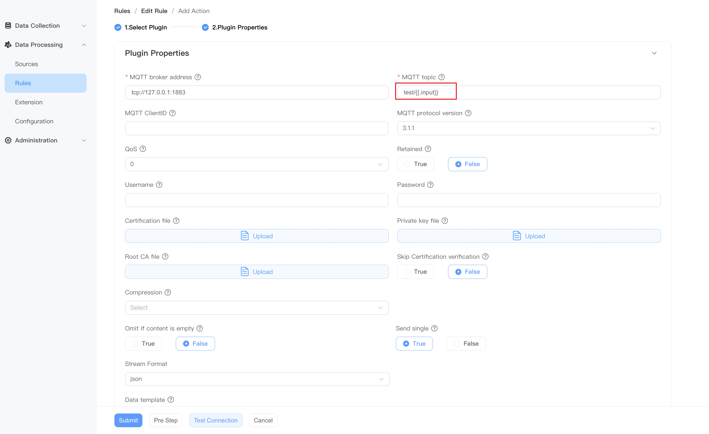

# MQTT Sink

This sink is used to publish output messages to the MQTT server.
If you want to use the MQTT Sink connector, click **Data Processing** -> **Rules** -> **Create Rule**, in the **Action** area, click **Add**, **Sink ** Select **MQTT**.

## Sink configuration

On the page that pops up, make the following settings:

::: tip
If you want to save the settings as a template, you can also click **Add Sink Template** to make settings in the pop-up window. The newly added template will be automatically added to the **Sink Templates** list. You can click **Data Processing** -> **Configuration** -> **Sink Templates** of **Resources** View or edit existing Sink templates.
:::

- **Name**: Enter a name
- **MQTT broker address**: The server of the MQTT message broker, such as `tcp://127.0.0.1:1883`
- **MQTT topic**: The MQTT topic to be subscribed to, for example topic1.
- **MQTT ClientID**: Client ID of the MQTT connection. If not specified, a uuid will be used.
- **MQTT protocol version**: MQTT protocol version, supports 3.1 or 3.1.1, the default is 3.1.1.
- **QoS**: The default QoS level is 0, optional values: 0, 1, 2.
- **retained**: If retained is set to true, the Broker will store the last retained message of each Topic and its Qos. The default value is false.
- **Username**: Optional parameter, MQTT connection username.
- **Password**: Optional parameter, MQTT connection password.
- **Certification Path**: Optional parameter, fill in the certificate path, which can be an absolute path or a relative path. If a relative path is specified, the parent directory is the path where the neuronex command is executed. Example value: `/var/xyz-certificate.pem`.
- **Private key path**: Optional parameter, which can be an absolute path or a relative path. Example value: `/var/xyz-private.pem.key`.
- **Root Ca Path**: Optional parameter to verify the server certificate. It can be an absolute path or a relative path. Example value: `/var/xyz-rootca.pem`.
- **Skip certification verification**: Defaults to False. If set to True, certificate verification will be skipped, otherwise certificate verification will be performed.
- **Compression**: Leave blank by default to not decompress. Decompress MQTT Payload using the specified compression method, optional values: zlib, gzip, flate.
- **Omit if content is empty**: Default is False.
- **Send single**: Default is True.
- **Stream format**: supports json, binary, protobuf, delimited, custom. Default json format.
   - If you select protobuf or custom, you should also configure the corresponding [mode and mode message] (../config.md#mode)
   - If you select delimited, you should also configure the delimiter, such as "`,`"
- **Data template**: Golang template, used to specify the output data format. If no data template is specified, the data will be used as raw input. For a detailed introduction to data templates, see [Data Template](./data_template.md).

After completing the settings, you can click **Test Connection** to confirm the connection. Finally click **Submit** to complete the settings.

## Example

The following is an example of using MQTT Sink to connect to EMQX.

