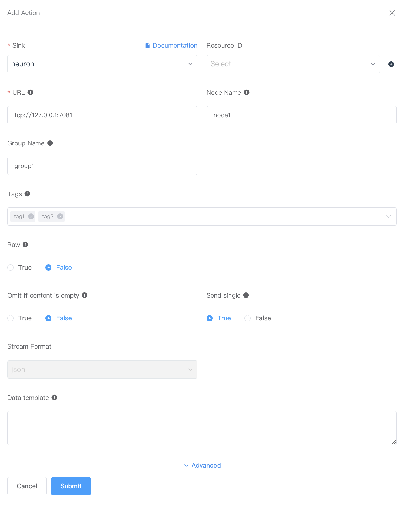
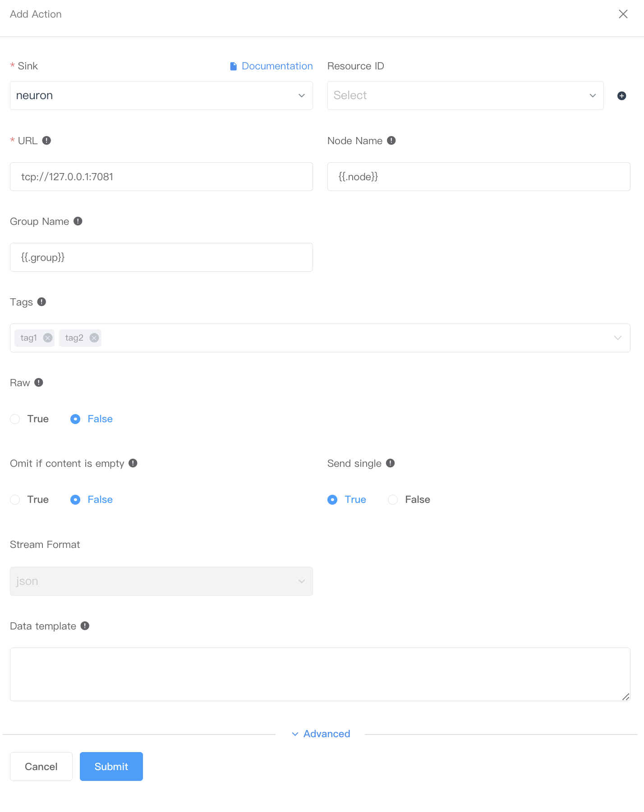
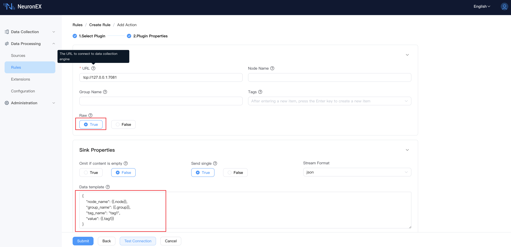

# Neuron Sink

This action is used to send the results to the data collection module of the NeuronEX instance to achieve device control.

If you want to use the Neuron Sink connector, click **Data Processing** -> **Rules** -> **Create Rule**, in the **Action** area, click **Add**, **Sink** Select **Neuron**.

## Sink configuration

On the page that pops up, make the following settings:

::: tip
If you want to save the settings as a template, you can also click **Add Sink Template** to make settings in the pop-up window. The newly added template will be automatically added to the **Sink Templates** list. You can click **Data Processing** -> **Configuration** -> **Sink Templates** of **Resources** View or edit existing Sink templates.
:::

- **Name**: Enter a name
- **URL**: The URL of the data collection module connected to the NeuronEX instance, the default is `tcp://127.0.0.1:7081`
- **Node name**: The node name sent to the southbound driver of the data collection module. The value can be a dynamic parameter template. This option must be configured when the `original string` configuration item is `False`.
- **Group name**: The group name sent to the southbound driver of the data collection module. The value can be a dynamic parameter template. This option must be configured when the `original string` configuration item is `False`.
- **Tags**: The specific tag name sent to the southbound driver of the data collection module. The label should be the field name after rule processing. **Note: When sending multiple tags at once, all tags (case-sensitive) must exist in the southbound driver. If any tag does not exist or the name is incorrect, all tags will fail to send.**
- **Raw**: When this configuration item is `False`, data is written through `node name`, `group name` and `label field`. When this configuration item is `True`, data is written through `data template`.
- **Omit if content is empty**: Default is False.
- **Send single**: Default is True.
- **Stream format**: Default is `json`.
- **Data template**: Golang template, used to specify the output data format. If no data template is specified, the data will be used as raw input. For a detailed introduction to data templates, see [Data Template](./data_template.md)

After completing the settings, you can click **Test Connection** to confirm the connection. Finally click **Submit** to complete the settings.

## Example

Suppose the result received looks like this:

```json
{
   "tag1": 25.2,
   "tag2": 72,
   "group": "group5",
   "node": "node5"
}
```

### Send selected tags

Send two tags tag1 and tag2 to node1 node group1 group.



:::tip note
In the NeuronEX data collection module, the node1 node group1 group and two data tags named tag1 and tag2 must exist before it can be successfully distributed.
:::

### Use dynamic templates to send to dynamic nodes

Use dynamic template to send two tags tag1 and tag2 to node5 node group5 group.



:::tip note
In the NeuronEX data collection module, the node5 node group5 group and two data tags named tag1 and tag2 must exist before the distribution can be successful.
:::


### Send tag data using raw string

- Using the raw string, send a tag tag1 to node5 node group5 group.



The content of the data template is as follows:
  
   ```json
{
   "node_name": {{.node}},
   "group_name": {{.group}},
   "tag_name": "tag1",
   "value": {{.tag1}}
}
   ```

- Using the raw string, send multiple tags tag1/tag2/tag3 to node5 node group5 group.

The content of the data template is as follows:
  
```json
{
    "node_name": {{.node}},
    "group_name": {{.group}},
    "tags": [
        {
            "tag_name": "tag1",
            "value": {{.tag1}}
        },
        {
            "tag_name": "tag2",
            "value": {{.tag2}}
        },
        {
            "tag_name": "tag3",
            "value": {{.tag3}}
        }
    ]
}
   ```
