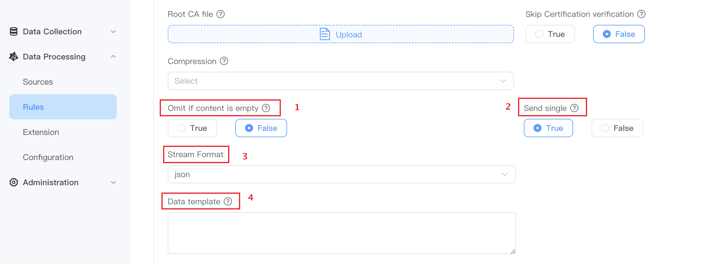
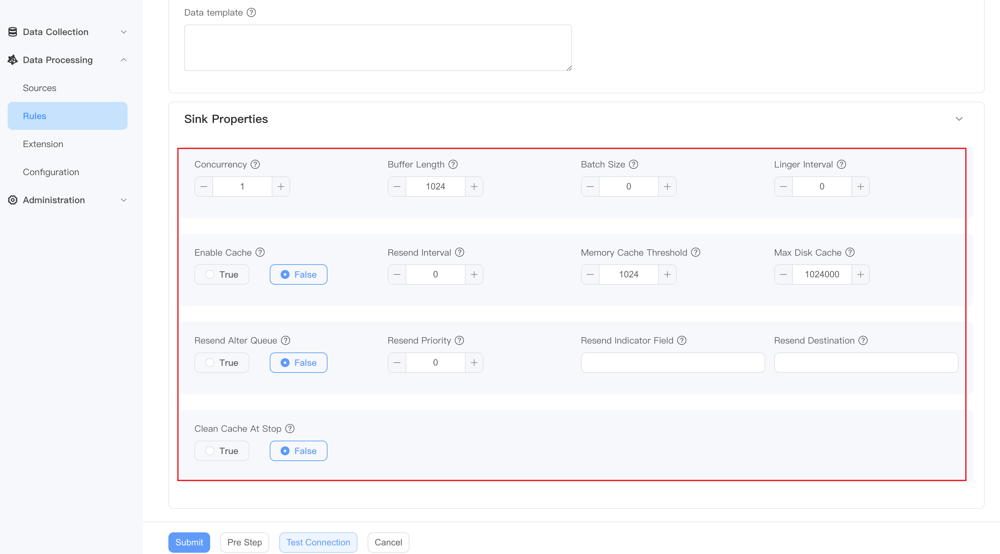

# Sink

In NeuronEX, Sink (Action) are used to write data to external systems.

## Sink Type

Users can directly use NeuronEX's built-in sink. The list of sink types is as follows:

- [MQTT](./mqtt.md): Output to external MQTT service.
- [Neuron](./neuron.md): Output to the data collection module of NeuronEX.
- [REST](./rest.md): Output to external HTTP server.
- [Memory](./memory.md): Output to the memory topic to form a rule pipeline.
- [Log](./log.md): Write log, usually only used for debugging.
- [SQL](./sql.md): Write to SQL database.
- [InfluxDB](./influx.md): Write to InfluxDB `v1.x`.
- [InfluxDB V2](./influx2.md): Write to InfluxDB `v2.x`.
- [File](./file.md): Write to file.
- [Nop](./nop.md): No output, used for performance testing.
- [Kafka](./kafka.md)：Output to Kafka 。

## Sink public parameter configuration



- **Omit if content is empty**

   Default is false.
   - `Omit if content is emptyt` is `true`. When the processing result of the rule SQL is empty, the output will be ignored.
   - `Omit if content is empty` is `false`, and when the processing result of the rule SQL is empty, `{}` is output.

- **Send single**

   - The default is true, the result messages will be sent in one-to-one correspondence, and the output format is generally `JSON` format.
   - If set to false, the result message will be sent based on the combination of processing results of the rule SQL. The output format is generally an `array` format wrapped in JSON.

- **Stream Format**

   Used to define the incoming data type, supporting `json`, `protobuf`, `binary`, `delimited` and `custom`, the default is `JSON`. The following is an introduction to some of the stream formats:

   - delimited

     For CSV file data source, you need to select the `delimited` format, and also specify a delimiter to distinguish the data fields, such as "`,`"

   - protobuf
  
     Protobuf is a way to serialize structured data. When the stream format is set to `protobuf`, the Schema used when decoding should also be configured. Schema can be defined in **Data Processing** -> **Configuration** -> **Schema**. For a detailed introduction to Schema, please refer to the [Schema](../config.md#Schema) chapter.

   - Binary
  
     For binary data streams, such as images or video streams, the data format needs to be specified as `binary`.

   - custom
  
     `custom` is a data format customized by the user.


- **Data Template**

   Data template allow users to perform "secondary processing" of analysis results to meet the diverse format requirements of different receiving systems. Utilizing the Golang template system, mechanisms for dynamic data conversion, conditional output, and iterative processing are provided, ensuring compatibility with various receivers and precise formatting.
   For a detailed introduction to data template, please refer to the [Data Template](./data_template.md) chapter.
  
   :::tip Tips
   **Data template** is an optional configuration. If no data template is specified, the results of rule processing will be output normally.
   :::
  

## Dynamic Properties

In some cases, users need to send results to different destinations based on data. For example, based on the received data, the calculation results are sent to different mqtt topics. This function can be achieved using dynamic attributes based on the [data template](./data_template.md) format. In the following example, the target's topic attribute is a data template formatted string that will send messages to a dynamic topic at runtime.

```json
{
   "id": "rule1",
   "sql": "SELECT topic FROM demo",
   "actions": [{
     "mqtt": {
       "sendSingle": true,
       "topic": "prefix/{{.topic}}"
     }
   }]
}
```

It should be noted that the `sendSingle` property is already set in the above example. By default, the target receives an array, and the jsonpath used needs to be <code v-pre>{{index . 0 "topic"}}</code>.

## Advanced configuration

You can click to expand the **Advanced** section for more customized settings.

- **Concurrency**: Set the number of running threads. When the parameter value is greater than 1, the order in which messages are sent may not be guaranteed.
- **Buffer Length**: Set the number of cacheable messages. If the number of cached messages exceeds this limit, the sink will block message reception until the number of cached messages is less than the limit.
- **batch Size**: Set the number of messages sent in batches.
- **Linger Interval**: Set the interval for batch sending, in milliseconds.
- **Enable Cache**: Set whether to enable caching, optional values True, False
- **Resend Interval**: The interval in millisecond to resend the cached messages.
- **Memory Cache Threshold**: The maximum number of messages to be cached in memory.
- **Max Disk Cache**: The maximum number of messages cached on disk.
- **Clean Cache At Stop**: Whether to clean the cache when the rule stops.
- **Resend Alter Queue**: Whether to use the backup queue when resending cache. If set to true, cache will be sent to the alternate queue instead of the original queue. This will cause real-time messages and resent messages to be sent using different queues, and the order of the messages will change, but it can prevent message storms. The following resend related configurations can only take effect when set to true.
- **Resend Priority**: The priority of the resend cache, type int, default is 0. -1 means sending real-time data first; 0 means equal priority; 1 means sending cached data first.
- **Resend Indicator Field**: Resend cached field names.
- **Resend Destination**: MQTT sink: This attribute indicates the topic of retransmission. If not set, it will still be passed to the original theme.



## Data cache

Actions in NeuronEX provide caching functionality to stage data in the event of a sending error and automatically resend the cached data after the error is recovered. The cache of actions can be divided into two levels of storage: memory and disk. The user can configure the number of memory caches. After exceeding the upper limit, the new cache will be stored offline in the disk, achieving greater cache capacity by simultaneously utilizing memory and disk space; in addition, the action will continue to detect the fault recovery status and support Resend without restarting the rule.


- **Error detection**: After a send failure, the sink should identify recoverable failures (network, etc.) by returning a specific error type, which will return a failed ack and trigger caching. After successful transmission, or in the case of unrecoverable errors, a successful ack will be sent to delete the cache.
- **Caching mechanism**: The cache will be saved in memory first. If the memory threshold is exceeded, subsequent caches will be saved to disk. Once the disk cache exceeds the disk storage threshold, the cache will start rotating, i.e. the oldest cache in memory will be discarded and the oldest cache in disk will be loaded instead.
- **Resend strategy**: The current caching mechanism can only run in the default synchronization mode. If a message is being sent, it will wait for the sending result to continue sending the next cached data. Otherwise, when new data arrives, the first data in the cache is sent to detect network conditions. If the send is successful, all caches in memory and disk will be sent in a sequential chain. Chain sending can define a sending interval to prevent message storms.

### Configuration

Action (Sink) cache configuration has two levels. Define the default behavior for all rules in the configuration file. There is also a rule sink layer defined to override the default behavior.

- enableCache: Whether to enable sink cache.
- memoryCacheThreshold: The number of messages to be cached in memory. For performance reasons, the oldest cached information is stored in memory so that it can be resent immediately upon recovery from a failure. The data here will be lost due to power outages and other failures.
- maxDiskCache: The maximum amount of information cached on disk. Disk cache is first in, first out. If the disk cache is full, the oldest page of information will be loaded into the memory cache, replacing the old memory cache.
- bufferPageSize: Buffer page is the unit of batch reading/writing to disk to prevent frequent IO. If the page is not full and NeuronEX crashes due to a hardware or software error, the last page not written to disk will be lost.
- resendInterval: The time interval for resending information after fault recovery to prevent information storms.
- cleanCacheAtStop: Whether to clean all caches when the rule is stopped to prevent large resends of expired messages when the rule is restarted. If not set to true, the memory cache will be stored to disk once the rule is stopped. Otherwise, memory and disk rules will be cleaned up.

In the example configuration of the following rules, the log sink has no cache-related options configured, so the global default configuration will be used; while the MQTT sink has configured its own cache strategy.

```json
{
   "id": "rule1",
   "sql": "SELECT * FROM demo",
   "actions": [{
     "log": {},
     "mqtt": {
       "server": "tcp://127.0.0.1:1883",
       "topic": "result/cache",
       "qos": 0,
       "enableCache": true,
       "memoryCacheThreshold": 2048,
       "maxDiskCache": 204800,
       "bufferPageSize": 512,
       "resendInterval": 10
     }
   }]
}
```

## Update action (Sink)

By default, Sink appends data to external systems. Some systems, such as memory, support updating or deleting data. Similar to lookup sources, only a few sinks are updateable. The `updateble` Sink must support inserts, updates and deletes. NeuronEX’s built-in `updateble` type sinks include:

- [Memory](./memory.md)
- [SQL](./sql.md)

In order to activate the update functionality, the Sink must set the `rowkindField` property to specify which field in the data represents the action to be taken. In the following example, `rowkindField` is set to `action`.

```json
{"sql": {
   "addr": "127.0.0.1:6379",
   "dataType": "string",
   "field": "id",
   "rowkindField": "action",
   "sendSingle": true
}}
```

The incoming data must have a field to represent the update action. In the following example, the `action` field is the action to be performed. Actions can be insert, update, upsert and delete. The action implementations of different sinks are different. Some sinks may perform the same actions for inserts, upserts, and updates.

```json
{"action":"update", "id":5, "name":"abc"}
```

This message will update the data with id 5 to the new name.