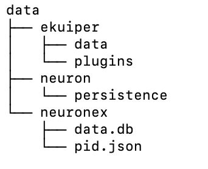

# 数据持久化

NeuronEX 将所有持久性数据放入其 `data` 目录中，用户可以轻松地升级 NeuronEX 而不担心丢失配置。

## 数据目录结构

`data` 目录中有三个目录，如下所示。


* ekuiper：数据处理相关配置
* Neuron：数据收集相关配置
* Neuronex：NeuronEX 相关配置

## 通过 Docker 部署

当使用 docker 部署时，用户可以将主机的一个目录挂载到 NeuronEX data 目录中，NeuronEX 所有配置都将被
保存到主机目录中。升级 NeuronEX 时，只需将相同的主机目录挂载到 NeuronEX 数据目录中，新的 NeuronEX 实例将使用之前所做的配置。另外第一次部署时，主机目录可以为空。

像下面的例子，我们在 host 中创建一个空目录，然后挂载到NeuronEX `/opt/neuronex/data`，然后本地空目录将被 NeuronEX 覆盖。当我们升级NeuronEX 时，我们可以将主机目录挂载到 `/opt/neuronex/data`, 这样主机目录中的所有配置
可由 NeuronEX 实例使用。

```shell
admin@Jianxiangs-MacBook-Pro /tmp % mkdir data
admin@Jianxiangs-MacBook-Pro /tmp % cd data 
admin@Jianxiangs-MacBook-Pro data % ls 
admin@Jianxiangs-MacBook-Pro data % pwd
/tmp/data
admin@Jianxiangs-MacBook-Pro data % docker run -d -p 8085:8085 -v /tmp/data:/opt/neuronex/data  --name neuronex  docker.io/library/neuronex:3.1.0-beta.2

5e256e21b0e5c7ca770fdcae64446d749d841148614bcacfcd064d3911004421
admin@Jianxiangs-MacBook-Pro data % 
admin@Jianxiangs-MacBook-Pro data % ls
ekuiper		neuron		neuronex
admin@Jianxiangs-MacBook-Pro data % 

```

## 通过二进制部署

当通过二进制部署时，所有配置都保存在本地到 NeuronEX 的数据目录中。
用户需要将旧版 NeuronEX 中的 `data` 目录复制到新版 NeuronEX `data` 目录中进行升级。