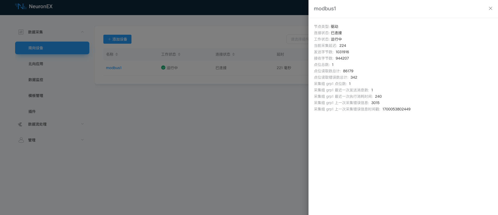
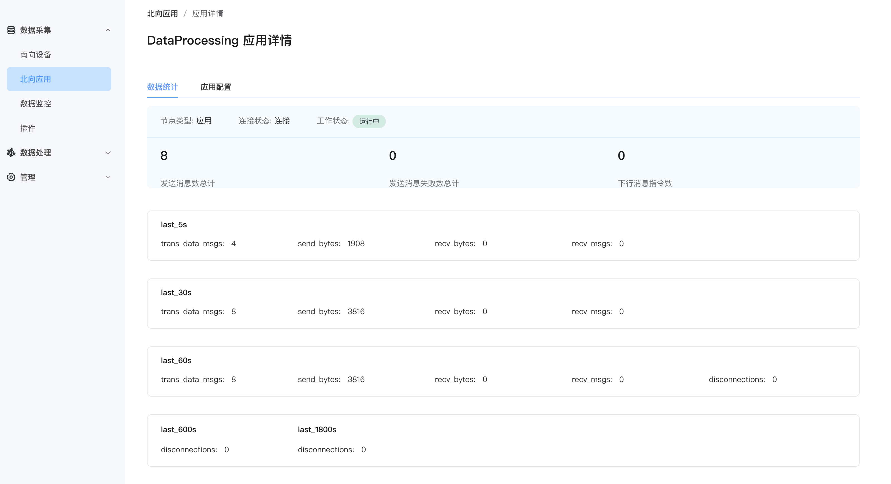
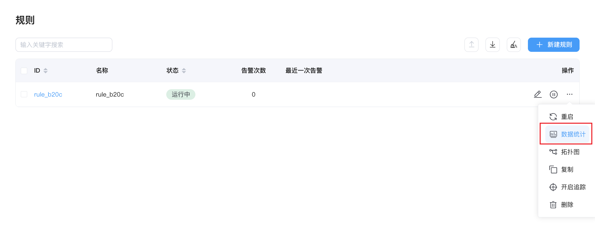
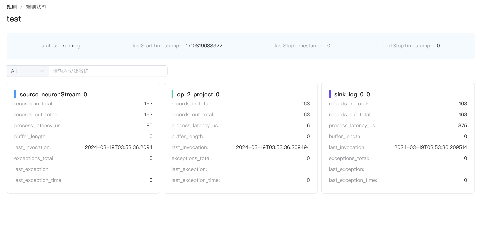

# 运行监控

## 状态统计

可查看驱动节点以及规则的运行状态统计信息，深入了解 NeuronEX 运行情况。

### 南向驱动状态统计

每个驱动节点卡片都有一个 `数据统计` 的操作按键，用于显示该节点统计的信息。

南向驱动节点的统计字段如下：
- 节点类型
- 连接状态
- 工作状态
- 当前采集延迟
- 发送字节数
- 接受字节数
- 点位总数
- 点位读取总数
- 点位读取错误数总计
- 采集组 XXX 点位数
- 采集组 XXX 最近一次发送消息数
- 采集组 XXX 最近一次执行消耗时间
- 采集组 XXX 上一次采集错误信息
- 采集组 XXX 上一次采集错误信息时间戳

::: tip 注意
不同的驱动或者配置的采集组数量不同，南向驱动节点的统计字段会略有差异。
:::

### 北向应用节点统计

北向应用节点的统计字段如下：
- 节点类型
- 连接状态
- 工作状态
- 发送消息数总计
- 发送消息失败数总计
- 下行消息指令数
- 缓存消息数

::: tip 注意
不同的北向应用节点的统计字段会略有差异。
:::

### 规则运行统计

点击规则的状态栏，可查看规则运行统计信息。

点击后，显示内容如下：

## 指标统计

NeuronEX 支持基于 Prometheus 的数据模型的指标统计功能，用于监测**驱动**、**规则**的运行状态。Prometheus 的基本原理是通过 HTTP 协议周期性抓取被监控组件的状态，任意组件只要提供对应的 HTTP 接口就可以接入监控，NeuronEX 提供对应的接口，可以顺利接入 Prometheus 进行监控。

- 数据采集模块的指标统计

http://x.x.x.x:8085/api/neuron/metrics

- 数据处理模块的指标统计

http://x.x.x.x:8085/api/ekuiper/metrics