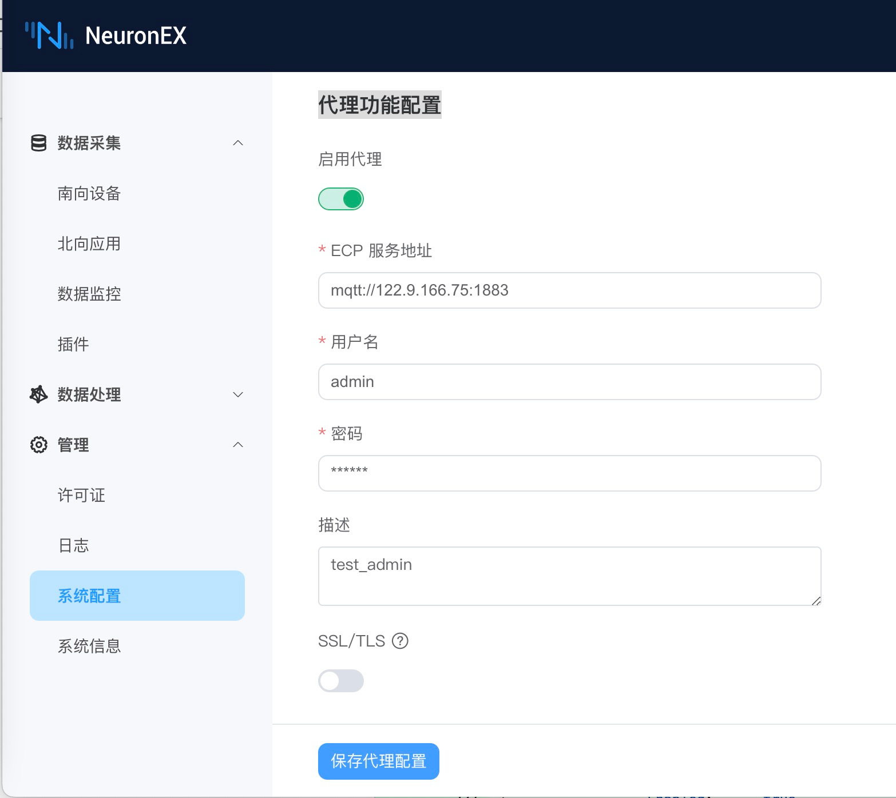

# ECP 纳管集成

当 NeuronEX 工作在私有网络中, ECP 无法通过 IP 地址直接访问 NeuronEX REST 服务时，ECP 可以通过 MQTT 纳管 NeuronEX，实现远程批量管理 NeuronEX 目的。

## 纳管配置开启

为了被 ECP 纳管，需要在 NeuronEX 上使能代理功能。点击 `管理` -> `系统配置` -> `代理功能配置`，点击启动代理并编辑与 ECP 连接的 MQTT 信息，如下图所示。

* ECP 服务地址：NeuronEX 通过 MQTT 协议与 ECP 通信，此处填写 ECP 部署的 MQTT Broker 连接地址。  
* 用户名：与 MQTT Broker 连接时，通过用户名、密码认证时填写的认证信息。
* 密码：同上。
* 描述： 该 NeuronEX 的注册描述信息，方便 ECP 端识别该 NeuronEX。

此外，如果 MQTT Broker 需要证书双向认证，则需要开启 SSL/TLS 功能。如下图所示。

当以上信息确认无误后，点击 `保存代理配置` NeuronEX 便会向 ECP 注册。用户在 ECP 端激活后便可纳管此 NeuronEX 。

## 纳管配置关闭

用户可以主动脱离 ECP 的纳管，只需要关掉代理纳管功能并点击 `保存代理配置`即可。