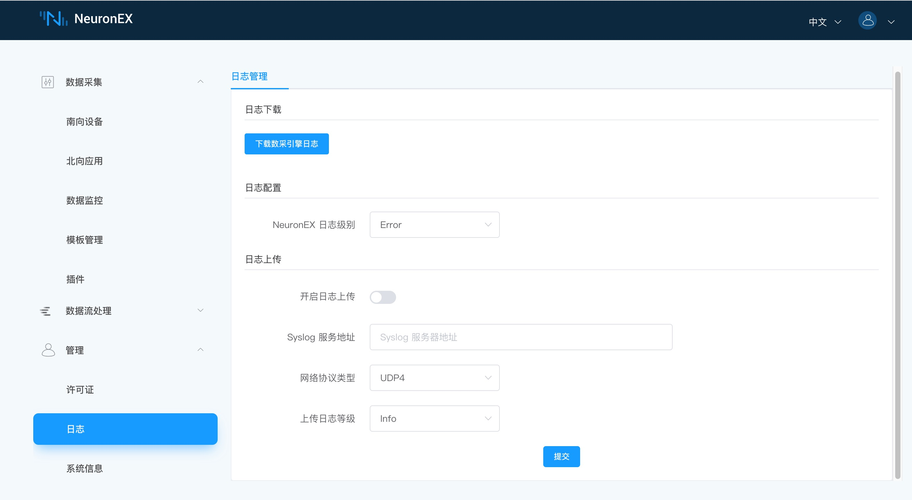
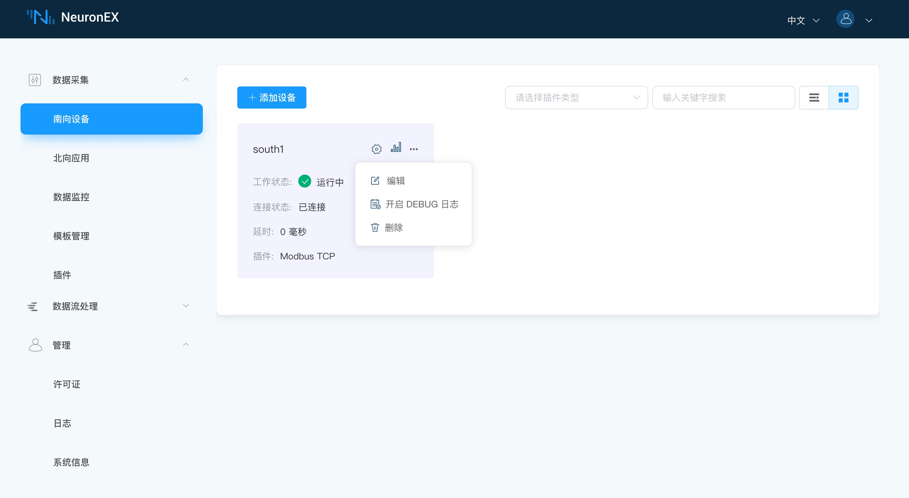

# 管理日志


NeuronEX 默认将日志打印到本地文件系统中，并在 Dashboard 上提供日志管理功能。


## 通过 Dashboard 进行日志管理

NeuronEX 支持在 Dashboard 页面一键下载所有日志文件的功能。登录 NeuronEX 后，点击页面左侧的 **管理** -> **日志**， 进入日志管理界面。


### 日志下载

  在日志下载部分，点击 **下载数采引擎日志** 按钮，即可下载数据采集引擎模块的日志。<br>
  该功能是把 /opt/neuronex/software/neuron/logs 的文件夹打包成 neuron_debug.tar.gz 文件并下载到网页上。文件包含所有已创建的驱动及 neuron 的日志文件，文件目录级别示例，如下图所示。


  * data-stream-processing.log：数据处理配置
  * dlt645.log：北向应用配置
  * modbus-plus-tcp.log：南向设备配置
  * neuron.log：Neuron 日志

### 日志配置

  如果现有日志信息不能满足需要， 在日志配置部分，可以动态设置日志级别，其中 Debug 级别将打印大量调试信息，有助于工程师调试分析程序故障，随着日志级别的升高，日志打印的信息越少。

:::tip  注意

注意此日志级别设置不会持久化，在 NeuronEX 重启后将恢复默认日志级别, 日志打印过多会对性能有一定影响，因此需要及时调整到较高级别。

:::

### 日志上传

  NeuronEX还支持将日志通过 SYSLOG 协议发送到 ECP 的 SYSLOG 服务器中，满足用户长期保存日志需求。


需配置以下参数
* 开启/关闭日志上传
* SYSLOG 服务地址 （只读，由ECP端配置）
* 网络协议类型 （只读，由ECP端配置）
* 上传日志等级 （只读，由ECP端配置）

:::tip  注意

此配置会持久化并且优先级高于[配置文件](./conf-management.md#log) syslogForward 部分。

:::

## 开启/关闭 驱动节点的 debug 日志

NeuronEX 支持开启/关闭某个驱动节点的 debug 日志，方便用户调试驱动，点击驱动节点的 `更多` -> `开启DEBUG日志` 按键，即可将日志级别设置为 debug，如下图所示。


此时，该驱动节点开始打印 debug 日志，用户可选择**下载数采引擎日志**，也可以选择在  /opt/neuronex/software/neuron/logs 下实时查看节点打印的日志。

::: tip 注意
打印节点 debug 日志时会打印很多冗余信息并对性能产生一定影响，当不需要时，请及时关闭。
:::

## 后台查看日志

除了在前端下载日志，用户还可以在后台实时观察日志输出。

数采引擎日志查看命令为

```shell
 tail -f tail -f /opt/neuronex/software/neuron/logs/neuron.log
```

数采引擎某南向节点日志查看命令为

```shell
 tail -f tail -f modbus-plus-tcp.log
```

数据处理引擎日志查看命令为

```shell
  tail -f /opt/neuronex/software/ekuiper/log/stream.log
```

NeuronEX 日志查看命令为

```shell
  tail -f /opt/neuronex/log/neuronex.log 
```

如果通过 Docker 部署，那么查看日志的命令为 ``docker exec <container_name> <command>``

数采引擎日志查看命令为

```shell
 docker exec neuronex tail -f /opt/neuronex/software/neuron/logs/neuron.log
```
