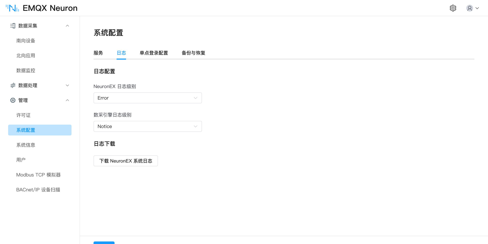
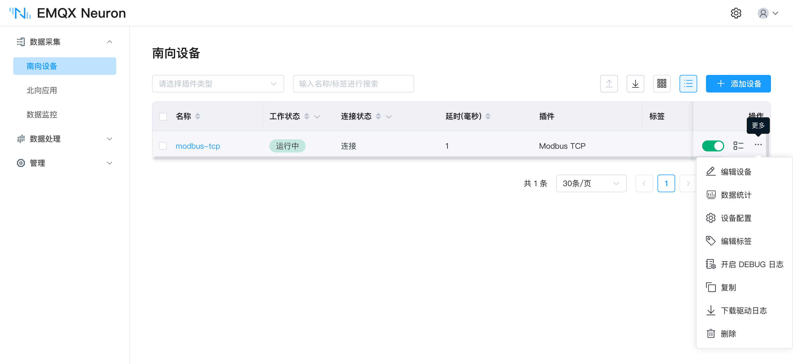

# 日志管理

EMQX Neuron 将日志打印到本地文件系统，并在控制台提供日志下载与级别配置。

## 下载日志

在 **管理 → 系统配置 → 日志** 页的「日志下载」区域，点击 `下载 NeuronEX 系统日志`，导出一个包含全部日志的压缩包。



压缩包包含三部分：

| 来源 | 目录 | 内容 |
| --- | --- | --- |
| 数采引擎 | `log/neuron/` | `neuron.log` 核心日志，以及每个已创建驱动的独立日志（如 `modbus-plus-tcp.log`、`dlt645.log`） |
| 数据处理引擎 | `log/ekuiper/` | `stream.log` 等 |
| EMQX Neuron | `log/neuronex/` | `neuronex.log`、`monitor.log` |

## 日志级别

在 **管理 → 系统配置 → 日志** 页分别设置 EMQX Neuron 与数采引擎的日志级别。Debug 级别打印大量调试信息，便于定位故障；级别越高打印越少。

::: tip
日志级别设置**不会持久化**，EMQX Neuron 重启后恢复默认级别。Debug 级别对性能有影响，排查结束后请及时调回。
:::

## 数采驱动 Debug 日志

除全局日志级别外，还可以单独打开某个驱动节点的 debug 日志。在驱动卡片上点击 `更多` -> `开启DEBUG日志`，该节点的日志级别即设为 debug：



随后点击该节点的 `下载驱动日志`，可单独下载这一个节点的日志文件。

::: tip
节点 debug 日志会打印大量冗余信息并影响性能，排查结束后请点击 `关闭DEBUG日志` 及时关闭。
:::

## 后台查看日志

除了在前端下载日志，用户还可以在后台实时观察日志输出。

数采引擎日志查看命令为

```shell
 tail -f /opt/neuronex/log/neuron/neuron.log
```

数采引擎某南向节点日志查看命令为

```shell
 tail -f /opt/neuronex/log/neuron/modbus-plus-tcp.log
```

数据处理模块日志查看命令为

```shell
  tail -f /opt/neuronex/log/ekuiper/stream.log
```

EMQX Neuron 日志查看命令为

```shell
  tail -f /opt/neuronex/log/neuronex/neuronex.log
```

如果通过 Docker 部署，那么查看日志的命令为 ``docker exec <container_name> <command>``

数采引擎日志查看命令为

```shell
 docker exec neuronex tail -f /opt/neuronex/log/neuron/neuron.log
```

## EMQX Neuron 异常退出日志

EMQX Neuron 异常退出时，会打印异常退出日志，用户可以通过查看异常退出日志，了解 EMQX Neuron 异常退出的原因。或者将日志信息提供给 EMQ 技术支持团队，以便快速定位问题。

- EMQX Neuron Docker 部署异常退出日志查看

```shell
docker logs <容器名>
```

```shell
admin@192 ~ % docker logs  neuronex-test
time="2024-12-16T08:57:55Z" level=info msg="trigger eKuiper with command: GOTRACEBACK=crash KUIPER__BASIC__RESTIP=127.0.0.1 KUIPER__BASIC__PROMETHEUS=true KUIPER__BASIC__PROMETHEUSPORT=9081 /opt/neuronex/software/ekuiper/bin/kuiperd -loadFileType absolute -etc /opt/neuronex/software/ekuiper/etc -data /opt/neuronex/data/ekuiper/data -log /opt/neuronex/software/ekuiper/log -plugins /opt/neuronex/data/ekuiper/plugins\n" file="process_control/process.go:87" func=monitor/process_control.get_ekuiper_Process
time="2024-12-16T08:57:55Z" level=info msg="trigger EMQX Neuron with command: /opt/neuronex/bin/neuronex alone\n" file="process_control/process.go:67" func=monitor/process_control.get_neuronex_Process
time="2024-12-16T08:57:55Z" level=info msg="trigger neuron with command: cd /opt/neuronex/software/neuron/ && ./neuron --log --disable_auth\n\n" file="process_control/process.go:98" func=monitor/process_control.get_neuron_Process
time="2024-12-16T08:57:56Z" level=info msg="set server total memory 2082197504 success" file="memory/mem.go:40"
time="2024-12-16T08:57:56Z" level=info msg="Set config 'kuiper.basic.prometheusport' to '9081' by environment variable" file="conf/load.go:141"
time="2024-12-16T08:57:56Z" level=info msg="Set config 'kuiper.basic.prometheus' to 'true' by environment variable" file="conf/load.go:141"
time="2024-12-16T08:57:56Z" level=info msg="Set config 'kuiper.basic.restip' to '127.0.0.1' by environment variable" file="conf/load.go:141"
```

- EMQX Neuron RPM/DEB 部署异常退出日志查看

```shell
journalctl -xeu neuronex
```

```shell
Dec 26 23:02:50 middleware02 bash[14275]: time="2024-12-26T23:02:50+08:00" level=info msg="trigger EMQX Neuron with command: /opt/neuronex/bin/neuronex alone\n" file="process_control/process.go:67" func=monitor/process_control.get_neuronex_Process
Dec 26 23:02:50 middleware02 bash[14275]: time="2024-12-26T23:02:50+08:00" level=info msg="trigger eKuiper with command: GOTRACEBACK=crash KUIPER__BASIC__RESTIP=127.0.0.1 KUIPER__BASIC__PROMETHEUS=true KUIPER__BASIC__PROMETHEUSPORT=9081 /opt/neuronex/software/ekuiper/bin/kuiperd -loadFileType absolute -etc /opt/neuronex/software/ekuiper/etc -data /opt/neuronex/data/ekuiper/data -log /opt/neuronex/software/ekuiper/log -plugins /opt/neuronex/data/ekuiper/plugins\n" file="process_control/process.go:87" func=monitor/process_control.get_ekuiper_Process
Dec 26 23:02:50 middleware02 bash[14275]: time="2024-12-26T23:02:50+08:00" level=info msg="trigger neuron with command: cd /opt/neuronex/software/neuron/ && ./neuron --log --disable_auth\n\n" file="process_control/process.go:98" func=monitor/process_control.get_neuron_Process
Dec 26 23:02:51 middleware02 bash[14275]: time="2024-12-26T23:02:51+08:00" level=info msg="set server total memory 33739272192 success" file="memory/mem.go:40"
Dec 26 23:02:51 middleware02 bash[14275]: time="2024-12-26T23:02:51+08:00" level=info msg="Set config 'kuiper.basic.prometheus' to 'true' by environment variable" file="conf/load.go:141"
Dec 26 23:02:51 middleware02 bash[14275]: time="2024-12-26T23:02:51+08:00" level=info msg="Set config 'kuiper.basic.prometheusport' to '9081' by environment variable" file="conf/load.go:141"
Dec 26 23:02:51 middleware02 bash[14275]: time="2024-12-26T23:02:51+08:00" level=info msg="Set config 'kuiper.basic.restip' to '127.0.0.1' by environment variable" file="conf/load.go:141"
Dec 27 00:59:38 middleware02 bash[14275]: panic: runtime error: slice bounds out of range [71:63]
Dec 27 00:59:38 middleware02 bash[14275]: goroutine 4770 [running]:
Dec 27 00:59:38 middleware02 bash[14275]: github.com/emqx/neuronex-go/logic/monitor/alert/rule_processor.(*StrQueue).RemoveHalf(...)
```
