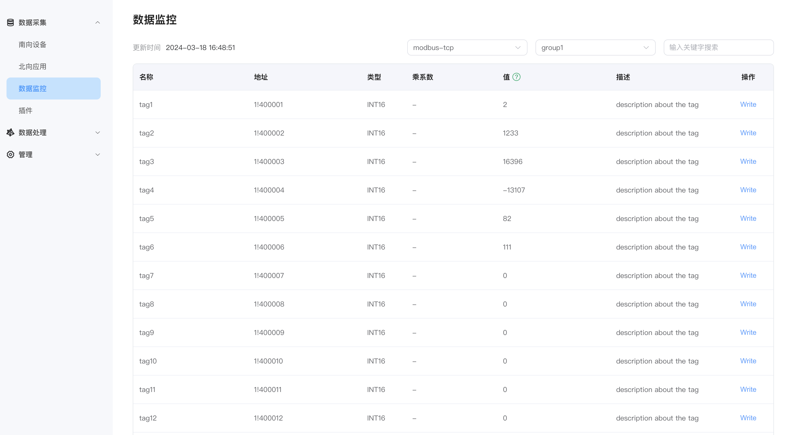

# 数据监控

## 南向驱动采集监控仪表盘

点击左侧的`数据监控`，选择南向设备和组名称，查看点位数值。

* 南向设备：选择想要查看的南向设备，例如，选择已创建的设备 modbus-tcp-1;
* 组名称：选择想要查看的南向设备下的组，例如，选择已创建的组 group-1；
* 数据监控以组为单位显示数值，页面将会展示读取到的组内每个标签的值。

## 反控设备

NeuronEX 提供通过南向驱动向设备下发指令控制的能力。通过以下各种途径可以向设备发出指令:

- NeuronEX 的数据流处理模块
- 其他第三方应用程序
- 工业互联网平台
- 云平台应用

向设备发送命令有三种方式：
- 用户可以在[仪表板监控屏幕](#监控仪表盘数据写入)上发出命令。
- 通过 [RESTful APIs](https://docs.emqx.com/zh/neuronex/latest/api/api-docs.html#tag/rw) 传递命令。
- 通过NeuronEX 的MQTT 数据下行通道。任何外部系统，如基于云的平台，都可以将指令数据发布到特定MQTT主题，NeuronEX 接收到指令数据并发送到设备。

### 监控仪表盘数据写入

当点位为写属性时，数据监控界面的 Tag 会有一个写操作，点击 `Write` 可以实现反控设备，例如，修改具有写属性的 1!40001 点位地址的值，如下图所示。

* 单击要改值的标签末尾的 `Write` 按键；
* 选择是否以十六进制方式输入，不选择；
* 输入标签新值，例如，123；
* 单击`提交`按键提交新的值。

::: tip
设备中该点位也必须具有可写属性，否则无法写成功。
:::

### 查看设备点位值是否修改成功

打开 Modbus 模拟器，查看点位值是否变化，如下图所示。

