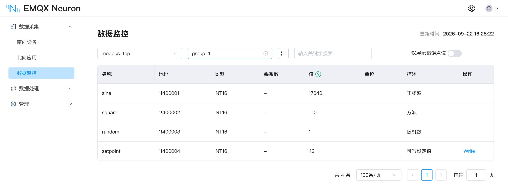
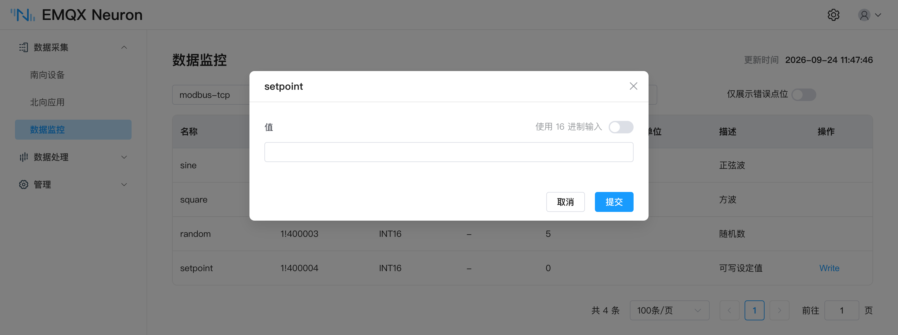

# 数据监控与反控

数据监控页面显示南向驱动采集到的点位实时值，同时提供向设备写入的入口。配置完组与点位之后，此页是确认采集链路是否正常的第一步。

## 查看采集数据

在 **数据采集 → 数据监控** 页选择南向设备和组名称：

| 选项 | 说明 |
| --- | --- |
| **南向设备** | 选择要查看的南向驱动节点，例如 `modbus-tcp` |
| **组名称** | 选择该节点下的采集组，例如 `group-1` |
| **关键字搜索** | 按点位名称筛选，用于在大量点位中定位单个点位 |
| **仅展示错误点位** | 只显示采集失败的点位。点位数量多时，用于快速定位地址配错或设备不支持的点位 |

数值能随设备变化持续刷新，说明采集链路正常。数值不刷新或显示错误码时，见[连接排查](../configuration/south-devices/south-devices.md#连接排查)。

## 反控设备

EMQX Neuron 的数据链路是双向的：除采集设备数据外，也可将指令写回设备，修改设备参数或控制设备行为。

目标点位必须带 **write** 属性，见[组与点位 · 点位属性](../configuration/groups-tags/groups-tags.md#点位属性)。设备侧该地址同样需要可写，否则写入失败。

共有四条反控通道：

| 通道 | 适用场景 |
| --- | --- |
| **数据监控页面** | 人工调试与验证，见下方[在数据监控页写入](#在数据监控页写入) |
| **北向应用** | 云平台或上位系统下发指令。MQTT 与 AWS IoT 通过写请求主题，Azure IoT 通过云到设备消息，Sparkplug B 通过 DCMD 命令，OPC UA Server 由客户端直接写变量节点。见[北向应用](../configuration/north-apps/catalog.md) |
| **数据处理** | 规则计算结果直接写回设备，构成「采集 → 判断 → 控制」的边缘闭环，见 [Neuron Sink](../streaming-processing/sink/neuron.md) |
| **HTTP API** | 第三方程序集成，见 [API 文档](https://docs.emqx.com/zh/neuronex/latest/api/api-docs.html#tag/rw) |

四条通道的完整示例见[设备反控功能详解](../best-practise/device-control.md)。

### 在数据监控页写入

点位带 write 属性时，数据监控页该点位末尾会出现 `Write` 按钮：

1. 点击目标点位末尾的 `Write`。
2. 选择是否以十六进制输入。
3. 输入新值，例如 `123`。
4. 点击 `提交`。

写入完成后，点位的实时值应更新为新值。也可以在设备侧或模拟器中确认：

::: tip
写入失败时先确认以下两点：点位在 EMQX Neuron 中带 `write` 属性，且设备侧该地址允许写入。部分协议的保持寄存器按位写入还需要驱动开启对应功能码，见相应驱动页面。
:::
