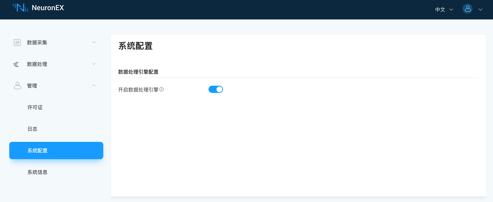
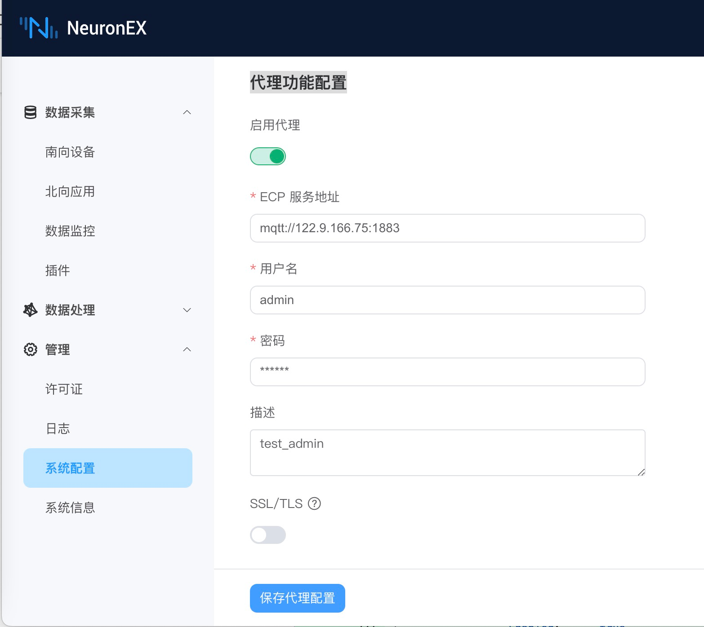
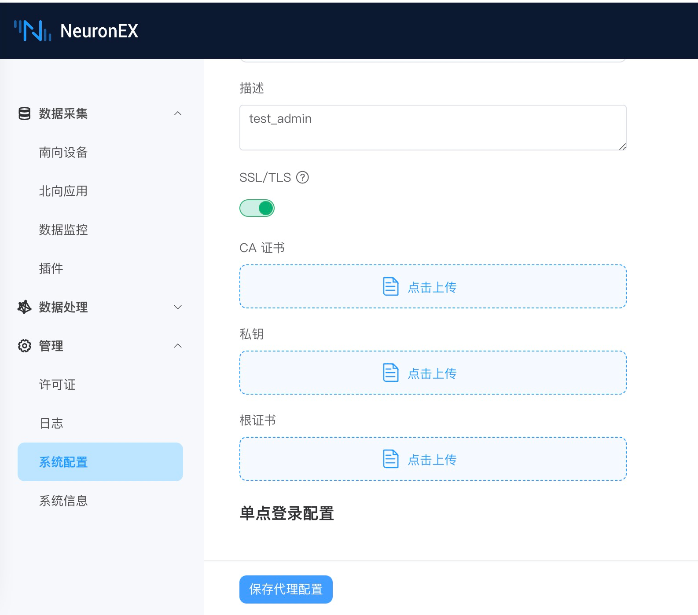
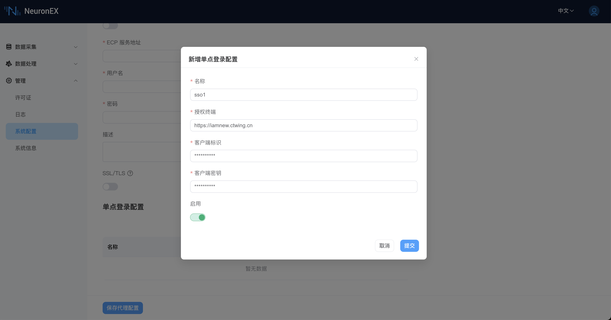

# 系统配置

NeuronEX 支持在 Dashboard 上对相关功能进行配置修改。

## 数据处理引擎配置
登录 NeuronEX 后，点击页面左侧的 **管理** -> **系统配置**， 进入系统配置界面。可手动开启、关闭数据处理引擎。

:::tip  注意

关闭数据处理引擎，会造成数据处理功能不可用，请谨慎操作！

:::

## 代理功能配置

当 NeuronEX 部署后存在 IP 变动或者网络地址转换的情况, ECP 无法通过 IP 地址直接访问 NeuronEX 服务以及纳入管理时，通过配置代理功能，由 NeuronEX 端配置 ECP 侧的连接信息，主动发起连接，ECP 进而实现后续的远程纳管功能。 

### 纳管配置开启

在以上情况下，为了被 ECP 纳管，需要在 NeuronEX 上开启代理功能。点击 `管理` -> `系统配置` -> `代理功能配置`，点击启动代理并编辑与 ECP 连接的 MQTT 信息，如下图所示。

* **ECP 服务地址**：NeuronEX 通过 MQTT 协议与 ECP 通信，此处填写 ECP 部署的 MQTT Broker 连接地址。  
* **用户名**：与 MQTT Broker 连接时，通过用户名、密码认证时填写的认证信息。
* **密码**：同上。
* **描述**： 该 NeuronEX 的注册描述信息，方便 ECP 端识别该 NeuronEX。

此外，如果 MQTT Broker 需要证书双向认证，则需要开启 SSL/TLS 功能。如下图所示。

当以上信息确认无误后，点击 `保存代理配置`，NeuronEX 便会向 ECP 注册。用户在 ECP 端激活后便可纳管此 NeuronEX 。

### 纳管配置关闭

用户可以主动脱离 ECP 的纳管，只需要关掉代理纳管功能并点击 `保存代理配置`即可。

## 单点登录配置

NeuronEX 使用 OAuth2.0 协议实现单点登录功能，用户需先在 SSO 服务上配置 NeuronEX 的单点登录 URL 地址。例如，http://127.0.0.1:8085/web/common

NeuronEX 页面上需配置 SSO 服务的访问地址及相关参数。

:::tip 注意

客户端标识和客户端密钥从 SSO 服务上查找，需正确填写。

:::
