# 系统配置

EMQX Neuron 支持在 Dashboard 上对相关功能进行配置修改。

## 数据处理引擎配置

### 启动数据处理引擎
登录 EMQX Neuron 后，点击页面左侧的 **管理** -> **系统配置**， 进入系统配置界面。可手动开启、关闭数据处理引擎。

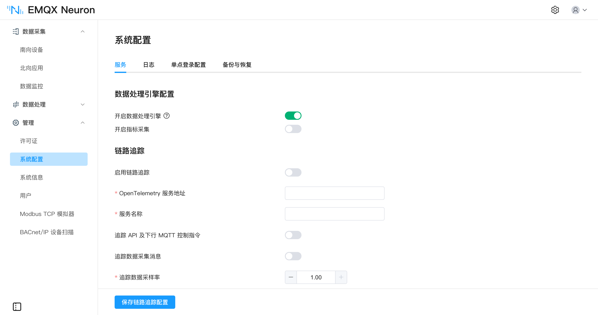

:::tip  注意

关闭数据处理引擎，会造成数据处理功能不可用，请谨慎操作！

:::

### 开启指标采集

开启指标采集后，数据处理引擎的运行指标（metrics）会被采集并存储到本地文件目录。

当开启指标采集时，在**日志**->**日志管理**页面，点击**下载数据处理引擎日志**按钮，可以下载完整的日志及指标文件。点击**下载自定义日志指标文件**按钮，可以自行勾选需要下载的日志或指标文件。

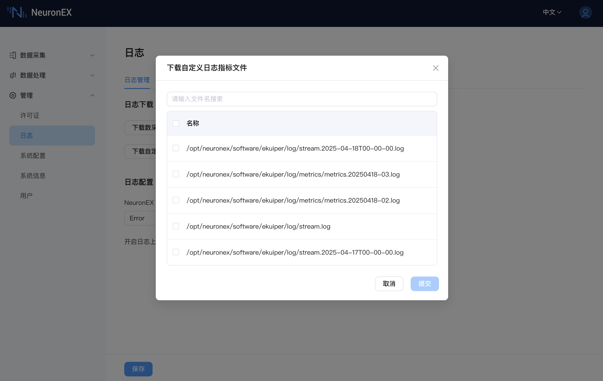

:::tip  注意

开启指标采集功能后，如果规则处理的数据接入量较大，可能会导致指标文件过大，需要消耗较多的磁盘空间。

:::

## 单点登录配置

EMQX Neuron 使用 OAuth2.0 协议实现单点登录功能。

### 天翼物联

在天翼物联平台配置 EMQX Neuron 的单点登录 URL 地址，格式：[EMQX Neuron 访问地址]/web/common。例如，http://127.0.0.1:8085/web/common

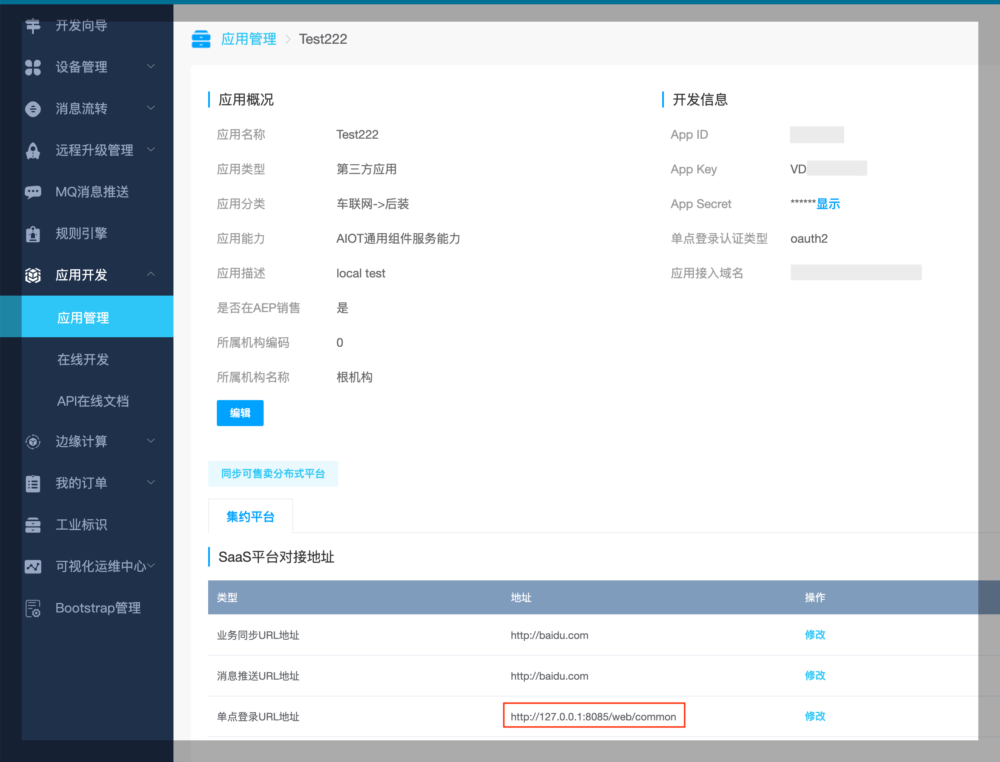

天翼物联平台提供客户端标识（App Key）和客户端密钥（App Secret）给 EMQX Neuron 配置页面。

在 EMQX Neuron 页面上需配置 SSO 服务的访问地址及相关参数。

:::tip 注意

Scope、Grant Type、Request Method 和 Content Type 字段需要根据平台要求填写。

:::

### Azure

在 Azure 平台上进入 Microsoft Entra ID -> App registrations 页面，找到相应的 App 填写 EMQX Neuron 的单点登录 URL 地址，格式同上。

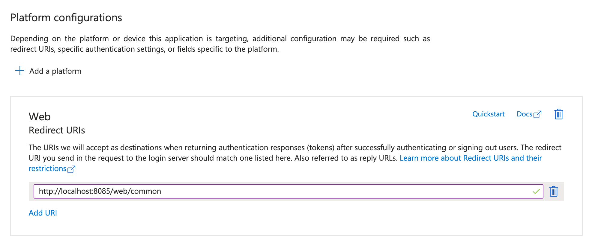

Overview 页面获取客户端标识（client id ）给 EMQX Neuron 配置页面。

Certificates & secrets 页面获取客户端密钥（client secret）给 EMQX Neuron 配置页面。

Overview -> Endpoints 页面获取授权终端 URL 和 Token 中端 URL。

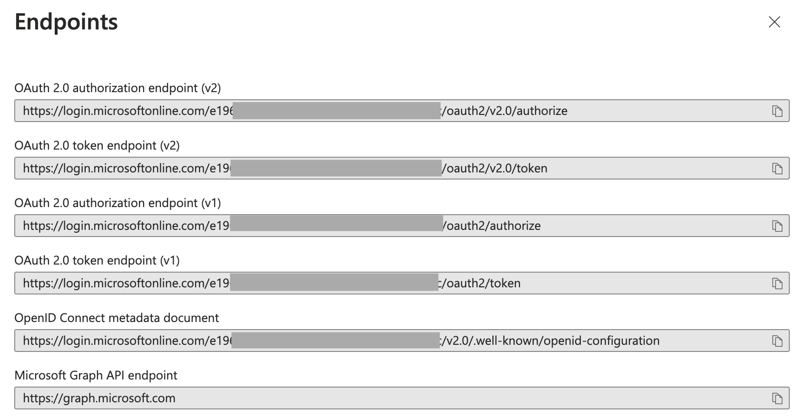

在 EMQX Neuron 页面上需配置 SSO 服务的访问地址及相关参数。

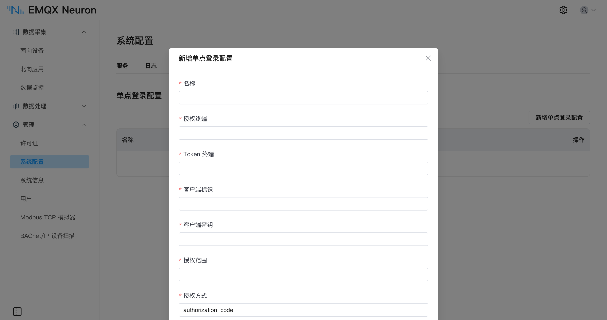

:::tip 注意

授权范围（Scope）、授权方式（Grant Type）、请求方法（Request Method）和内容类型（Content Type）字段需要根据平台要求填写。

:::

## 网络连接测试

输入设备的 IP，确认 EMQX Neuron 运行环境能否访问到设备的 IP 地址：

## 内置 Modbus TCP Server 模拟器

在 `内置 Modbus TCP Server 模拟器` 选项卡中启动模拟器、配置模拟点位，并下载对应的南向驱动配置，用于在无硬件环境下验证采集链路。详见[内置 Modbus TCP Server 模拟器](../configuration/modbus-simulator.md)。

## 备份与恢复

在 `备份与恢复` 选项卡中将全部配置导出为一个文件，或导入备份文件覆盖现有配置。覆盖范围、与其他备份方式的区别以及执行时机，见[备份与恢复](./backup-restore.md)。

## 代理功能配置

当 EMQX Neuron 部署后存在 IP 变动或者网络地址转换的情况, ECP 无法通过 IP 地址直接访问 EMQX Neuron 服务以及纳入管理时，通过配置代理功能，由 EMQX Neuron 端配置 ECP 侧的连接信息，主动发起连接，ECP 进而实现后续的远程纳管功能。 

### 纳管配置开启

在以上情况下，为了被 ECP 纳管，需要在 EMQX Neuron 上开启代理功能。点击 `管理` -> `系统配置` -> `代理功能配置`，点击启动代理并编辑与 ECP 连接的 MQTT 信息，如下图所示。
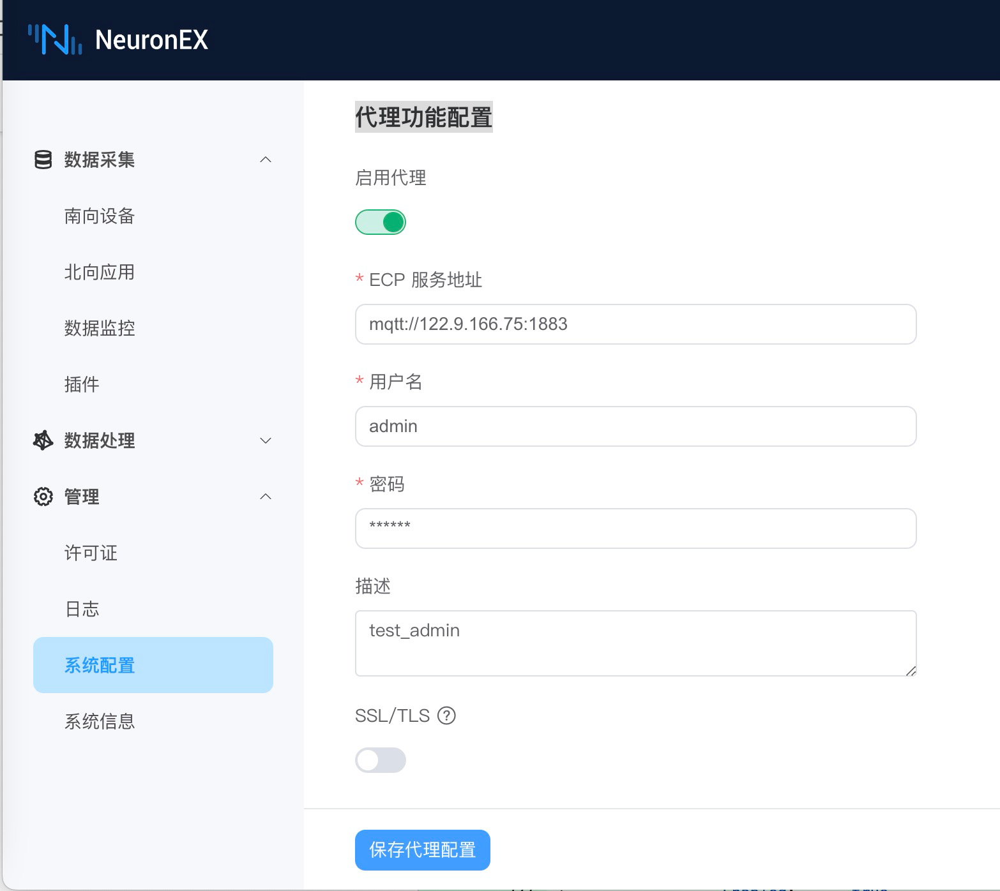

* **ECP 服务地址**：EMQX Neuron 通过 MQTT 协议与 ECP 通信，此处填写 ECP 部署的 MQTT Broker 连接地址。  
* **用户名**：与 MQTT Broker 连接时，通过用户名、密码认证时填写的认证信息。
* **密码**：同上。
* **描述**： 该 EMQX Neuron 的注册描述信息，方便 ECP 端识别该 EMQX Neuron。

此外，如果 MQTT Broker 需要证书双向认证，则需要开启 SSL/TLS 功能。如下图所示。
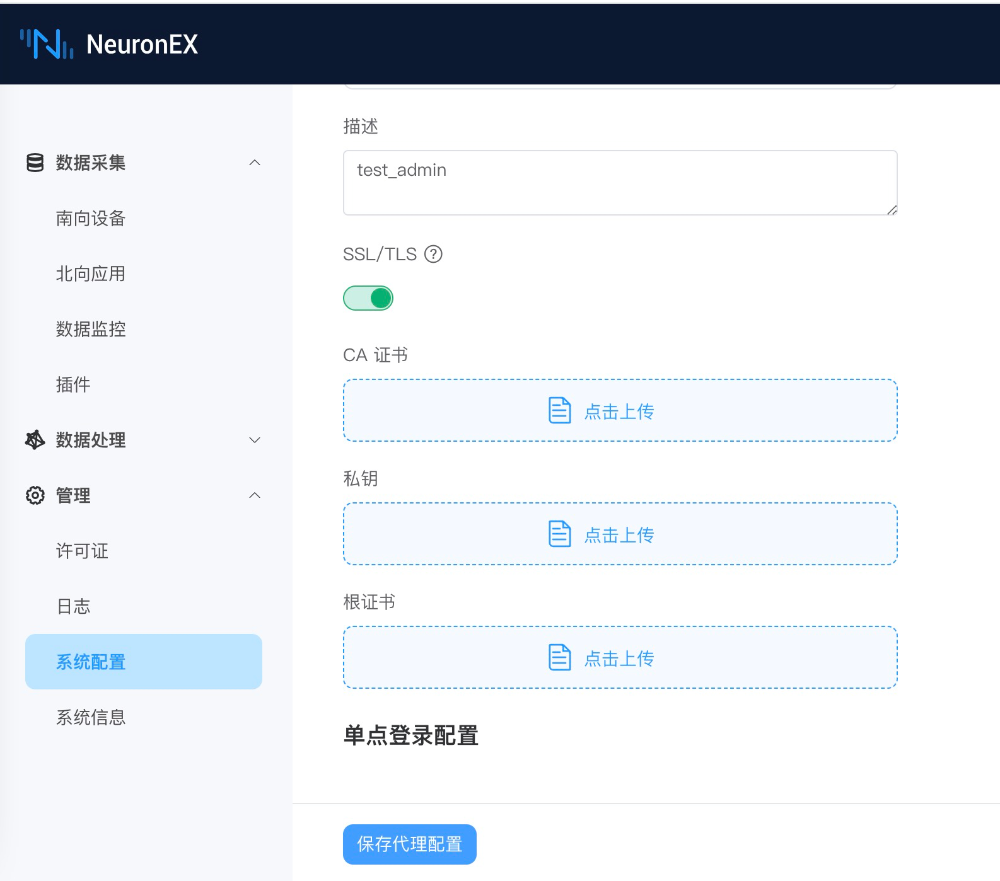

当以上信息确认无误后，点击 `保存代理配置`，EMQX Neuron 便会向 ECP 注册。用户在 ECP 端激活后便可纳管此 EMQX Neuron 。

### 纳管配置关闭

用户可以主动脱离 ECP 的纳管，只需要关掉代理纳管功能并点击 `保存代理配置`即可。

## 链路追踪

链路追踪功能用于追踪 EMQX Neuron 中数据采集、处理分析以及转发过程中的详细处理过程，可以应用于以下几类场景：

- MQTT 下行控制指令追踪
    - EMQX Neuron 可结合 EMQX V5 对应用端下发的 MQTT 控制指令进行全链路追踪，监测全链路指令控制时延，分析各节点的时延信息，应用于对控制延迟要求较高的场景，进行故障分析。
- EMQX Neuron API 下行控制指令追踪
    - 可记录 EMQX Neuron API 下发控制指令的详细过程，分析 EMQX Neuron 发送指令到设备到收到设备响应的完整链路和时延，应用于对控制指令下发的可靠性要求较高的场景，进行故障分析。
- 数采链路追踪
    - 可记录数据采集、数据计算以及结合 EMQX 的数据链路追踪，应用于采集延迟检测、数据丢失检测等场景。
- 边缘计算数据追踪
    - 可记录边缘计算过程中每个算子计算的详细过程，以及在各个算子数据处理后的数据结果。

### 配置说明

- **启用链路追踪** : 启用链路追踪功能。

- **OpenTelemetry 服务地址** : 填写 OpenTelemetry 服务地址，EMQX Neuron 将追踪数据发送到该地址。 EMQX ECP 软件集成了 OpenTelemetry 服务，用户可直接使用 EMQX ECP 的 OpenTelemetry 服务地址。

::: tip
EMQX ECP 的 OpenTelemetry 服务地址请使用[ip]:[port]方式，例如`192.168.1.100:4318`，不要带有 `http://` 前缀。
:::

- **服务名称** : 填写服务名称，EMQX Neuron 上报追踪数据时，将使用该服务名称，用于区分不同 EMQX Neuron 上报的追踪数据。

- **追踪 API 及下行 MQTT 控制指令** : 开启追踪 API 及下行 MQTT 控制指令。如使用下行 MQTT 控制指令，还需要在北向应用页面将 MQTT 应用的`MQTT版本`设置为`5.0`。

- **追踪数据采集消息** : 开启追踪数据采集消息，开启后，EMQX Neuron 将所有南向驱动采集消息的追踪数据上报到 OpenTelemetry 服务。（目前仅支持 FINS TCP、FINS UDP、Mitsubishi 3E、Mewtocol、 Modbus RTU/TCP  驱动）

- **追踪数据采样率** : 填写追踪数据采样率。范围：0-1。1表示100%采样率全量追踪，0.1表示10%采样率追踪。仅在**开启追踪数据采集消息**时，该参数有效。

:::tip 注意

开启链路追踪功能后，EMQX Neuron 会产生一定的性能开销，请根据实际需求开启。

:::

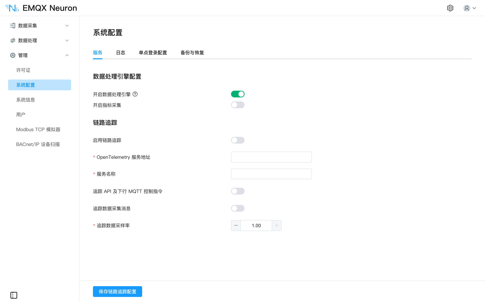

### 单独开启规则追踪

在规则页面，点击规则操作列的`开启追踪`按钮，可直接开启该条规则的追踪。

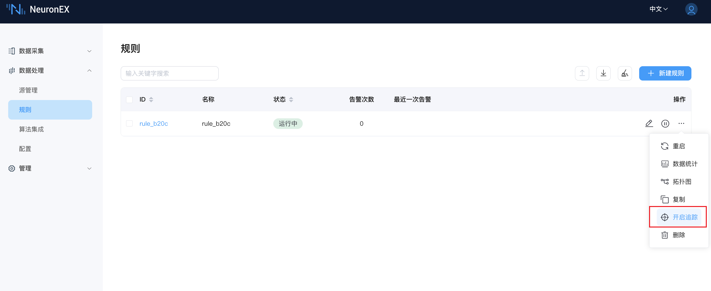

### EMQX Neuron API 下行控制指令追踪

方式一：在向 EMQX Neuron 发送 API 请求时， Header 中添加 `tracestate: tracer=start` 参数，EMQX Neuron 才会记录该条 API 请求的追踪数据。以 Postman 为例，如下图所示。

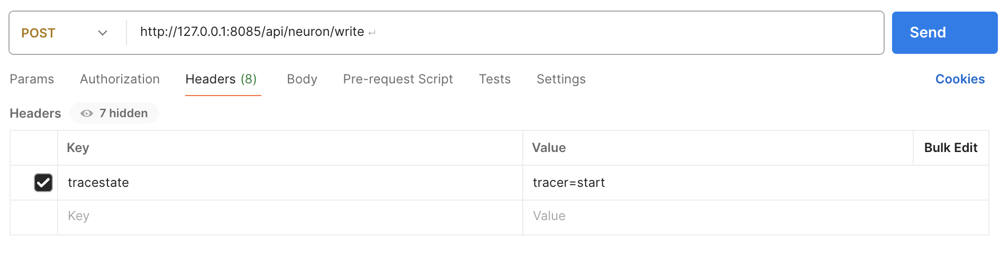

方式二：在开启链路追踪功能后，在 EMQX Neuron 数据监控页面，点击`write`写入数据到设备，会自动记录该条 API 请求的追踪数据。

:::tip 注意

在 EMQX Neuron Dashboard 上进行的其他非点位写入操作，不会记录追踪数据。

:::

### MQTT 下行控制指令追踪

实现 MQTT 下行控制指令追踪，需要同时满足以下条件：

- 北向应用页面将 MQTT 应用的`MQTT版本`设置为`5.0`，如下图：

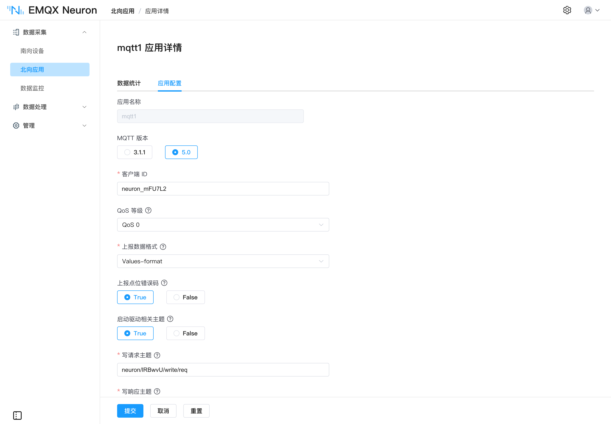

- 使用 EMQX V5 版本，并且开启链路追踪功能，配置如下图：

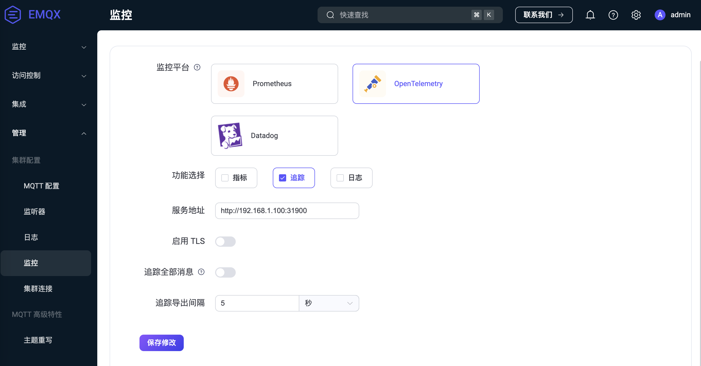

- 第三方 MQTT 客户端支持 MQTT V5.0 协议，并且发送 MQTT 消息时，在自定义属性中添加如下属性：
    `traceparent: 00-cce3a024ca134a7cb4b41e048e8d98de-cef47eaa4ebc3fae-01` 

    以 MQTTX 为例，如下图所示：

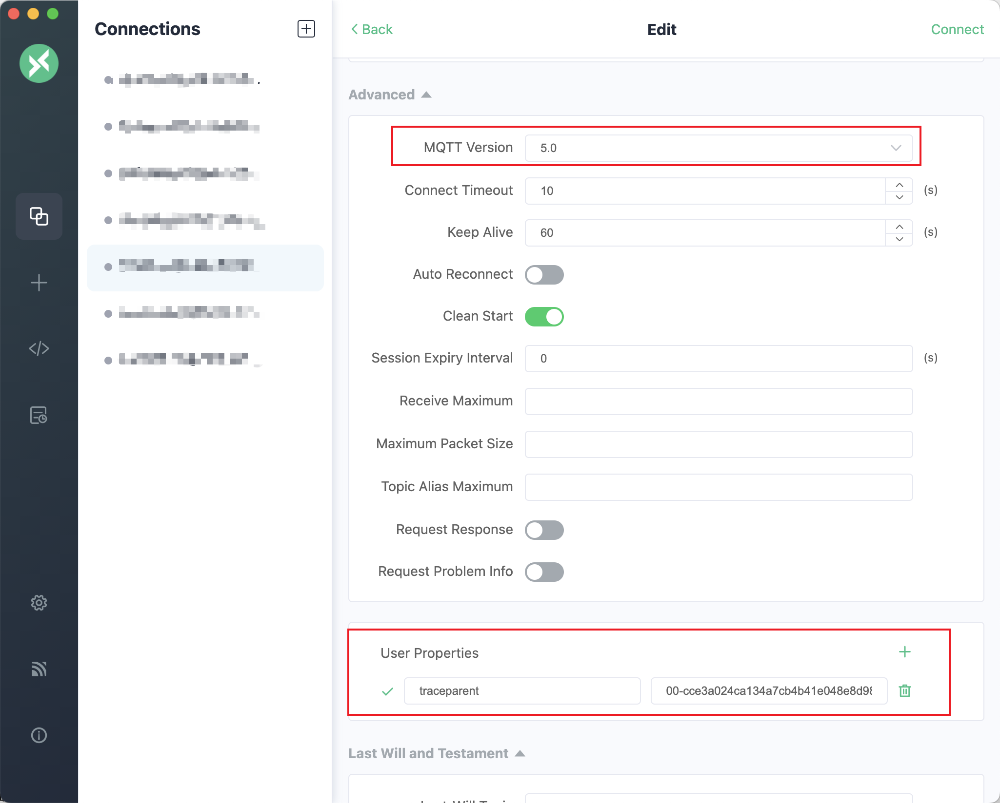
