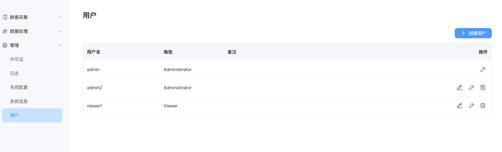

# 用户管理

从 NeuronEX 3.3 开始，Dashboard 用户引入了 基于角色的访问控制 （RBAC）功能。RBAC 允许根据用户在组织中的角色为其分配权限。此功能简化了授权管理，通过限制访问权限提高安全性。

**用户管理**页面提供了所有活跃的 Dashboard 用户的概览。

## 创建用户

要添加新用户，只需点击页面右上角的**创建用户**按钮。一个弹出的对话框将提示您输入必要的用户详细信息。输入完毕后，点击**创建**按钮即可生成用户帐户。对于进一步的用户管理，如编辑用户信息、更新密码或删除用户，您可以通过**操作**列轻松访问这些选项。

## 角色介绍

目前，可以为用户设置以下两种预定义角色之一。您可以在创建用户时从**角色**下拉菜单中选择角色。
- **Administrator** 

    Administrator (管理员) 拥有对 NeuronEX 所有功能和资源的完全管理访问权限，包括数据采集、数据处理、以及系统配置管理。

- **Viewer**

    Viewer (查看者) 可以访问 NeuronEX 的所有数据和配置信息，对应 REST API 中的所有 `GET` 请求，但无权进行创建、修改和删除操作。

::: tip  
NeuronEX 安装后自带的登录用户名及密码为`admin/0000`，`admin` 用户默认为 Administrator 角色，无法删除及修改角色，可以修改密码。
另外可以通过环境变量的方式，在首次启动时修改 admin 用户默认密码以及增加一个 viewer 用户。  
- NEURONEX__SERVER__ADMIN__PASSWORD='xxxxxx'， xxxxxx 为 admin 用户修改后的密码
- NEURONEX__SERVER__VIEWER__USERNAME='user1'，user1 为 viewer 用户用户名
- NEURONEX__SERVER__VIEWER__PASSWORD='xxxxxx'，xxxxxx 为 viewer 用户密码

admin 用户通过以上设置登录系统后，可以继续修改上述用户的密码

:::

::: warning

NeuronEX 用户管理功能与认证功能相关，如需使用多用户功能，请确保未手动关闭认证功能(默认配置下，认证功能是开启的)：

1. 在安装包部署时，未设置 `NEURONEX_DISABLE_AUTH=1` 环境变量
2. 在 Docker 部署时，未设置 `NEURONEX_DISABLE_AUTH=1` 环境变量
3. 位于`/opt/neuronex/etc/neuronex.yaml`的配置文件中的配置项 `disableAuth` 未关闭 Token 认证。

:::

## ECP 用户管理

当用户使用 ECP 远程管理 NeuronEX 时:
- ECP 侧的项目管理员等同于 NeuronEX 的 Administrator 角色，将拥有对 NeuronEX 所有功能和资源的完全管理访问权限。

- ECP 侧的项目成员等同于 NeuronEX 的 Viewer 角色，只能访问 NeuronEX 的数据和配置信息。