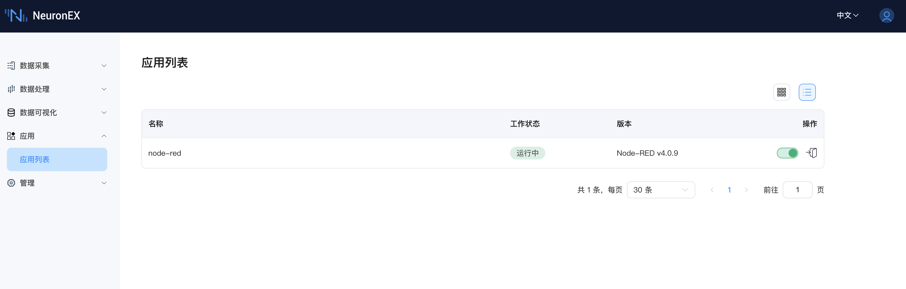

# Node-RED 集成

NeuronEX 集成了 Node-RED，这是一款广受欢迎的开源可视化编程工具，采用基于流程的开发方式。此集成允许用户利用 Node-RED 丰富的节点库，对 NeuronEX 采集和管理的数据执行复杂的数据处理，并构建自定义工作流。

## 可用性

从 NeuronEX 3.6.0 版本开始，**Node-RED v4.0.9** 已在以下 Docker 镜像中默认集成：

*   `emqx/neuronex:3.6.0-ai`
*   `emqx/neuronex:3.6.0-ai-arm64`

对于其他安装包（例如 deb, rpm, zip）或其他 Docker 镜像，Node-RED 未被集成。

## 启用和访问 Node-RED

默认情况下，Node-RED 服务是**关闭**的。您可以通过 NeuronEX 的**应用列表**来启用和访问它。

1.  从左侧菜单导航至 **应用** -> **应用列表**。
2.  您将在列表中看到 `node-red` 应用，以及其**版本** (Node-RED v4.0.9) 和当前的**工作状态**。

 

*   **启用/禁用服务:**
    *   在 `node-red` 条目的**操作**列中，使用拨动开关来启动或停止 Node-RED 服务。
    *   当服务运行时，其**工作状态**将显示为“运行中”。
*   **访问 Node-RED UI:**
    *   一旦 Node-RED 服务正在运行，点击**操作**列中的“进入”图标，这将在新的浏览器标签页中打开 Node-RED 界面，允许您创建和管理您的流程。

## 将数据发送到 Node-RED

NeuronEX 支持通过以下方式将数据推送到您的 Node-RED 流程中进行进一步处理：

*   **北向 Websocket 应用:**
    您可以在 NeuronEX 中配置一个 Websocket 应用来发送数据。然后在 Node-RED 中，您可以使用 `websocket in` 节点连接到 NeuronEX 的此 Websocket 端点以接收数据。
*   **数据处理模块 REST Sink:**
    利用 NeuronEX 数据处理模块中的 REST Sink。配置 REST Sink 将数据 POST 到您在 Node-RED 中使用 `http in` 节点创建的 HTTP 端点。

此集成通过允许用户在熟悉的 Node-RED 环境中直观地设计数据操作、转换或集成逻辑，从而增强了 NeuronEX 的功能。