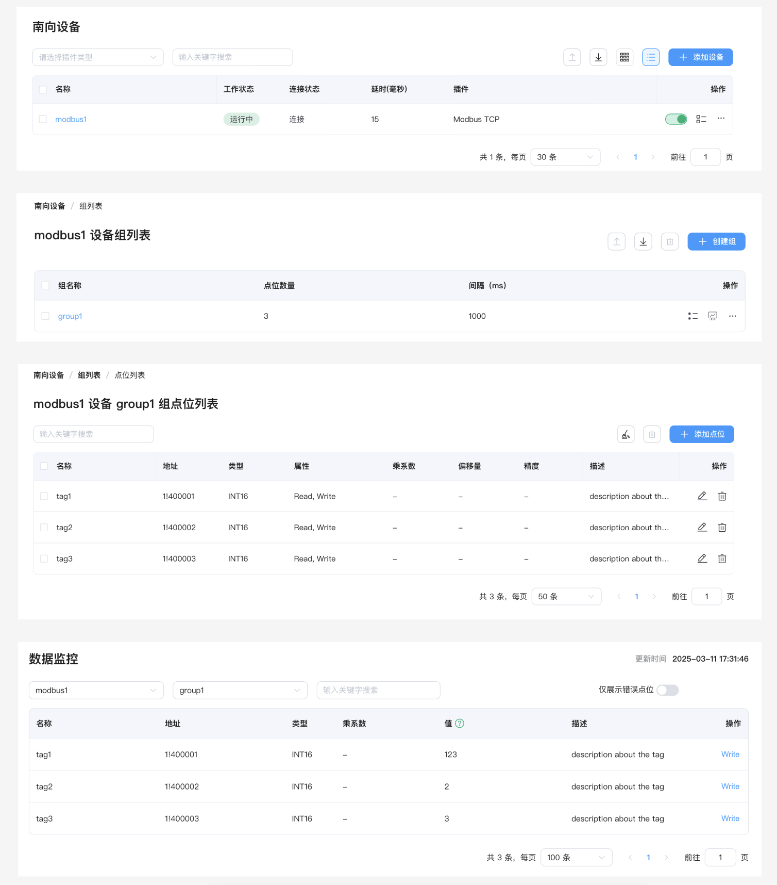
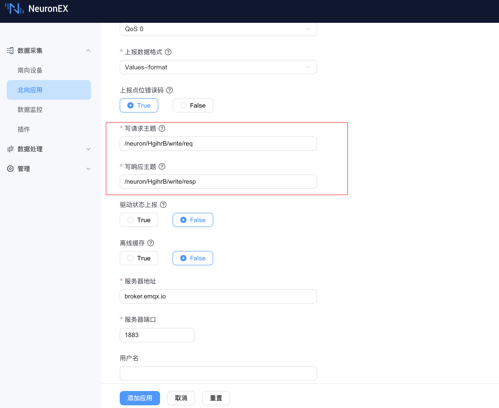
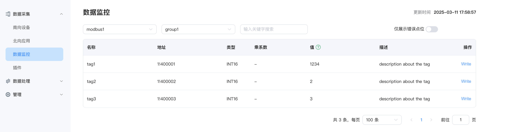
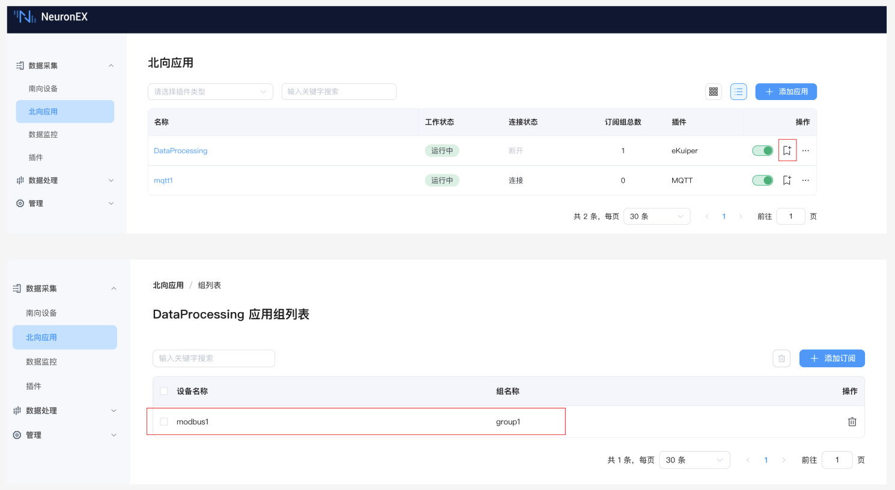
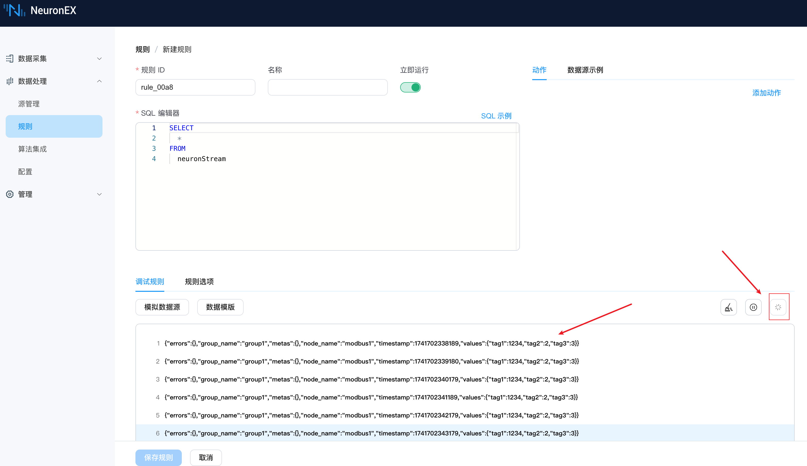
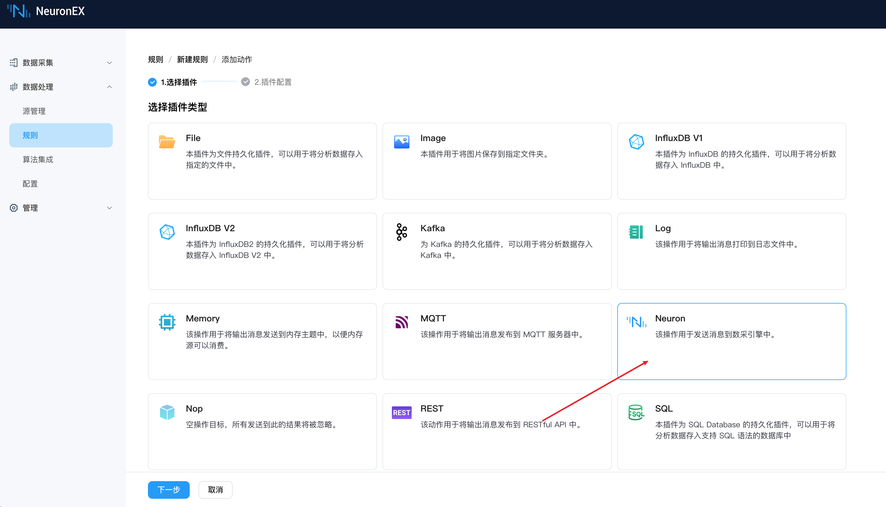
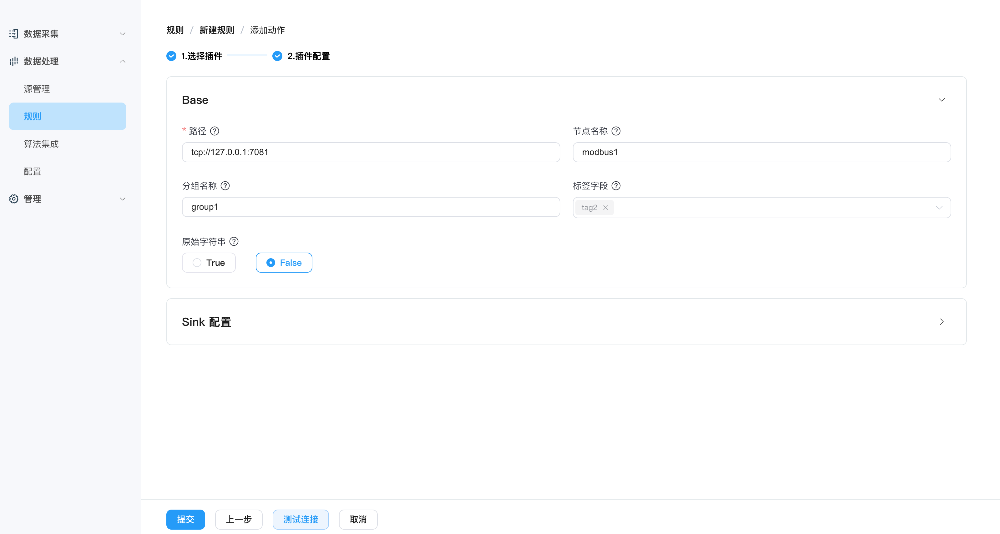
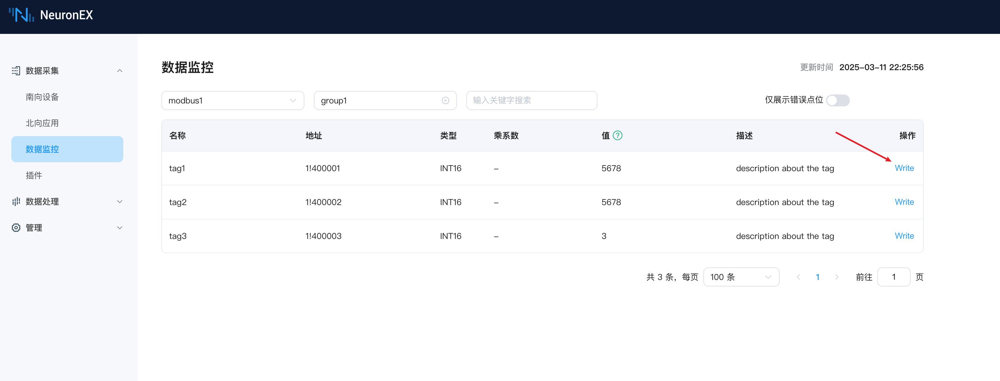
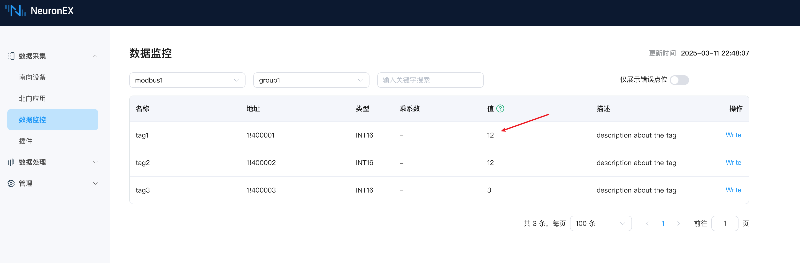

# NeuronEX 设备反控功能详解

## 引言

在工业互联网领域，设备数据的双向流动对于实现智能制造至关重要。NeuronEX 作为一款功能强大的工业边缘网关软件，不仅能够高效采集设备数据，还提供了多种灵活的方式实现对设备的反向控制（反控）能力，满足不同工业场景的需求。

本文将详细介绍 NeuronEX 支持的多种反控功能，帮助您更好地利用这些功能优化工业生产流程，提升自动化水平。

## 什么是设备反控

设备反控是指通过向下游自动化设备发送指令，控制设备行为或修改设备参数的过程。NeuronEX 提供了多种反控方式，满足不同应用场景的需求：

- **仪表盘反控**：通过直观的用户界面实现人工控制
- **MQTT 反控**：通过 MQTT 协议向设备发送控制指令
- **数据处理模块反控**：利用 NeuronEX 的数据处理引擎实现智能反控
- **API 反控**：通过 RESTful API 接口实现程序化控制

::: tip
设备反控过程中，设备点位必须具有可写属性，否则无法写入成功。可写属性包括在 NeuronEX 设备中配置的点位必须具有 write 属性，同时在设备端该点位也必须支持可写入。
:::


## 仪表盘反控

仪表盘反控是最直观的人机交互方式，适合运维人员进行日常操作和临时调试。访问 NeuronEX 的 Web 界面，进入**数据采集** -> **数据监控** 页面，选择相应的南向设备和组名称，找到具有写属性的点位，点击其末尾的 Write 按钮，在弹出的对话框中输入新值，点击“提交”完成设备反控。


## MQTT 反控

### 功能介绍

MQTT 反控允许任何支持 MQTT 协议的客户端程序向 MQTT Broker 的对应主题发送指令数据，NeuronEX 北向 MQTT 插件订阅该主题接收数据，并将控制指令发送给南向驱动节点实现设备控制。当在工业场景选择 EMQX 构建企业统一数据接入平台时，这种方式尤为合适。


采用该方式，需要在 NeuronEX 配置北向 MQTT 插件，并设置**写请求主题**和**写响应主题**。同时，需要配置南向驱动节点，并设置点位为可读可写状态。以下示例结合 EMQX 和 MQTTX（作为MQTT客户端） 进行详细说明。

### MQTT 完整示例

**1）配置南向驱动 modbus1**

在 NeuronEX 配置 ModbusTCP 南向驱动 modbus1，采集组名称为 group1，并添加好3个数据点位tag1、tag2、tag3（支持可读可写），modbus1 驱动从 Modbus 模拟器读取数据。想详细了解该步骤，请参考[连接南向驱动](../configuration/south-devices/south-devices.md)。



**2）配置北向 MQTT 插件**

在 NeuronEX 新建北向 MQTT 插件，在插件配置项中，可使用默认**写请求主题** `/neuron/HgihrB/write/req`和**写响应主题** `/neuron/HgihrB/write/resp`，进行 MQTT 反控指令的接收，见下图。在本例中使用 EMQ 提供的公共 MQTT 服务器 `broker.emqx.io` 作为 MQTT Broker。



**3）EMQX 配置**

由于我们使用 EMQ 提供的公共 MQTT 服务器 `broker.emqx.io` 作为 MQTT Broker，因此需无需单独部署或者配置 EMQX。

**4）MQTTX 配置**

在 MQTTX 添加一个新的连接，接入公共 MQTT 服务器 `broker.emqx.io`。


查阅 NeuronEX MQTT 数据反控格式，了解到单个数据点的反控 JSON 消息格式如下，其中：
 - **uuid** 为 NeuronEX 生成的唯一标识，用于接收反控响应时匹配响应数据
 - **node** 为南向驱动节点名称，在本例中为 modbus1
 - **group** 为南向驱动组名，在本例中为 group1
 - **tag** 为南向驱动点位名称，在本例中为 tag1
 - **value** 为写入的值，在本例中为 1234

```json
{
    "uuid": "cd32be1b-c8b1-3257-94af-77f847b1ed3e",
    "node": "modbus1",
    "group": "group1",
    "tag": "tag1",
    "value": 1234
}
```
关于 NeuronEX MQTT 数据反控格式，如需多点位写入，或想了解反控相应格式，请查阅[MQTT 数据上下行格式](https://docs.emqx.com/zh/neuronex/latest/configuration/north-apps/mqtt/api.html#%E5%86%99-tag)。

在 MQTTX 中，填入上述 JSON 消息，并配置发送主题为`/neuron/HgihrB/write/req`，点击发送按钮，即可向 MQTT Broker 发送反控指令。

如需查看反控是否执行成功，可通过 MQTTX 的 `+ New Subscription` 按钮，来订阅 `/neuron/HgihrB/write/resp` 主题，查看响应数据。


**5）查看反控结果**

在 NeuronEX 的**数据采集** -> **数据监控** 页面，可以看到点位 tag1 的值被更新为 1234,表示通过 MQTT 客户端 MQTTX 反控 NeuronEX 南向驱动节点 modbus1 中的点位 tag1 成功。


::: tip
只是通过MQTT 驱动进行设备控制，则无需将南向驱动采集组配置到 MQTT 驱动的订阅组。

如需要同时通过 MQTT 驱动上报南向驱动数据到 MQTT Broker，则需要将南向驱动采集组配置到 MQTT 驱动的订阅组。
:::

## 数据处理模块反控

### 功能介绍

NeuronEX 的数据处理模块提供了强大的数据分析和处理能力，可以根据业务逻辑自动触发设备反控，实现自动化控制和闭环反馈。

在本次示例中，我们使用 NeuronEX 南向驱动节点 modbus1 采集到的点位 tag1 的值，自动反控写入到南向驱动节点 modbus1 的点位 tag2。

### 数据处理模块反控示例

**1）modbus1驱动数据发送到数据处理模块**

继续使用[MQTT 完整示例](#mqtt-完整示例)中的 modbus1 驱动，参考下图，将驱动采集组配置到数据处理模块的订阅组。配置完成后，接下来在数据处理模块中，neuronStream数据流将会每秒都收到来自 modbus1 驱动采集组group1的所有采集数据。



**2）创建规则并测试数据流入**

在**数据处理** -> **规则** 页面，点击**新建规则**，进入该页面，点击运行测试按钮，即可看到数据处理模块每秒都会收到来自 modbus1 驱动的采集数据，表示前序步骤配置成功，之后可以停止规则测试。




**3）配置反控**

在当前页面编辑 SQL 编辑器，输入以下 SQL 语句，这段 SQL 语句的作用是，将tag1的值重命名为tag2，SQL的数据结果为`{tag2: 1234}`。此处同样可以开启规则调试，进行规则 SQL 输出的测试查看。

```sql
SELECT
  values.tag1 as tag2
FROM
  neuronStream
```

选择规则 action 为 Neuron 类型， 并配置如下，表示将 SQL 输出的数据结果写入到南向驱动节点 **modbus1** 采集组 **group1** 的点位 **tag2**。





保存规则后，规则自动已经进入运行状态。

**4）查看反控结果**

回到**数据采集** -> **数据监控** 页面，可以看到点位 tag2 的值被更新为 1234，表示通过数据处理模块反控 NeuronEX 南向驱动节点 modbus1 中的点位 tag2 成功。

此时，我们通过点击点位 tag1 的 Write 按钮，写入新的值 5678，可以看到点位 tag2 的值也被更新为 5678，表示通过数据处理模块反控 NeuronEX 南向驱动节点 modbus1 中的点位 tag2 成功。



通过数据处理模块反控，可以实现更复杂的控制逻辑，如根据不同的条件触发不同的反控操作，或者根据多个条件组合触发反控操作，可快速构建工业场景下智能化应用。

## API反控

### 功能介绍

NeuronEX 提供了完善的 RESTful API 接口，允许第三方应用程序通过 HTTP 协议实现设备反控。这种方式灵活性高，适合与其他系统集成。

通过调用 NeuronEX 的 RESTful API，可以实现读写设备点位数据。详细的 API 文档可参考[NeuronEX API 文档](https://docs.emqx.com/zh/neuronex/latest/api/api-docs.html)。

### POSTMAN 反控示例

POSTMAN 是一款常用的 API 测试工具，通过调用 NeuronEX 的 RESTful API，可以实现设备反控。

**1）获取 NeuronEX 的 Token**

在 POSTMAN 上，选择 POST 方法，调用 `localhost:8085/api/login` 接口，并设置请求体为 JSON 格式，输入用户名和密码，点击发送按钮，即可获取 NeuronEX 的 Token。


**2）调用反控接口写入数据**

在 POSTMAN 上，选择 POST 方法，调用 `localhost:8085/api/neuron/write` 接口，并设置请求头为 `Authorization`，值为 `Bearer ${Token}`，设置请求体为 JSON 格式，输入反控的 JSON 消息体，点击发送按钮，即可实现设备反控。`/api/neuron/write`接口的详细说明，请参考[NeuronEX API 文档](https://docs.emqx.com/zh/neuronex/latest/api/api-docs.html#tag/rw/paths/~1api~1neuron~1write/post)。

```json
{
  "node": "modbus1",
  "group": "group1",
  "tag": "tag1",
  "value": 12
}
```


**3）查看反控结果**

在 NeuronEX 的**数据采集** -> **数据监控** 页面，可以看到点位 tag2 的值被更新为 12，表示通过 API 反控 NeuronEX 南向驱动节点 modbus1 中的点位 tag2 成功。




## 总结
NeuronEX 提供的多种反控功能，为工业设备的智能化控制提供了强大支持。无论是人工操作、远程控制还是自动化控制，都能通过 NeuronEX 实现。这些功能的灵活组合使用，可以极大提升工业生产的智能化水平和运营效率。

通过本文介绍的四种反控方式，用户可以根据自己的实际需求选择最适合的反控方案，通过 NeuronEX 实现从边缘到云端的全方位设备管理和控制。