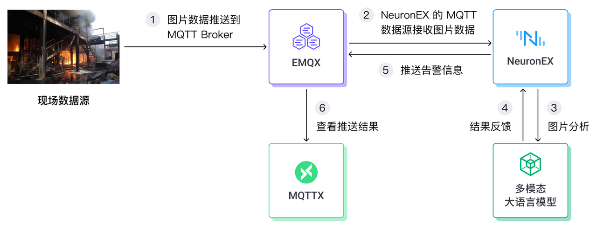
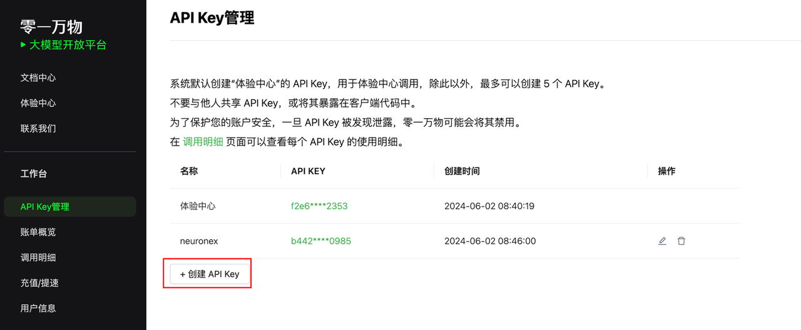
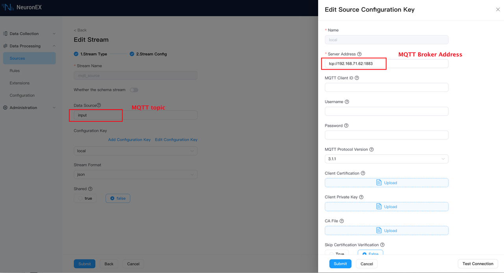
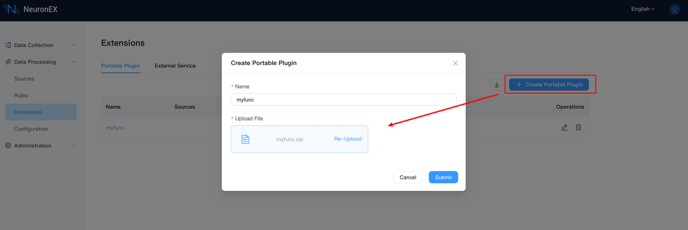
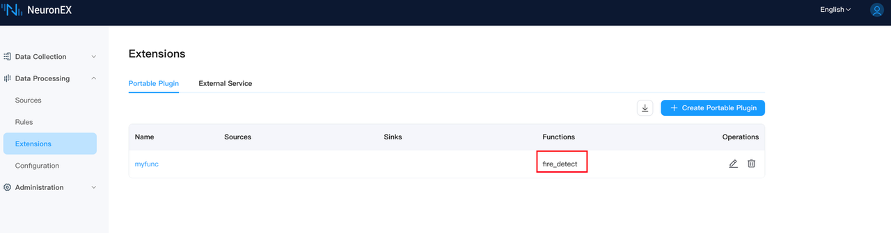
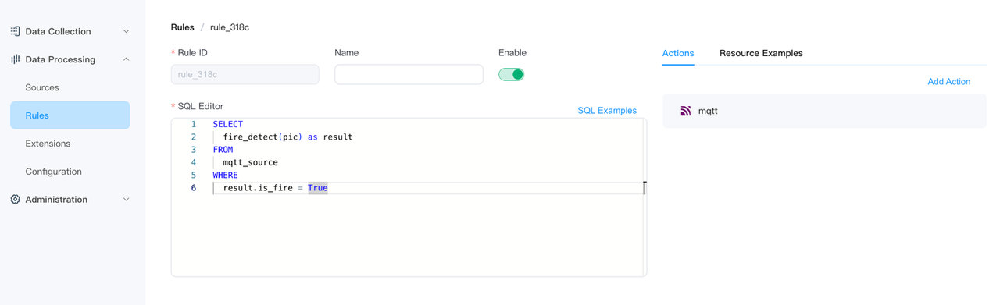
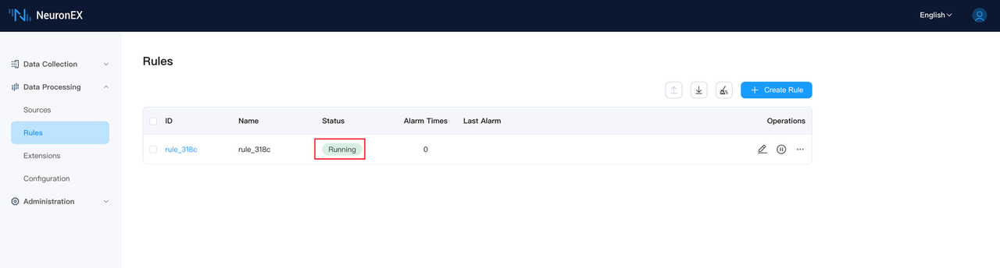
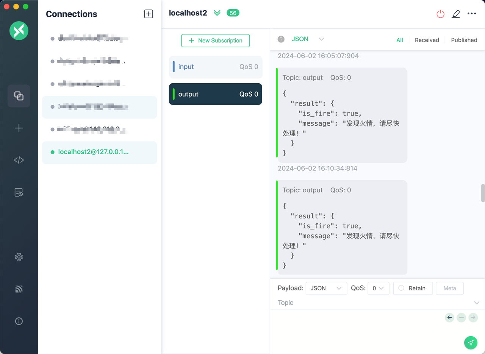
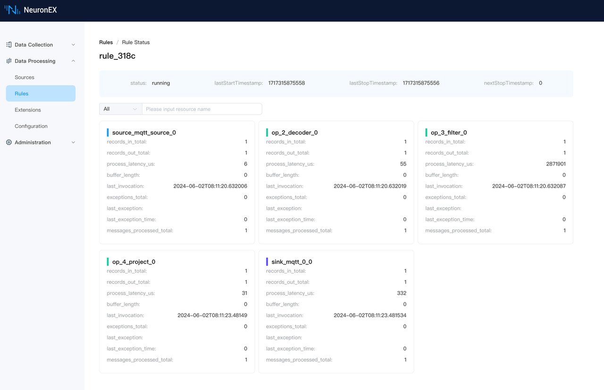

# NeuronEX + 大语言模型 LLM - 实时监控预防工业火灾

火灾是工业场景中的重大安全隐患之一，火灾的预防和及时响应对于保障生产和人员安全至关重要。本文将探讨如何利用先进的工业边缘软件 NeuronEX 和大型语言模型（Large language model, LLM），构建一个实时、高效、智能的火灾监控系统，以提高工业场景的安全性和火灾响应速度。

NeuronEX 是一款专为工业领域设计的设备数据采集和边缘智能分析软件，它支持工业协议采集及各类数据接入、边端数据过滤分析以及 AI 算法集成。大语言模型（LLM）是一种基于机器学习技术的人工智能（AI）模型，可理解和生成人类语言，还具备处理和解释图像、视频、音频等多种数据类型的多模态能力。

本文将介绍如何结合 NeuronEX 和大语言模型（LLM）的能力，实现工业现场的火灾安全监控。

## NeuronEX + LLM 整体架构介绍



- 现场数据接入

在本例中，我们采用 Base64 格式的图片数据接入 NeuronEX 的 MQTT 数据源。实际生产中 NeuronEX 也可以接入 RSTP 视频数据，为了简化示例，本例采用了更为简单的 MQTT 方式来接收图片数据。

- NeuronEX 集成 Python 算法函数

在 NeuronEX 中，我们编写了 Python 算法函数，该函数能够调用外部多模态大语言模型服务。这些函数将接收到的图片数据发送到大语言模型，利用模型自身的分析能力进行处理，并将结果反馈回 NeuronEX。

- 大语言模型

为了对图片进行分析，需要选择一款支持图片分析的多模态大语言模型。在本例中，我们采用了零一万物的 yi-vision 模型。

- 告警推送及告警信息查看

NeuronEX 会将大型语言模型分析得出的异常数据结果推送至 EMQX 平台。用户可以通过客户端工具 MQTTX 直观地查看这些告警信息。

## 详细配置步骤介绍

### 准备环境

- 可通过 Docker 命令快速创建一个 NeuronEX 服务，访问地址为 localhost:8085

```shell
docker run -d --name neuronex -p 8085:8085 emqx/neuronex:3.4.1
```

- 可通过 Docker 命令快速创建一个 EMQX 服务，访问地址为 localhost:18083 。

```shell
docker run -d --name emqx-enterprise -p 1883:1883 -p 18083:18083 emqx/emqx-enterprise:5.8.0
```

由于 NeuronEX 和 EMQX 分属于不同的容器，在本例中，NeuronEX 需要通过作者电脑的 IP 地址 192.168.71.62 来访问到 EMQX。

- 注册零一万物平台，获取 API Key

注册账号 https://platform.lingyiwanwu.com/ ，添加一个 API Key，在本文章编写时，零一万物模型支持免费试用。



- 准备 MQTT 客户端软件 MQTTX ，用来查看结果

MQTTX 下载地址：https://mqttx.app/zh/downloads 

### NeuronEX 接收模拟图片数据

- NeuronEX 添加 MQTT 数据源
在 NeuronEX Dashboard 上添加一个 MQTT 数据源 `mqtt_source`，Broker 地址配置为 `tcp://192.168.71.62:1883`，MQTT 主题为 `input` 。




### NeuronEX 集成 Python 算法函数

NeuronEX 提供了一套集成 Python 算法函数的 SDK 和[示例文档](../streaming-processing/portable_python.md)。

基于此框架， 用户可以在 Python 代码中添加调用 LLM 服务、编写提示词 Prompt、接收 LLM 的返回结果。以下为部分示例代码。

- 调用 LLM 服务

```python
class FireDetectFunc(Function):
    def exec(self, args: List[Any], ctx: Context):
        completion = client.chat.completions.create(
            model="yi-vision",
            messages=[
            {
                "role": "user",
                "content": [
                {
                    "type": "text",
                    "text": SYSTEM_PROMPT
                },
                {
                    "type": "image_url",
                    "image_url": {
                    "url": args[0]
                    }
                }
                ]
            },
            ]
        )
        # 解析大模型返回结果
        result = json.loads(completion.choices[0].message.content.strip())
        return result
```

- Prompt 提示内容

```shell
系统提示词
SYSTEM_PROMPT = '''
我将发给你一张经过 Base64 编码后的工厂摄像头拍摄的图片，图片表示了当前工厂设备、环境等各方面的状态信息，你基于这张图片，帮我判断是否有着火、发生火灾、或者有发生火灾的潜在风险，并把判断结果以固定的json格式发出。
例如，如果我发给你的图片，你判断有着火、发生火灾、或者有发生火灾的潜在风险。
请输出这样的格式：
{
 "is_fire":true,
 "message":"发现火情，请尽快处理！"
}
例如，如果我发给你的图片，你判断没有着火、发生火灾、或者有发生火灾的潜在风险。
请输出这样的格式：
{
 "is_fire":false,
 "message":"工厂环境正常！"
}
你只需要回复json本身内容即可，不要回复其它内容。
'''
```
- 添加 requirements 文件

由于本例中使用了 OpenAI Python 函数库，NeuronEX 默认的 docker 镜像中未包含该函数库。需要在 requirements.txt 文件中添加以下内容：

```shell
openai>=1.30.5
```
- 将编写好的 Python 插件 myfunc.zip 导入到 NeuronEX





考虑到国内的网络问题，有可能 OpenAI 库会安装失败。此时可进入 NeuronEX 容器内，手动执行以下命令进行安装：

```shell
pip install openai -i https://pypi.tuna.tsinghua.edu.cn/simple
```

### NeuronEX 中编写规则计算

- 新建规则，并编写规则 SQL 语句

```sql
SELECT
  fire_detect(pic) as result
FROM
  mqtt_source
WHERE
  result.is_fire = True
```

规则中的 `fire_detect` 为上一步中导入到 NeuronEX 的 Python 自定义函数，该 SQL 语句表示，接收每一条 mqtt_source 数据源发过来的数据，调用 `fire_detect` 函数处理 mqtt_source 数据源中的 pic 字段，并将函数处理结果中 `is_fire` 字段为 `True` 的结果发送到 EMQX 。mqtt_source 数据源的数据结构，参考后续步骤[Demo测试->发送模拟图片数据](#发送模拟图片数据) 。

判断大模型返回的结果 `result`，只发送发现火情的结果。



- 规则中的 MQTT Action 配置

通过这个 MQTT 动作，会将结果输出到 EMQX 的主题 output 上。


- 将规则成功创建



## Demo 测试

### 发送模拟图片数据

- 准备着火 (fire.png) 和没着火 (no_fire.png) 的图片各一张


- 准备 Python 程序发送图片数据到 MQTT Broker

将本地 `fire.png` 图片 Base64 编码，放入 JSON payload，发送到 EMQX 的主题 `input` 。

```python

import paho.mqtt.client as mqtt
import base64
import json
#MQTT broker的地址和端口
broker_address = "192.168.71.62"
broker_port = 1883
#创建一个新的MQTT客户端实例
client = mqtt.Client("MQTT_Client_u34jb34q")
#连接到broker
client.connect(broker_address, broker_port)
#将本地fire.png图片Base64编码，放入Json payload
with open('./_assets/fire.png', 'rb') as image_file:
        image = 'data:image/png;base64,' +base64.b64encode(image_file.read()).decode('utf-8')
dict = {
        "pic":image
}
json_data = json.dumps(dict)
topic = "input"
#发布消息
client.publish(topic, json_data)
#断开连接
client.disconnect()

```

### 查看输出结果

- 查看 MQTTX的输出



- 查看规则状态



## 总结

在本文中，我们探讨了如何将 NeuronEX 软件与大型语言模型（LLM）相结合，实现对现场火灾安全的智能监控。
通过 NeuronEX 与大型语言模型（LLM）的结合，我们不仅展示了 AI 及大语言模型在工业领域的强大应用潜力，还为工业企业提供了一种新的智能监控和运维方式。未来，随着技术的不断进步，我们有理由相信，工业领域的数字化转型将更加深入，AI 智能体将在工业监控和运维中扮演更加重要的角色。