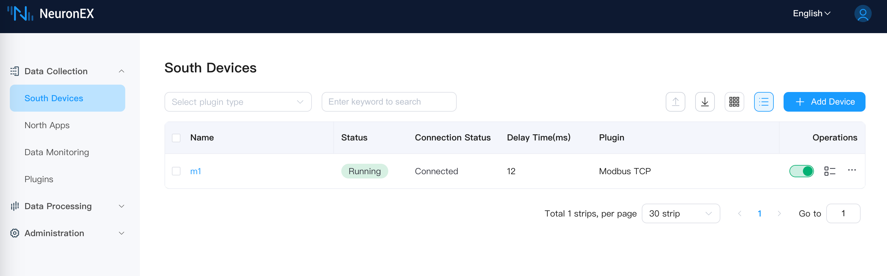
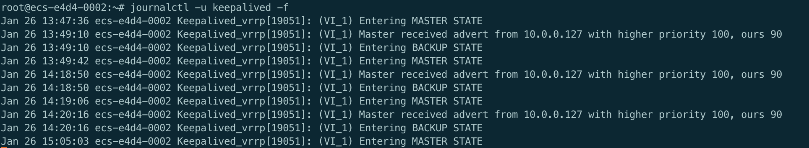

# NeuronEX 主备模式最佳实践

## 概述

NeuronEX 是一款工业边缘网关软件，提供工业设备数据采集和边缘智能分析服务。在某些业务场景下，需要保证 NeuronEX 服务的持续性和稳定性，通过主备模式部署两套 NeuronEX，可以实现服务的高可用性。

该方案通过在两台服务器上部署 NeuronEX，通过 Keepalived 实现主备节点的自动切换。支持主节点 NeuronEX 软件故障不工作、或者主节点服务器故障等场景下，备节点自动接管服务，保证 NeuronEX 服务不中断，主节点恢复后，自动切换到主节点 NeuronEX 运行。

## 环境准备

- 硬件要求
  - 主节点和备节点服务器 2 台
  - 单台服务器资源至少 1 核 CPU，1GB 内存

- 软件要求
  - 操作系统：Ubuntu >=18.04 或 CentOS >=7
  - NeuronEX 安装包（支持 deb、rpm、Docker）
  - Keepalived 软件

- 网络要求
  - 主节点和备节点之间的内网互通
  - 确保安全组或防火墙允许 VRRP 协议和 NeuronEX 服务端口的流量

本示例使用华为云 2 台 Ubuntu 22.04 操作系统的 x86_64 架构虚拟机，主机内网 IP 地址为`10.0.0.127`，备机内网 IP 地址为`10.0.0.223`，主机与备机 IP 绑定的网卡均为 `eth0`。


## 安装与配置 NeuronEX

### 安装 NeuronEX
在主节点和备节点上安装 NeuronEX,本示例使用 NeuronEX 3.4.3 版本的 x86_64 架构 deb 包。如需其他安装包，请访问 [NeuronEX 下载页面](https://www.emqx.com/zh/downloads-and-install/neuronex)。

```shell
# 下载 NeuronEX 安装包
wget https://www.emqx.com/zh/downloads/neuronex/3.4.3/neuronex-3.4.3-linux-amd64.deb

# 安装 NeuronEX
sudo dpkg -i neuronex-3.4.3-linux-amd64.deb

# 启动 NeuronEX
sudo systemctl start neuronex

# 设置为开机自启动
sudo systemctl enable neuronex
```

### 配置 NeuronEX

访问主节点 NeuronEX Dashboard 页面，配置 NeuronEX 数采服务，可配置一个 Modbus TCP 南向驱动，可正常采集数据，用来后续验证主备切换功能。

访问备节点 NeuronEX Dashboard 页面，可手动配置与主节点相同的数采服务，用来验证主备切换功能。 或者也可以将主节点的配置 `/opt/neuronex/data/` 拷贝到备节点相同目录下覆盖原有配置。

通过以上配置，主节点和备节点均可以正常采集数据，并且功能一致。此时通过以下命令将备节点的 NeuronEX 服务停止，表示主节点运行，备节点停止的初始状态。

```shell
sudo systemctl stop neuronex
```

## 安装与配置 Keepalived

### 安装 Keepalived
在主节点和备节点上安装 Keepalived：

```bash
# 安装 Keepalived
sudo apt-get install keepalived
```


### 配置主机 Keepalived

在主节点的目录 `/etc/keepalived/` 下创建 `keepalived.conf`、 `master.sh`、 `fault.sh`、 `check_alive.sh` 文件。

1. 在主节点上配置 Keepalived，配置文件目录为 `/etc/keepalived/keepalived.conf`，内容如下：

```shell
! Configuration File for keepalived
global_defs {
   # 路由器标识，一般不用改，也可以写成每个主机自己的主机名
   # router_id huyidb03
   vrrp_skip_check_adv_addr
   #vrrp_strict
   vrrp_garp_interval 0
   vrrp_gna_interval 0
}

# 定义用于实例执行的脚本内容，比如可以在线降低优先级，用于强制切换
vrrp_script check_ex_alived {
        script "/etc/keepalived/check_alive.sh"
        interval 5
        fall 3 # 连续3次检测失败后，确定服务故障
}


# 一个vrrp_instance就是定义一个虚拟路由器的，实例名称
vrrp_instance VI_1 {
    # 定义初始状态，可以是MASTER或者BACKUP
    state MASTER
	#非抢占模式
    # nopreempt
    # 工作接口，通告选举使用哪个接口进行
    interface eth0
	# 虚拟路由ID，如果是一组虚拟路由就定义一个ID，如果是多组就要定义多个，而且这个虚拟
    # ID还是虚拟MAC最后一段地址的信息，取值范围0-255
    virtual_router_id 51
	#权重 如果你上面定义了MASTER,这里的优先级就需要定义的比其他的高
    priority 100
	#通告频率 单位s
    advert_int 1
	#通信认证机制，这里是明文认证还有一种是加密认证
    authentication {
        auth_type PASS
        auth_pass abcdefgh
    }

    # 设置虚拟VIP地址，并未使用
    virtual_ipaddress {
        192.160.127.254/17
    }
    unicast_peer {
        10.0.0.223  # 备机的 IP 地址
    }
    # 追踪脚本，通常用于去执行上面的vrrp_script定义的脚本内容
    track_script {
        check_ex_alived
    }

    # 如果主机状态变成Master|Backup|Fault之后会去执行的通知脚本
    notify_fault "/etc/keepalived/fault.sh"
    notify_master "/etc/keepalived/master.sh"
}

```

::: tip

由于在本例中，从机的 IP 地址是 `10.0.0.223`，所以在 keepalived.conf 文件中 unicast_peer 的内容为 `10.0.0.223`，请根据实际情况修改。

由于在本例中，主机的 IP 地址 `10.0.0.127` 绑定的网卡是 `eth0`，所以在 keepalived.conf 文件中 interface 的内容为 `eth0`，请根据实际情况修改。

:::


2. 在主节点上配置 `master.sh` 脚本， 配置文件目录为`/etc/keepalived/master.sh`，内容如下：

```shell
#!/bin/bash

systemctl start neuronex
```

3. 在主节点上配置 `fault.sh` 脚本， 配置文件目录为`/etc/keepalived/fault.sh`，内容如下：

```shell
#!/bin/bash

systemctl stop neuronex
```

4. 在主节点上配置 `check_alive.sh` 脚本， 配置文件目录为`/etc/keepalived/check_alive.sh`，内容如下：

```shell
#!/bin/bash

if ! curl 127.0.0.1:8085  >/dev/null 2>&1; then echo "neuronex start failed"; exit 1; fi
```

5. 在主节点上启动 Keepalived

```shell
sudo systemctl start keepalived

# 设置为开机自启动
sudo systemctl enable keepalived
```


### 配置从机 Keepalived

在从节点的目录 `/etc/keepalived/` 下创建 `keepalived.conf`、 `master.sh`、 `backup.sh` 文件。

1. 在从节点上配置 Keepalived，配置文件目录为 `/etc/keepalived/keepalived.conf`，内容如下：

```shell
! Configuration File for keepalived
global_defs {
   # 路由器标识，一般不用改，也可以写成每个主机自己的主机名
   # router_id huyidb03
   vrrp_skip_check_adv_addr
   #vrrp_strict
   vrrp_garp_interval 0
   vrrp_gna_interval 0
}

# 一个vrrp_instance就是定义一个虚拟路由器的，实例名称
vrrp_instance VI_1 {
    # 定义初始状态，可以是MASTER或者BACKUP
    state BACKUP
	#非抢占模式
    nopreempt
    # 工作接口，通告选举使用哪个接口进行
    interface eth0
	# 虚拟路由ID，如果是一组虚拟路由就定义一个ID，如果是多组就要定义多个，而且这个虚拟
    # ID还是虚拟MAC最后一段地址的信息，取值范围0-255
    virtual_router_id 51
	#权重 如果你上面定义了MASTER,这里的优先级就需要定义的比其他的高
    priority 90
	#通告频率 单位s
    advert_int 1
	#通信认证机制，这里是明文认证还有一种是加密认证
    authentication {
        auth_type PASS
        auth_pass abcdefgh
    }

    # 设置虚拟VIP地址，并未使用
    virtual_ipaddress {
        192.160.127.254/17
    }

    unicast_peer {
        10.0.0.127  # 主机的 IP 地址
    }

    # 如果主机状态变成Master|Backup|Fault之后会去执行的通知脚本
    notify_master "/etc/keepalived/master.sh"
    notify_backup "/etc/keepalived/backup.sh"
}
```

::: tip

由于在本例中，主机的 IP 地址是 `10.0.0.127`，所以在 keepalived.conf 文件中 unicast_peer 的内容为 `10.0.0.127`，请根据实际情况修改。

由于在本例中，从机的 IP 地址 `10.0.0.223` 绑定的网卡是 `eth0`，所以在 keepalived.conf 文件中 interface 的内容为 `eth0`，请根据实际情况修改。

:::

2. 在从节点上配置 `master.sh` 脚本， 配置文件目录为`/etc/keepalived/master.sh`，内容如下：

```shell
#!/bin/bash

systemctl start neuronex
```

3. 在从节点上配置 `backup.sh` 脚本， 配置文件目录为`/etc/keepalived/backup.sh`，内容如下：

```shell
#!/bin/bash

systemctl stop neuronex
```

4. 在从节点上启动 Keepalived

```shell
sudo systemctl start keepalived

# 设置为开机自启动
sudo systemctl enable keepalived
```


## 主备切换逻辑说明

经过以上配置步骤，目前主节点和备节点均已启动 Keepalived 服务，并且主节点为 `MASTER` 状态，备节点为 `BACKUP` 状态。主节点 NeuronEX 服务正常运行，备节点 NeuronEX 服务停止。当以下情况发生时：

1. **主节点 NeuronEX 服务故障**

  - 故障检测：

    Keepalived 通过 vrrp_script 定期执行 `check_alive.sh` 脚本，检测 NeuronEX 服务的状态。

    如果 `check_alive.sh` 脚本检测到 NeuronEX 服务失败，返回失败状态。

    Keepalived 根据 interval 和 fall 参数，在指定时间内（本例中为 15 秒）确认服务故障。

  - 优先级调整：

    Keepalived 降低主节点的优先级。

    Keepalived 执行脚本 `fault.sh`，停止主节点 NeuronEX 服务。

    主节点发送 VRRP 通告，通告自己的新优先级。

  - 备节点切换：

    备节点收到主节点的 VRRP 通告，发现主节点的优先级低于自己的优先级（例如 0 < 90）。

    备节点切换为 `MASTER` 状态。

    备节点执行脚本 `master.sh`，启动 NeuronEX 服务，接管主节点的工作负载。


2. **主节点服务器故障**

  - 故障检测：

    主节点服务器完全宕机，Keepalived 和 NeuronEX 都停止运行。

    主节点无法发送 VRRP 通告，备节点无法收到主节点的状态信息。

  - 备节点切换：

    备节点在 advert_int * 3 时间内（ 本例为 3 秒）未收到主节点的 VRRP 通告，认为主节点故障。

    备节点自动切换为 `MASTER` 状态。

    备节点执行脚本 `master.sh`，启动 NeuronEX 服务，接管主节点的工作负载。


3. **主节点恢复**

  - 服务恢复：

    主节点的 NeuronEX 服务恢复后，`check_alive.sh` 脚本检测到 NeuronEX 正常运行，返回成功状态。

    Keepalived 恢复主节点的优先级。

    主节点发送 VRRP 通告，通告自己的优先级。

  - 主节点重新成为 `MASTER`：

    备节点收到主节点的 VRRP 通告，发现主节点的优先级高于自己的优先级。

    备节点配置 nopreempt，备节点主动降级为 `BACKUP`。

    备节点执行脚本 `backup.sh`，停止 NeuronEX 服务。

    主节点重新成为 `MASTER`，接管工作负载。

::: tip 

由于在主节点 Keepalived 配置中，设置了抢占模式，所以主节点恢复后，会自动切换为 `MASTER` 状态，并启动 NeuronEX 服务，接管主节点的工作负载。

:::


## 测试与验证

### 模拟主节点 NeuronEX 服务故障

1. 通过以下命令停止主节点 NeuronEX 服务：

    ```shell
    sudo systemctl stop neuronex
    ```

2. 通过以下命令查看主节点和备节点的 NeuronEX 状态：

    ```shell
    sudo systemctl status neuronex
    ```

3. 访问从节点 NeuronEX Dashboard 页面，从节点 NeuronEX 服务正常运行，南向驱动正常采集数据。访问主节点 NeuronEX Dashboard 页面，主节点 NeuronEX 服务停止。

    - 从节点 NeuronEX 服务正常运行


    - 主节点 NeuronEX 服务停止


### 模拟主节点服务器故障

1. 将主节点服务器关机，通过以下命令查看备节点的 NeuronEX 状态：

    ```shell
    sudo systemctl status neuronex
    ```

2. 访问从节点 NeuronEX Dashboard 页面，从节点 NeuronEX 服务正常运行，南向驱动正常采集数据。访问主节点 NeuronEX Dashboard 页面，主节点 NeuronEX 服务停止。


### 主节点恢复

1. 将主节点服务器开机，由于前序步骤中我们已经设置了 Keepalived 和 NeuronEX 开机自启动，所以主节点会自动启动 Keepalived 和 NeuronEX 服务。通过以下命令查看主节点的 NeuronEX 状态：

    ```shell
    sudo systemctl status neuronex
    ```

2. 访问主节点 NeuronEX Dashboard 页面，主节点 NeuronEX 服务正常运行。

3. 访问从节点 NeuronEX Dashboard 页面，从节点 NeuronEX 服务已停止。


## 其他说明

### 部署方式

主备模式也支持 NeuronEX Docker 部署模式。

在本例中 NeuronEX 通过 systemd 方式部署，因此在相应脚本启动停止 NeuronEX 为 systemctl 命令形式。如果 NeuronEX 部署方法为 Docker ，那么在脚本中启动停止 NeuronEX 方式为 docker 命令形式。需要将 master.sh 、 backup.sh 、 fault.sh 脚本中的 systemctl 命令替换为 docker 命令。如 `docker start neuronex`，`docker stop neuronex`。

### 配置文件同步

该示例的主备模式不支持主备 NeuronEX 之间配置文件的自动同步，如果需要主备 NeuronEX 之间配置文件一致，需要手动同步配置文件。

如果在主节点 NeuronEX 运行了一段时间以后，主节点 NeuronEX 的配置文件发生了变化，同时也不希望同时开启主备两个 NeuronEX 服务（会造成采集数据的重复），那么可以在保持备节点 NeuronEX 服务停止的状态下，手动同步配置文件：

- 安装包方式：

    将主节点 NeuronEX 的配置文件 `/opt/neuronex/data/` 复制到备节点的相同目录下。

- Docker 方式：

    将主节点 NeuronEX 的配置文件 `/opt/neuronex/data/` 复制到docker容器挂载到主机的目录下。


### 数据丢失与重复问题

如果要构建 NeuronEX 的完整高可用功能，完整高可用指任意单个 NeuronEX 节点失效，都不会丢失或重复采集数据，需要配置三节点 NeuronEX 服务，通过分布式数据库及集群模式，实现数据的高可用，该种方式需要极高成本，并且需要现场设备端及网络均能支持高可用，才能完整有效。而在实际工厂场景下，往往无法满足该条件，也即 PLC不支持主备或者现场网络不支持主备，仍存在单点故障，达不到全数据链路的高可用性。

当前示例的高可用方案，仍存在少量的数据丢失或重复的问题。

关于数据丢失问题，在主节点上的 NeuronEX 出现故障时，keepalived 需要一定的时间才会检测到，其中检测间隔与失败次数可配置，如下所示：

```shell

vrrp_script check_ex_alived {
        script "/etc/keepalived/check_alive.sh"
        interval 5
        fall 3 # require 3 failures for KO
}
```

当前配置为检测间隔为 5 秒，检测失败 3 次才触发主备切换。因此在这段时间内，`MASTER` 和 `BACKUP` 上的 NeuronEX 都不在运行状态，会短时间内数据丢失。

另外，关于数据重复问题，在主节点故障恢复后，备节点检测到主节点恢复后才会停止自身的 NeuronEX, 因此会有短暂的时间两个节点上的 NeuronEX 都在运行状态，会造成短时间采集的数据重复。

## 常见问题处理

- 可通过 `ping` 命令，查看主节点和备节点是否网络通讯是否正常。

- 可通过查看 keepalived 日志，查看主节点和备节点的状态及是否正常切换。

    ```shell
    journalctl -u keepalived -f
    ``` 

主节点日志示例：


备节点日志示例：

