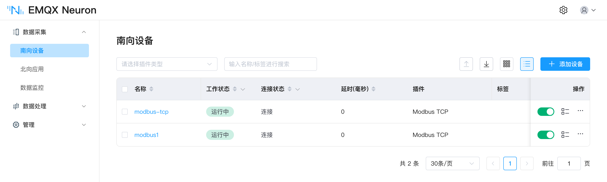
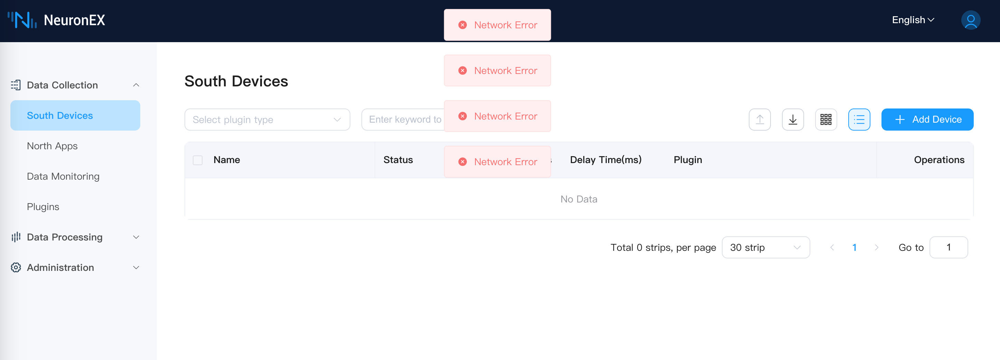

# 主备模式

## 方案说明

在两台服务器上各部署一套 EMQX Neuron，用 Keepalived 做故障检测和自动切换。主节点的 EMQX Neuron 服务故障、或整台服务器宕机时，备节点自动接管；主节点恢复后再切回。

<style>
.nxm            { width: 100%; height: auto; display: block; margin: 24px 0; }
.nxm .t         { font-family: -apple-system, "PingFang SC", "Microsoft YaHei", "Helvetica Neue", sans-serif; fill: #1f2d3d; }
.nxm .h         { font-size: 15px; font-weight: 600; }
.nxm .m         { font-size: 14px; font-weight: 600; }
.nxm .sub       { font-size: 12px; fill: #4a5b6e; }
.nxm .tiny      { font-size: 11.5px; fill: #6b7c8f; }
.nxm .lbl       { font-size: 12px; font-weight: 600; fill: #2a6ebb; }
.nxm .on        { fill: #00b173; font-size: 13px; font-weight: 600; }
.nxm .off       { fill: #8b98a6; font-size: 13px; font-weight: 600; }
.nxm .bg        { fill: #f7fafd; }
.nxm .box       { fill: #ffffff; stroke: #ccd8e4; stroke-width: 1.5; }
.nxm .node      { fill: #eaf2fb; stroke: #2a6ebb; stroke-width: 2; }
.nxm .nodeoff   { fill: #f2f5f8; stroke: #a9b8c7; stroke-width: 2; stroke-dasharray: 6 4; }
.nxm .card      { fill: #ffffff; stroke: #ccd8e4; stroke-width: 1.5; }
.nxm .flow      { stroke: #2a6ebb; stroke-width: 2; }
.nxm .idle      { stroke: #a9b8c7; stroke-width: 2; stroke-dasharray: 6 4; }
.nxm .vrrp      { stroke: #00b173; stroke-width: 2; }
.nxm .ah        { fill: #2a6ebb; }
.nxm .ah-i      { fill: #a9b8c7; }
.nxm .ah-v      { fill: #00b173; }

html.dark .nxm .t       { fill: #d7dee6; }
html.dark .nxm .sub     { fill: #9db0c4; }
html.dark .nxm .tiny    { fill: #8496a8; }
html.dark .nxm .lbl     { fill: #7fb4ea; }
html.dark .nxm .on      { fill: #3ecf9a; }
html.dark .nxm .off     { fill: #7d8b99; }
html.dark .nxm .bg      { fill: #161c24; }
html.dark .nxm .box     { fill: #1d2631; stroke: #3b4857; }
html.dark .nxm .node    { fill: #1a2938; stroke: #5a9fe0; }
html.dark .nxm .nodeoff { fill: #1a1f27; stroke: #4a5866; }
html.dark .nxm .card    { fill: #1d2631; stroke: #3b4857; }
html.dark .nxm .flow    { stroke: #7fb4ea; }
html.dark .nxm .idle    { stroke: #56646f; }
html.dark .nxm .vrrp    { stroke: #3ecf9a; }
html.dark .nxm .ah      { fill: #7fb4ea; }
html.dark .nxm .ah-i    { fill: #56646f; }
html.dark .nxm .ah-v    { fill: #3ecf9a; }
</style>

<svg class="nxm" xmlns="http://www.w3.org/2000/svg" viewBox="0 0 1060 430" role="img" aria-label="主备模式拓扑：主节点的 Keepalived 为 MASTER、优先级 100，EMQX Neuron 运行中并采集设备数据、转发到上层系统；备节点的 Keepalived 为 BACKUP、优先级 90 且启用 nopreempt，EMQX Neuron 处于停止状态；两节点之间通过 VRRP 单播通告互相探测，主节点故障时备节点接管">
  <defs>
    <marker id="nxmA" viewBox="0 0 10 10" refX="9" refY="5" markerWidth="7" markerHeight="7" orient="auto-start-reverse"><path class="ah" d="M0 0 L10 5 L0 10 z"/></marker>
    <marker id="nxmI" viewBox="0 0 10 10" refX="9" refY="5" markerWidth="7" markerHeight="7" orient="auto-start-reverse"><path class="ah-i" d="M0 0 L10 5 L0 10 z"/></marker>
    <marker id="nxmV" viewBox="0 0 10 10" refX="9" refY="5" markerWidth="7" markerHeight="7" orient="auto-start-reverse"><path class="ah-v" d="M0 0 L10 5 L0 10 z"/></marker>
  </defs>
  <rect class="bg" x="0" y="0" width="1060" height="430" rx="10"/>

  <rect class="box" x="24" y="80" width="150" height="280" rx="8"/>
  <text class="t h" x="99" y="200" text-anchor="middle">现场设备</text>
  <text class="t sub" x="99" y="226" text-anchor="middle">PLC · CNC · 仪表</text>

  <line class="flow" x1="182" y1="115" x2="242" y2="115" marker-end="url(#nxmA)"/>
  <text class="t lbl" x="212" y="104" text-anchor="middle">采集</text>
  <line class="idle" x1="182" y1="325" x2="242" y2="325" marker-end="url(#nxmI)"/>
  <text class="t tiny" x="212" y="314" text-anchor="middle">故障时接管</text>

  <rect class="node" x="250" y="40" width="520" height="150" rx="10"/>
  <text class="t h" x="510" y="66" text-anchor="middle">主节点  10.0.0.127</text>
  <rect class="card" x="270" y="82" width="230" height="90" rx="6"/>
  <text class="t m" x="385" y="106" text-anchor="middle">Keepalived</text>
  <text class="t sub" x="385" y="128" text-anchor="middle">MASTER · priority 100</text>
  <text class="t tiny" x="385" y="150" text-anchor="middle">check_alive.sh 每 5 秒检测</text>
  <rect class="card" x="520" y="82" width="230" height="90" rx="6"/>
  <text class="t m" x="635" y="112" text-anchor="middle">EMQX Neuron</text>
  <text class="t on" x="635" y="140" text-anchor="middle">● 运行中</text>

  <line class="vrrp" x1="385" y1="196" x2="385" y2="244" marker-start="url(#nxmV)" marker-end="url(#nxmV)"/>
  <text class="t sub" x="404" y="216" >VRRP 单播通告</text>
  <text class="t tiny" x="404" y="236" >每 1 秒</text>

  <rect class="nodeoff" x="250" y="250" width="520" height="150" rx="10"/>
  <text class="t h" x="510" y="276" text-anchor="middle">备节点  10.0.0.223</text>
  <rect class="card" x="270" y="292" width="230" height="90" rx="6"/>
  <text class="t m" x="385" y="316" text-anchor="middle">Keepalived</text>
  <text class="t sub" x="385" y="338" text-anchor="middle">BACKUP · priority 90</text>
  <text class="t tiny" x="385" y="360" text-anchor="middle">nopreempt</text>
  <rect class="card" x="520" y="292" width="230" height="90" rx="6"/>
  <text class="t m" x="635" y="322" text-anchor="middle">EMQX Neuron</text>
  <text class="t off" x="635" y="350" text-anchor="middle">○ 已停止</text>

  <line class="flow" x1="778" y1="115" x2="838" y2="115" marker-end="url(#nxmA)"/>
  <text class="t lbl" x="808" y="104" text-anchor="middle">转发</text>
  <line class="idle" x1="778" y1="325" x2="838" y2="325" marker-end="url(#nxmI)"/>

  <rect class="box" x="846" y="80" width="150" height="280" rx="8"/>
  <text class="t h" x="921" y="200" text-anchor="middle">上层系统</text>
  <text class="t sub" x="921" y="226" text-anchor="middle">MQTT · SCADA</text>
</svg>

::: warning 主备互斥
**同一时刻只有一个节点在采集数据。** 备节点平时保持 EMQX Neuron 服务停止状态，只在接管时才启动。两个节点同时运行会导致重复采集。这也是本方案在切换瞬间存在少量数据丢失和重复的原因，详见[数据丢失与重复](#数据丢失与重复)。
:::

## 环境准备

| 项目 | 要求 |
| --- | --- |
| 服务器 | 2 台，主备各一 |
| 单台资源 | 至少 1 核 CPU、1 GB 内存 |
| 操作系统 | Ubuntu 18.04 及以上，或 CentOS 7 及以上 |
| 软件 | EMQX Neuron（deb、rpm 或 Docker 均可）、Keepalived |
| 网络 | 主备之间内网互通；安全组和防火墙放行 VRRP 协议与 EMQX Neuron 服务端口 |

下文以两台 Ubuntu 22.04 x86_64 服务器为例：

| 角色 | 内网 IP | 网卡 |
| --- | --- | --- |
| 主节点 | `10.0.0.127` | `eth0` |
| 备节点 | `10.0.0.223` | `eth0` |

配置中出现的 IP 和网卡名需按实际环境替换。

## 安装与配置 EMQX Neuron

### 安装

在两个节点上都安装 EMQX Neuron，步骤见[使用安装包安装](../installation/package.md)或[通过 Docker 部署](../installation/docker.md)。安装后设为开机自启动：

```bash
sudo systemctl enable neuronex
```

### 配置数采服务

两个节点需要配置**完全相同**的采集服务，切换后才能无缝接管。

1. 在主节点的控制台配置数采服务，例如建一个 Modbus TCP 南向驱动，确认能正常采集。
2. 把主节点的 `/opt/neuronex/data/` 目录复制到备节点的相同位置，覆盖原有配置。也可以在备节点手动配置一遍。
3. 停止备节点的 EMQX Neuron 服务，进入「主节点运行、备节点待命」的初始状态：

   ```bash
   sudo systemctl stop neuronex
   ```

::: tip
主备之间的配置**不会自动同步**。主节点的配置后续有变更时，需要手动同步到备节点，做法见[配置文件同步](#配置文件同步)。
:::

## 安装与配置 Keepalived

### 安装 Keepalived
在主节点和备节点上安装 Keepalived：

```bash
# 安装 Keepalived
sudo apt-get install keepalived
```


### 配置主机 Keepalived

在主节点的目录 `/etc/keepalived/` 下创建 `keepalived.conf`、 `master.sh`、 `fault.sh`、 `check_alive.sh` 文件。

1. 在主节点上配置 Keepalived，配置文件目录为 `/etc/keepalived/keepalived.conf`，内容如下：

```shell
! Configuration File for keepalived
global_defs {
   # 路由器标识，一般不用改，也可以写成每个主机自己的主机名
   # router_id huyidb03
   vrrp_skip_check_adv_addr
   #vrrp_strict
   vrrp_garp_interval 0
   vrrp_gna_interval 0
}

# 定义用于实例执行的脚本内容，比如可以在线降低优先级，用于强制切换
vrrp_script check_ex_alived {
        script "/etc/keepalived/check_alive.sh"
        interval 5
        fall 3 # 连续3次检测失败后，确定服务故障
}


# 一个vrrp_instance就是定义一个虚拟路由器的，实例名称
vrrp_instance VI_1 {
    # 定义初始状态，可以是MASTER或者BACKUP
    state MASTER
	#非抢占模式
    # nopreempt
    # 工作接口，通告选举使用哪个接口进行
    interface eth0
	# 虚拟路由ID，如果是一组虚拟路由就定义一个ID，如果是多组就要定义多个，而且这个虚拟
    # ID还是虚拟MAC最后一段地址的信息，取值范围0-255
    virtual_router_id 51
	#权重 如果你上面定义了MASTER,这里的优先级就需要定义的比其他的高
    priority 100
	#通告频率 单位s
    advert_int 1
	#通信认证机制，这里是明文认证还有一种是加密认证
    authentication {
        auth_type PASS
        auth_pass abcdefgh
    }

    # 设置虚拟VIP地址，并未使用
    virtual_ipaddress {
        192.160.127.254/17
    }
    unicast_peer {
        10.0.0.223  # 备机的 IP 地址
    }
    # 追踪脚本，通常用于去执行上面的vrrp_script定义的脚本内容
    track_script {
        check_ex_alived
    }

    # 如果主机状态变成Master|Backup|Fault之后会去执行的通知脚本
    notify_fault "/etc/keepalived/fault.sh"
    notify_master "/etc/keepalived/master.sh"
}

```

::: tip

由于在本例中，从机的 IP 地址是 `10.0.0.223`，所以在 keepalived.conf 文件中 unicast_peer 的内容为 `10.0.0.223`，请根据实际情况修改。

由于在本例中，主机的 IP 地址 `10.0.0.127` 绑定的网卡是 `eth0`，所以在 keepalived.conf 文件中 interface 的内容为 `eth0`，请根据实际情况修改。

:::


2. 在主节点上配置 `master.sh` 脚本， 配置文件目录为`/etc/keepalived/master.sh`，内容如下：

```shell
#!/bin/bash

systemctl start neuronex
```

3. 在主节点上配置 `fault.sh` 脚本， 配置文件目录为`/etc/keepalived/fault.sh`，内容如下：

```shell
#!/bin/bash

systemctl stop neuronex
```

4. 在主节点上配置 `check_alive.sh` 脚本， 配置文件目录为`/etc/keepalived/check_alive.sh`，内容如下：

```shell
#!/bin/bash

if ! curl 127.0.0.1:8085  >/dev/null 2>&1; then echo "neuronex start failed"; exit 1; fi
```

5. 在主节点上启动 Keepalived

```shell
sudo systemctl start keepalived

# 设置为开机自启动
sudo systemctl enable keepalived
```


### 配置从机 Keepalived

从节点的 `keepalived.conf` 与主节点**大部分相同**，把主节点的配置复制过去，按下表改动即可：

| 配置项 | 主节点 | 从节点 |
| --- | --- | --- |
| `state` | `MASTER` | `BACKUP` |
| `priority` | `100` | `90` |
| `nopreempt` | 注释掉（启用抢占） | 启用 |
| `unicast_peer` | `10.0.0.223`（对端 IP） | `10.0.0.127`（对端 IP） |
| `vrrp_script` / `track_script` | 需要 | **删除**，从节点不监控自身服务 |
| 通知脚本 | `notify_fault` + `notify_master` | `notify_master` + `notify_backup` |

改动后从节点的 `vrrp_instance` 部分如下：

```shell
vrrp_instance VI_1 {
    state BACKUP
    nopreempt
    interface eth0
    virtual_router_id 51
    priority 90
    advert_int 1
    authentication {
        auth_type PASS
        auth_pass abcdefgh
    }
    virtual_ipaddress {
        192.160.127.254/17
    }
    unicast_peer {
        10.0.0.127  # 主节点的 IP 地址
    }
    notify_master "/etc/keepalived/master.sh"
    notify_backup "/etc/keepalived/backup.sh"
}
```

从节点只需要两个脚本，放在 `/etc/keepalived/` 下：

| 脚本 | 内容 | 何时执行 |
| --- | --- | --- |
| `master.sh` | `systemctl start neuronex` | 从节点升为 MASTER 时，启动服务接管 |
| `backup.sh` | `systemctl stop neuronex` | 从节点降回 BACKUP 时，停止服务让出 |

启动 Keepalived 并设为开机自启：

```bash
sudo systemctl start keepalived
sudo systemctl enable keepalived
```

## 主备切换逻辑说明

经过以上配置步骤，目前主节点和备节点均已启动 Keepalived 服务，并且主节点为 `MASTER` 状态，备节点为 `BACKUP` 状态。主节点 EMQX Neuron 服务正常运行，备节点 EMQX Neuron 服务停止。当以下情况发生时：

1. **主节点 EMQX Neuron 服务故障**

  - 故障检测：

    Keepalived 通过 vrrp_script 定期执行 `check_alive.sh` 脚本，检测 EMQX Neuron 服务的状态。

    如果 `check_alive.sh` 脚本检测到 EMQX Neuron 服务失败，返回失败状态。

    Keepalived 根据 interval 和 fall 参数，在指定时间内（本例中为 15 秒）确认服务故障。

  - 优先级调整：

    Keepalived 降低主节点的优先级。

    Keepalived 执行脚本 `fault.sh`，停止主节点 EMQX Neuron 服务。

    主节点发送 VRRP 通告，通告自己的新优先级。

  - 备节点切换：

    备节点收到主节点的 VRRP 通告，发现主节点的优先级低于自己的优先级（例如 0 < 90）。

    备节点切换为 `MASTER` 状态。

    备节点执行脚本 `master.sh`，启动 EMQX Neuron 服务，接管主节点的工作负载。


2. **主节点服务器故障**

  - 故障检测：

    主节点服务器完全宕机，Keepalived 和 EMQX Neuron 都停止运行。

    主节点无法发送 VRRP 通告，备节点无法收到主节点的状态信息。

  - 备节点切换：

    备节点在 advert_int * 3 时间内（ 本例为 3 秒）未收到主节点的 VRRP 通告，认为主节点故障。

    备节点自动切换为 `MASTER` 状态。

    备节点执行脚本 `master.sh`，启动 EMQX Neuron 服务，接管主节点的工作负载。


3. **主节点恢复**

  - 服务恢复：

    主节点的 EMQX Neuron 服务恢复后，`check_alive.sh` 脚本检测到 EMQX Neuron 正常运行，返回成功状态。

    Keepalived 恢复主节点的优先级。

    主节点发送 VRRP 通告，通告自己的优先级。

  - 主节点重新成为 `MASTER`：

    备节点收到主节点的 VRRP 通告，发现主节点优先级（100）高于自己（90），降级为 `BACKUP`。

    备节点执行脚本 `backup.sh`，停止自己的 EMQX Neuron 服务。

    主节点重新成为 `MASTER`，接管工作负载。

::: tip 关于抢占
主节点的配置里 `nopreempt` 是注释掉的，即**启用抢占**——恢复后会凭借更高的优先级自动夺回 `MASTER`。

从节点则**启用了 `nopreempt`**，作用是防止它在启动时抢走已经在运行的主节点的 `MASTER` 身份。

如果不希望主节点恢复后自动切回（避免多一次切换带来的数据抖动），把主节点的 `nopreempt` 也取消注释即可。
:::


## 测试与验证

### 模拟主节点 EMQX Neuron 服务故障

1. 通过以下命令停止主节点 EMQX Neuron 服务：

    ```shell
    sudo systemctl stop neuronex
    ```

2. 通过以下命令查看主节点和备节点的 EMQX Neuron 状态：

    ```shell
    sudo systemctl status neuronex
    ```

3. 访问从节点 EMQX Neuron Dashboard 页面，从节点 EMQX Neuron 服务正常运行，南向驱动正常采集数据。访问主节点 EMQX Neuron Dashboard 页面，主节点 EMQX Neuron 服务停止。

    - 从节点 EMQX Neuron 服务正常运行


    - 主节点 EMQX Neuron 服务停止


### 模拟主节点服务器故障

1. 将主节点服务器关机，通过以下命令查看备节点的 EMQX Neuron 状态：

    ```shell
    sudo systemctl status neuronex
    ```

2. 访问从节点 EMQX Neuron Dashboard 页面，从节点 EMQX Neuron 服务正常运行，南向驱动正常采集数据。访问主节点 EMQX Neuron Dashboard 页面，主节点 EMQX Neuron 服务停止。


### 主节点恢复

1. 将主节点服务器开机，由于前序步骤中我们已经设置了 Keepalived 和 EMQX Neuron 开机自启动，所以主节点会自动启动 Keepalived 和 EMQX Neuron 服务。通过以下命令查看主节点的 EMQX Neuron 状态：

    ```shell
    sudo systemctl status neuronex
    ```

2. 访问主节点 EMQX Neuron Dashboard 页面，主节点 EMQX Neuron 服务正常运行。

3. 访问从节点 EMQX Neuron Dashboard 页面，从节点 EMQX Neuron 服务已停止。


## 其他说明

### 部署方式

本文以 systemd 方式部署为例，所以脚本里用的是 `systemctl` 命令。

改用 Docker 部署时，把 `master.sh`、`backup.sh`、`fault.sh` 里的命令换成 docker 形式即可：

| 脚本 | systemd | Docker |
| --- | --- | --- |
| `master.sh` | `systemctl start neuronex` | `docker start neuronex` |
| `backup.sh` / `fault.sh` | `systemctl stop neuronex` | `docker stop neuronex` |

### 配置文件同步

该示例的主备模式不支持主备 EMQX Neuron 之间配置文件的自动同步，如果需要主备 EMQX Neuron 之间配置文件一致，需要手动同步配置文件。

如果在主节点 EMQX Neuron 运行了一段时间以后，主节点 EMQX Neuron 的配置文件发生了变化，同时也不希望同时开启主备两个 EMQX Neuron 服务（会造成采集数据的重复），那么可以在保持备节点 EMQX Neuron 服务停止的状态下，手动同步配置文件：

- 安装包方式：

    将主节点 EMQX Neuron 的配置文件 `/opt/neuronex/data/` 复制到备节点的相同目录下。

- Docker 方式：

    将主节点 EMQX Neuron 的配置文件 `/opt/neuronex/data/` 复制到docker容器挂载到主机的目录下。


### 数据丢失与重复

如果要构建 EMQX Neuron 的完整高可用功能，完整高可用指任意单个 EMQX Neuron 节点失效，都不会丢失或重复采集数据，需要配置三节点 EMQX Neuron 服务，通过分布式数据库及集群模式，实现数据的高可用，该种方式需要极高成本，并且需要现场设备端及网络均能支持高可用，才能完整有效。而在实际工厂场景下，往往无法满足该条件，也即 PLC不支持主备或者现场网络不支持主备，仍存在单点故障，达不到全数据链路的高可用性。

当前示例的高可用方案，仍存在少量的数据丢失或重复的问题。

关于数据丢失问题，在主节点上的 EMQX Neuron 出现故障时，keepalived 需要一定的时间才会检测到，其中检测间隔与失败次数可配置，如下所示：

```shell

vrrp_script check_ex_alived {
        script "/etc/keepalived/check_alive.sh"
        interval 5
        fall 3 # require 3 failures for KO
}
```

当前配置为检测间隔为 5 秒，检测失败 3 次才触发主备切换。因此在这段时间内，`MASTER` 和 `BACKUP` 上的 EMQX Neuron 都不在运行状态，会短时间内数据丢失。

另外，关于数据重复问题，在主节点故障恢复后，备节点检测到主节点恢复后才会停止自身的 EMQX Neuron, 因此会有短暂的时间两个节点上的 EMQX Neuron 都在运行状态，会造成短时间采集的数据重复。

## 常见问题处理

- 可通过 `ping` 命令，查看主节点和备节点是否网络通讯是否正常。

- 可通过查看 keepalived 日志，查看主节点和备节点的状态及是否正常切换。

    ```shell
    journalctl -u keepalived -f
    ``` 

主节点日志示例：


备节点日志示例：

