# OPCUA 点位发现功能介绍

## 前言

OPC UA（OPC Unified Architecture） 是一种跨平台、服务导向的通信协议，广泛应用于工业自动化和工业物联网（IIoT）。它为工业设备和系统之间的互操作性提供了一个标准化的框架。作为工业通信领域的核心技术，OPC UA 具有高安全性、灵活性和扩展性，特别适合工业 4.0 和 IIoT 应用场景，正逐步成为工业设备互操作的通用标准。

本文将介绍如何通过 NeuronEX 的点位发现功能，帮助用户更高效地管理 OPC UA 设备点位。

## 准备工作

在开始使用点位发现功能之前，我们需要先接入一个 OPC UA 设备。

1. 登录到 NeuronEX 控制台，进入「数据采集」->「南向设备」页面。

2. 点击「添加设备」按钮，进入到添加设备页面。

3. 选择「OPC UA」插件，并填入 OPC UA 服务器端点 URL。

4. 填写设备名称，例如 opcua1，点击「添加设备」按扭。

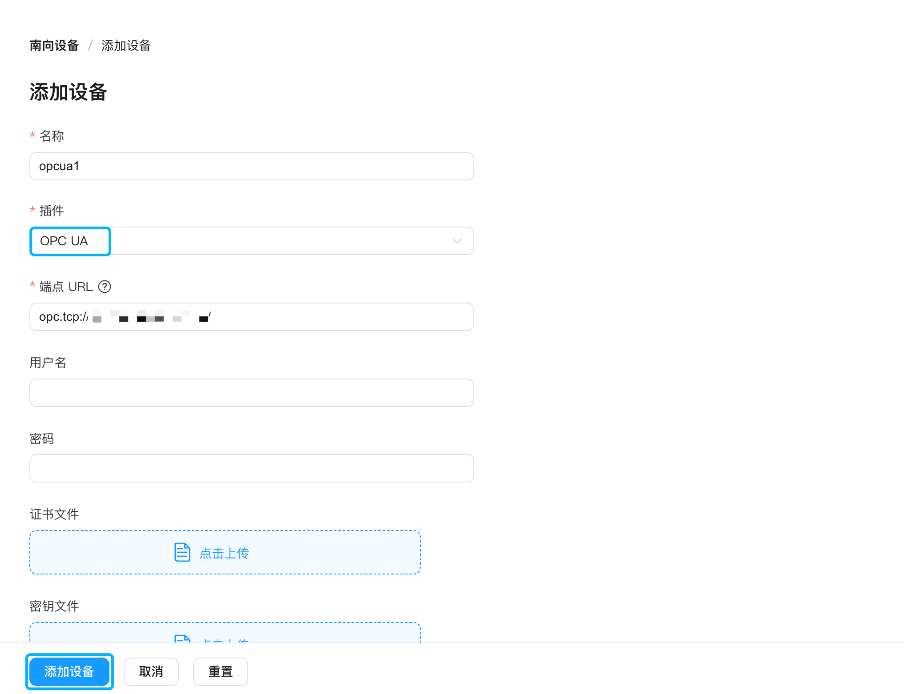

5. 添加设备后，回到「南向设备」页面，您将看到新添加的 opcua1 设备，其设备状态为「连接」。

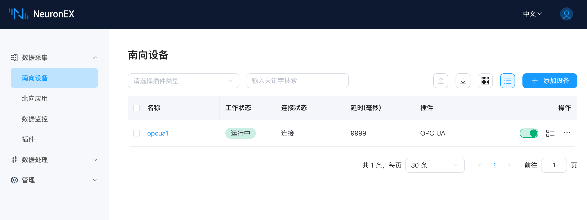

## 点位发现功能

准备工作完成后，让我们进入正题：通过点位发现功能来高效管理 OPC UA 设备的点位。

### 点位扫描

1. 点击 opcua1 设备对应操作栏中的「设备配置」按钮。

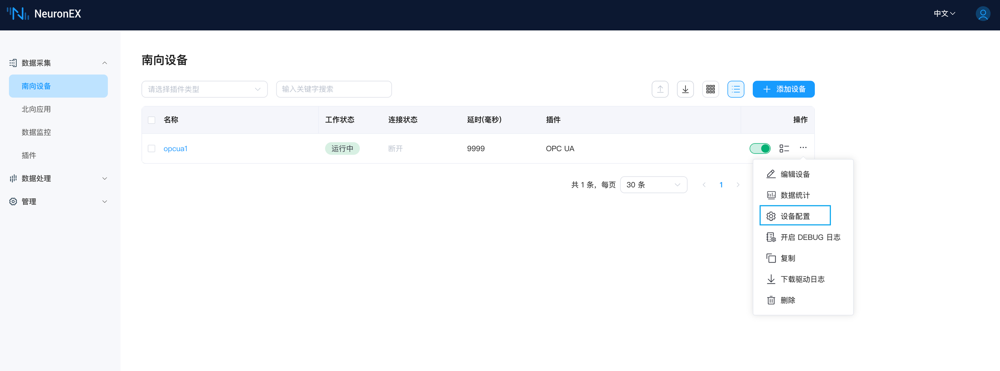

2. 进入「设备配置」页面后，点击最右侧的「点位发现」标签页。

3. 在「点位发现」页面中，点击「扫描」按扭进行点位发现扫描。NeuronEX 将自动扫描 OPCUA 服务器地址空间中的点位信息。

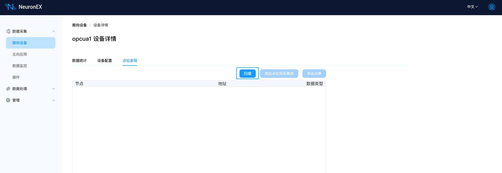

4. 扫描完成后，节点信息中将列出最顶层的三个节点。

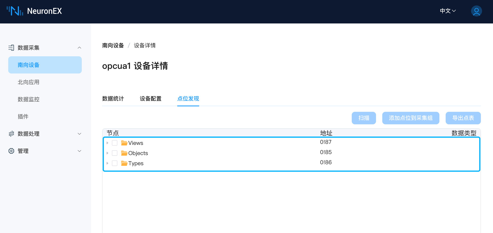

5. 单击节点前的三角形标识，可展开显示其所有子节点信息。如果子节点是数据点位，数据类型一列会展示对应的信息。

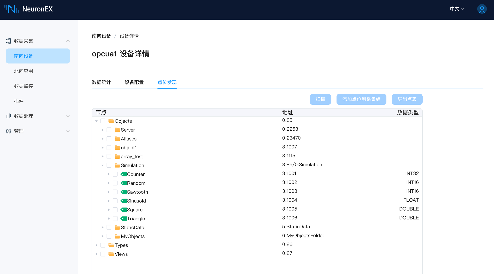

### 添加点位到采集组

如果想将某些点位添加到设备的采集组中，请按照以下步骤操作：

1. 选中需要添加的点位，点击「添加点位到采集组」按扭。您也可以勾选 Simulation 节点来选择其所有子节点。

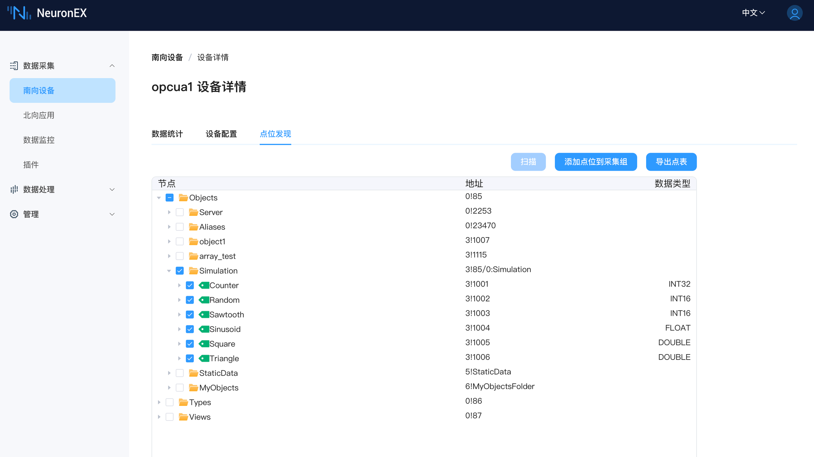

2. 在「选择或创建需要添加点位的采集组」对话框中，如果需要将点位添加到已经创建好的采集组，只需在下拉选择框中选择对应的采集组即可。

3. 本例中，我们创建了一个新的采集组，配置组名称（例如 group1）以及采集间隔，点击「创建采集组并添加点位」按扭，将跳转到「添加点位」页面。

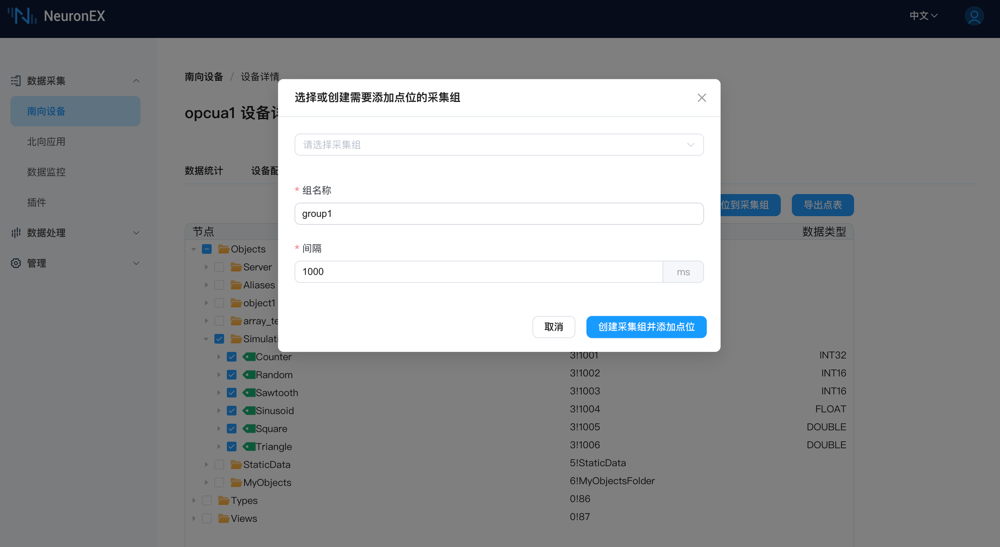

4. 在「添加点位」页面，您可以看到所选的六个数据类型点位。您可以进一步修改点位名称、读写类型等配置，点击「创建」按扭即可完成点位添加。

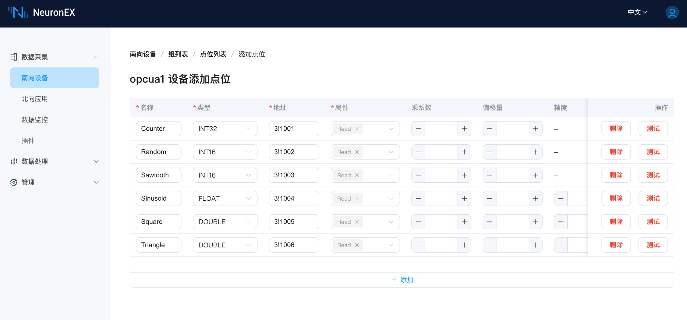

5. 点位创建完成后，在「数据监控」页面，您可以实时查看数据采集结果。

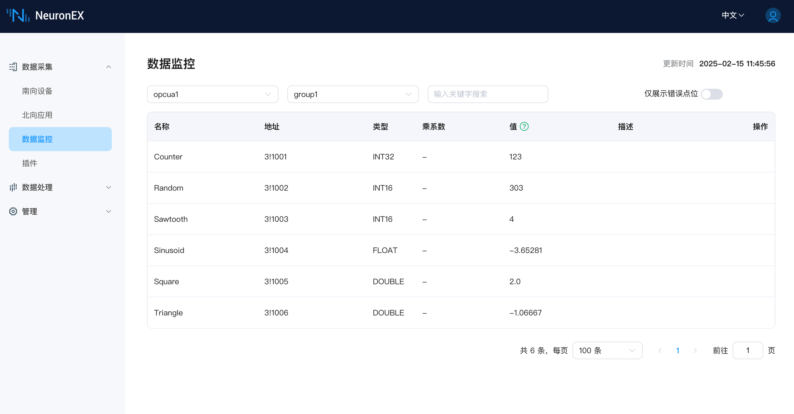

### 导出点表

如果想将某些点位导出为点表，请按照以下步骤操作：

1. 回到「点位发现」页面，选中需要导出的点位，然后点击「导出点表」按钮。

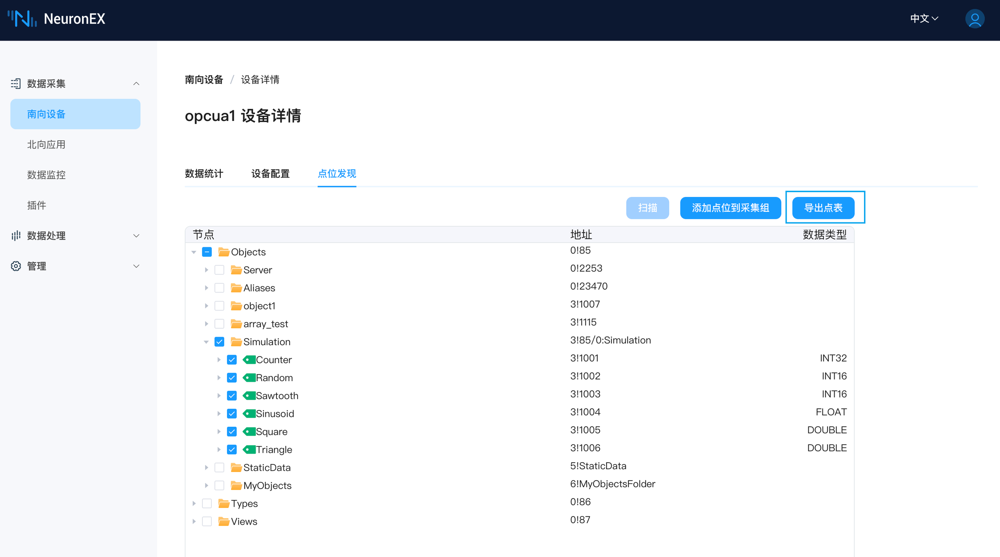

2. 导出后一个 excel 文件将下载到您的本地计算机。该文件将包含所选六个点位的相关信息，您可以在本地编辑和保存点表信息，还可以将更新后的点表导入到 NeuronEX 中使用。

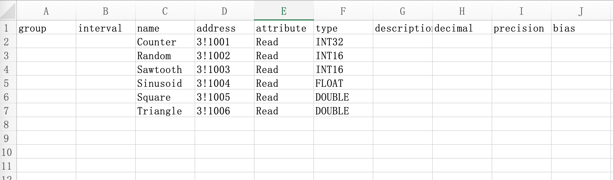

## 总结

基于 NeuronEX 的点位发现功能，用户可以高效地管理 OPC UA 设备的点位，实现 OPC UA 设备的快速集成和应用。