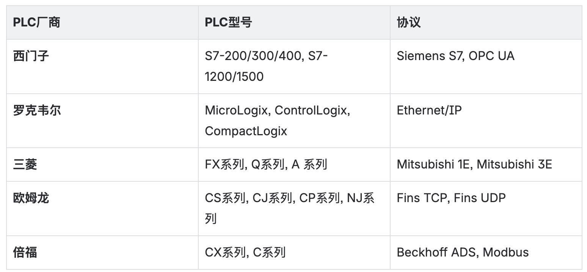
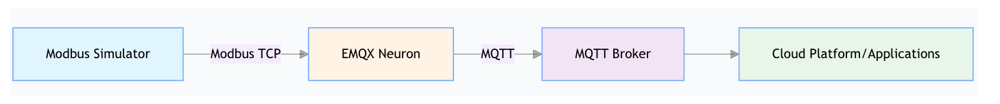
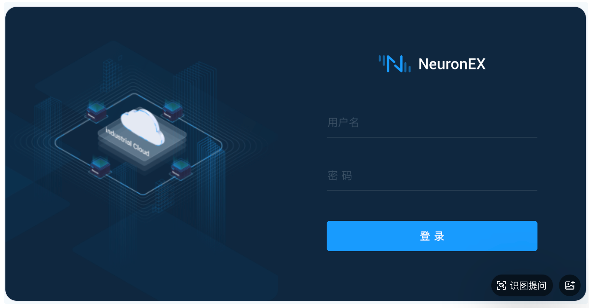
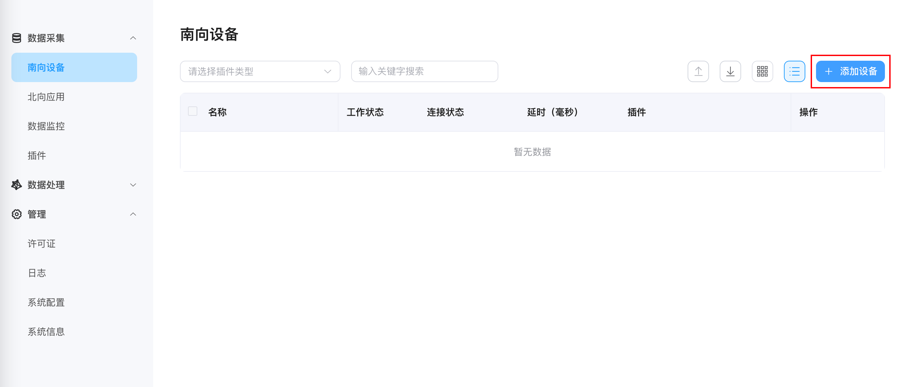
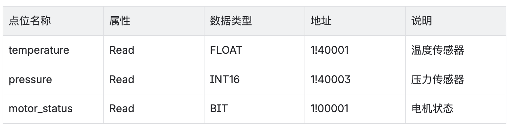
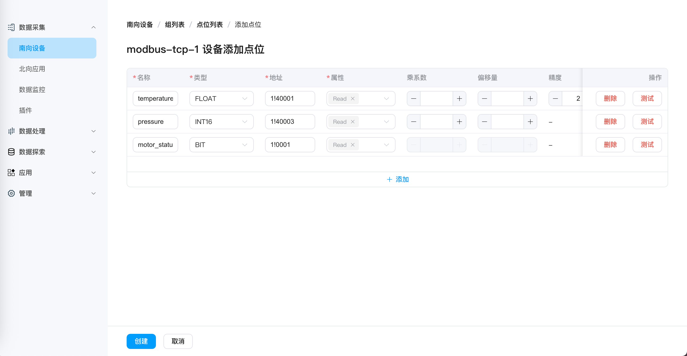
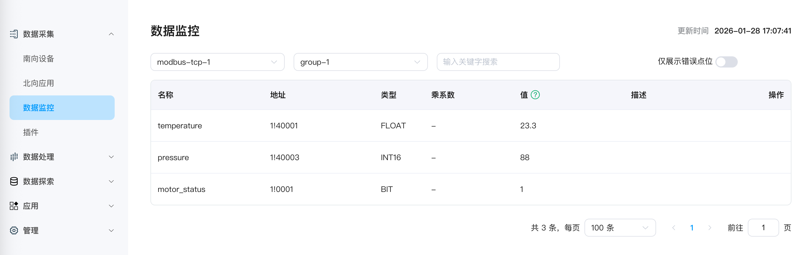
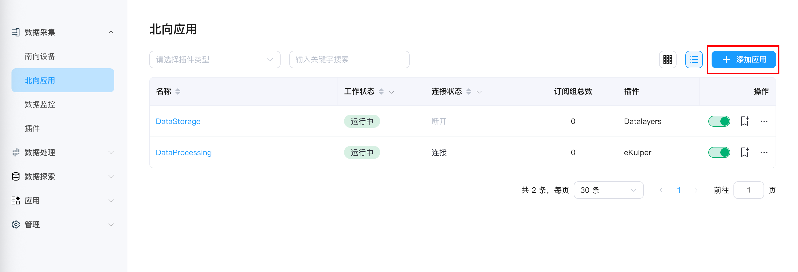
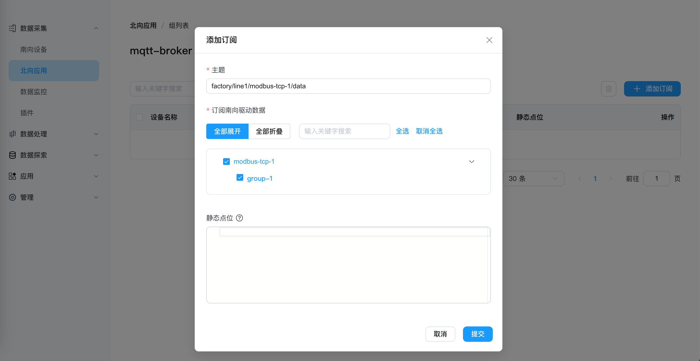
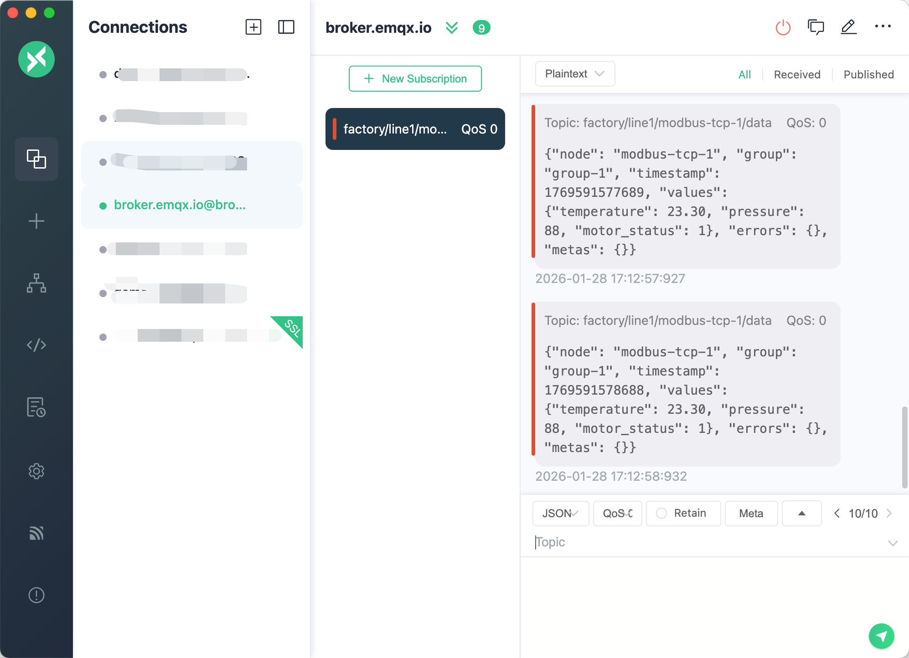

# 如何在 10 分钟内将任意 PLC 连接到 MQTT

将 **PLC** 数据接入 **MQTT** 是现代工业数字化的第一步。**MQTT** 作为轻量级的消息传输协议，已成为工业物联网的事实标准——它能很好地处理不稳定的网络环境，支持实时数据流传输，并且几乎所有的云平台、数据分析工具和 **MES** 系统都原生支持 **MQTT**。

但在实际工厂环境中，将 **PLC** 数据接入 **MQTT** 却远比想象中复杂。不同厂商的 **PLC** 使用不同的通信协议（**Modbus**、**OPC UA**、**Siemens S7**、**Ethernet/IP**...），传统方案需要为每种协议编写驱动代码，部署和维护成本高昂。

本文将展示如何使用 **EMQX Neuron** 在 10 分钟内将任意 **PLC** 连接到 **MQTT**，无需编写任何代码。

## 为什么 PLC 到 MQTT 如此困难？

### 协议碎片化
工厂车间的设备来自不同年代、不同厂商：



每种协议都有自己的数据格式、寻址方式和通信机制。传统方案需要为每种协议开发和维护独立的驱动程序。

### 数据格式不统一
即使成功采集到数据，不同 **PLC** 的数据格式也千差万别：

- 寄存器地址：`40001`（**Modbus**）vs `DB1.DBD0`（**Siemens**）vs `N7:0`（**Allen-Bradley**）

- 数据类型：`INT16`、`FLOAT`、`BOOL`、`STRING`...

- 字节序：大端 vs 小端

这些数据需要标准化处理后才能发送到 **MQTT**。

### 部署和维护成本
传统接入方案往往依赖专用硬件网关，不仅初始采购成本不菲，还需承担后续一系列隐性支出：硬件网关的部署调试需要专业工程师现场操作，耗时耗力；针对不同PLC协议的驱动适配、后期固件升级与故障排查，均需支付额外的技术服务费。

## EMQX Neuron：工业边缘网关软件

**EMQX Neuron** 是一款专为工业场景设计的工业边缘网关软件，它将协议转换、数据处理和 **MQTT** 发布整合到一个轻量级的软件中。

### 核心优势

1. **100+ 工业协议开箱即用**

   - **Modbus TCP/RTU**、**OPC UA**、**Siemens S7**、**Ethernet/IP**、**BACnet**、**IEC 60870-5-104**、**DNP3**...

   - 完整协议列表：[数采插件列表](../introduction/plugin-list/plugin-list.md)

2. **灵活&轻量的部署**

   - **Docker** 容器：一键部署，跨平台运行（`256MB` 内存即可运行）

   - **Kubernetes**：云原生部署

   - 裸机安装：支持 **Ubuntu**、**CentOS**、**Debian**

   - 边缘硬件：树莓派、工业 **PC**、**ARM** 网关

3. **零代码配置**

   - **Web** 界面可视化配置

   - 10 分钟完成从 **PLC** 到 **MQTT** 的完整链路

4. **强大的边缘计算能力**

   - **SQL** 流计算：`160+` 内置函数，支持过滤、转换、聚合

   - **AI** 算法集成：支持 **Python**、**ONNX**、外部 **HTTP** 服务

   - 实时告警：毫秒级响应，支持复杂规则

5. **企业级特性**

   - 高性能：单节点支持 `100,000+` 数据点

   - 安全性：**TLS/SSL** 加密、用户权限管理

   - 可观测性：完整的日志、指标和监控

## 10 分钟实战：Modbus PLC 到 MQTT

让我们通过一个完整的实战案例来演示整个流程。

### 架构概览



### 前提条件

- **PLC** 或模拟器：本例使用 **Modbus TCP** 模拟器（**PeakHMI Slave Simulators**）

- **EMQX Neuron**：通过 **Docker** 快速部署

- **MQTT Broker**：使用公共 **Broker** `broker.emqx.io`

- **MQTT** 客户端：使用 **MQTTX** 验证数据

### 步骤 1：启动 EMQX Neuron


```shell
docker pull emqx/neuronex:latest
docker run -d --name neuronex -p 8085:8085 --log-opt max-size=100m --privileged=true emqx/neuronex:latest
```

访问 <http://localhost:8085>，使用默认账号登录：用户名：`admin`，密码：`0000`



### 步骤 2：添加南向设备（数据源）

**南向设备**是 **NeuronEX** 与 **PLC** 之间的连接。

1. 进入「**数据采集**」→「**南向设备**」

2. 点击「**添加设备**」

3. 配置设备参数：

   - 名称：`modbus-tcp-1`

   - 插件：选择「**Modbus TCP**」

   - **IP** 地址：填写模拟器的 **IP**（如 `192.168.1.100`）

   - 端口：`502`（**Modbus TCP** 默认端口）

   - 其他参数保持默认

4. 点击「**添加设备**」


 

### 步骤 3：创建采集组和点位

**采集组**用于将数据点分组，每个组可以设置独立的采集频率。

#### 3.1 创建采集组

1. 点击刚创建的 `modbus-tcp-1` 设备卡片

2. 点击「**创建组**」

3. 配置组参数：

   - 组名称：`group-1`

   - 采集间隔：`1000`（毫秒，即每秒采集一次）

#### 3.2 添加数据点位

1. 点击 `group-1` 组的「**点位列表**」

2. 点击「**添加点位**」

3. 配置点位参数：



地址格式说明：

- `1!40001`，其中 `1` 是站点号，`40001` 是保持寄存器地址

- `1!00001:1`，其中 `1` 是站点号，`00001` 是线圈地址

4. 点击「**创建**」



完成点位创建后，设备状态会自动变为「**已连接**」。

### 步骤 4：验证数据采集

1. 进入「**数据采集**」→「**数据监控**」

2. 选择南向设备：`modbus-tcp-1`

3. 选择组：`group-1`

4. 查看实时数据



你将看到每个点位的实时值。

### 步骤 5：配置北向应用（MQTT 发布）

**北向应用**用于将采集到的数据发送到外部系统。

#### 5.1 创建 MQTT 应用

1. 进入「**数据采集**」→「**北向应用**」

2. 点击「**添加应用**」

3. 配置应用参数：

   - 名称：`mqtt-broker`

   - 插件：选择「**MQTT**」



#### 5.2 配置 MQTT 连接

1. 在应用配置页面填写：

   - 服务器地址：`broker.emqx.io`（公共 **MQTT Broker**）

   - 服务器端口：`1883`

   - 客户端 **ID**：`neuron-client-001`（可选）

   - 用户名/密码：留空（公共 **Broker** 无需认证）

2. 点击「**提交**」，应用状态会变为「**运行中**」。

#### 5.3 订阅南向数据组

1. 点击 `mqtt-broker` 应用的「**添加订阅**」

2. 配置订阅参数：

   - 主题：`factory/line1/modbus-tcp-1/data`（自定义主题）

   - 订阅南向驱动数据：选择 `modbus-tcp-1` → `group-1`



3. 点击「**提交**」

### 步骤 6：验证 MQTT 数据

使用 **MQTTX** 客户端验证数据是否成功发布到 **MQTT Broker**。

1. 打开 **MQTTX**，创建新连接：

   - 名称：`TestConnection`

   - **Host**：`broker.emqx.io`

   - **Port**：`1883`

2. 添加订阅：

   - **Topic**：`factory/line1/modbus-tcp-1/data`

3. 查看接收到的数据：

```json
{
  "timestamp": 1706745600000,
  "node_name": "modbus-tcp-1",
  "group_name": "group-1",
  "values": {
    "temperature": 23.3,
    "pressure": 88,
    "motor_status": 1
  }
}
```



恭喜！你已经在 10 分钟内完成了从 **Modbus PLC** 到 **MQTT** 的完整数据链路。

## 进阶：支持更多 PLC 协议

上面的例子使用了 **Modbus** 模拟器进行数据采集，**EMQX Neuron** 支持 `100+` 种工业协议。关于 **EMQX Neuron** 采集**西门子 S7-1200 PLC** 数据并发送到 **MQTT** 的完整教程，请参考：[10 分钟将西门子 S7-1200 连接到 MQTT](https://www.emqx.com/zh/blog/connecting-siemens-s7-1200-plc-to-mqtt)

## 进阶：边缘数据处理

**EMQX Neuron** 不仅能采集和转发数据，还能在边缘端进行实时数据处理。

### 使用场景

- **数据过滤**：只上传超过阈值的数据（如温度 > `80°C`）

- **数据转换**：单位转换（`PSI` → `Bar`）、数值计算（`+1`、`×0.9`）

- **数据聚合**：计算平均值、最大值、最小值

- **告警触发**：实时检测异常并发送告警

### 快速示例：温度超限告警

场景：当温度超过 `80°C` 时，发送告警到独立的 **MQTT** 主题。

1. **订阅数据到数据处理模块**

   在「**数据采集**」→「**北向应用**」中，找到默认的 **DataProcessing** 应用，添加订阅：`modbus-tcp-1` 驱动的 `group-1` 采集组。

   数据会自动流入数据处理模块的 `neuronStream` 数据流。

2. **创建处理规则**

   进入「**数据处理**」→「**规则**」，点击「**新建规则**」：

```sql
SELECT
  timestamp,
  node_name,
  values.temperature as temp
FROM neuronStream
WHERE values.temperature > 80
```

3. **配置动作（Sink）**

   在「**动作**」模块点击「**添加**」，选择「**MQTT**」：

   - 服务器地址：`broker.emqx.io:1883`

   - 主题：`factory/alerts/high-temperature`

   - 数据模板：

```json
{
  "alert_type": "high_temperature",
  "device": "{{.node_name}}",
  "temperature": {{.temp}},
  "timestamp": {{int64 .timestamp}}
}
```

4. **验证告警**

   在 **MQTTX** 中订阅 `factory/alerts/high-temperature`，当温度超过 `80°C` 时，你会收到告警消息。


## 总结

将 **PLC** 连接到 **MQTT** 不应该是一个复杂、昂贵、耗时的项目。**EMQX Neuron** 通过以下方式简化了整个流程：

✅ **100+ 协议开箱即用**：无需为每种 **PLC** 编写驱动

✅ **零代码配置**：**Web** 界面可视化操作，10 分钟完成配置

✅ **轻量级部署**：**Docker** 容器，`200MB+` 镜像，`256MB` 内存

✅ **边缘计算能力**：**SQL** 流计算 + **AI** 算法集成

今天就开始你的工业数字化之旅，让数据流动起来。