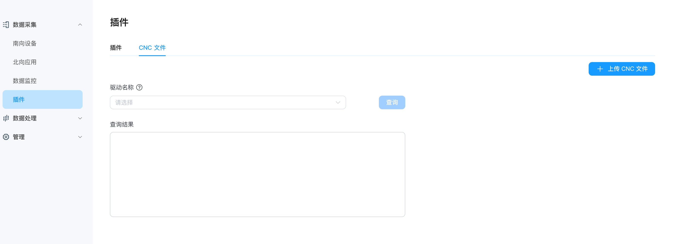

# 管理插件模块

插件可以分为南向驱动和北向应用。南向插件是实现特定协议以访问外部设备的通信驱动程序。北向插件通常用于连接到云平台或像处理引擎这样的外部应用程序。为了实现协议采集及上报，至少需要一个南向插件和一个北向插件分别用于数据采集和数据传递。

登录 NeuronEX 后，您可点击**数据采集** -> **插件**查看系统的插件列表。您也可点击右上角的**添加插件**按钮安装自定义插件。

您可访问[插件列表页](../introduction/plugin-list/plugin-list.md)获取 NeuronEX 完整支持的插件列表。

## 查看可用插件模块

插件管理页面显示所有可用的可插拔模块和详细信息，包括插件名称、插件类型、插件类别、插件版本和描述信息，如下图所示，您可从下拉框中选择北向应用或南向设备的插件。

插件类型包括以下两种模式：

* System：由 NeuronEX 官网提供的插件驱动，不可删除，可以进行插件替换升级。
* Custom：由用户自己开发的插件驱动，可删除，可以进行插件替换升级。

## 添加新的可插拔模块

在插件页面，点击左上角的**添加插件**按钮，上传本地的插件 .so 文件和 .json 文件。

具体的插件开发教程请参考 [SDK 教程](../dev-guide/sdk-tutorial/sdk-tutorial.md)。

## 替换已有插件模块

在插件页面，点击每个插件卡片上的**替换插件**按钮，上传本地的插件 .so 文件和 .json 文件。

具体的插件替换更新，请联系[EMQ商务](https://www.emqx.com/zh/contact?product=neuronex)团队。

## CNC 文件上传

针对南向驱动中的 CNC 驱动，NeuronEX 支持 CNC 文件上传功能，可以将 CNC 文件发送到 CNC 设备侧。

