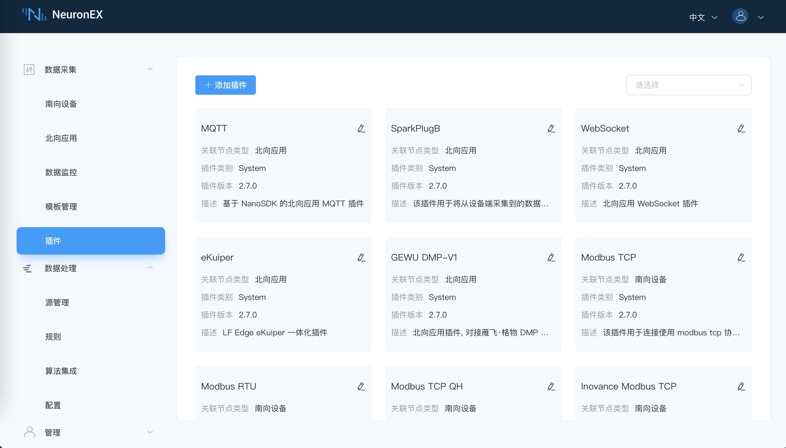
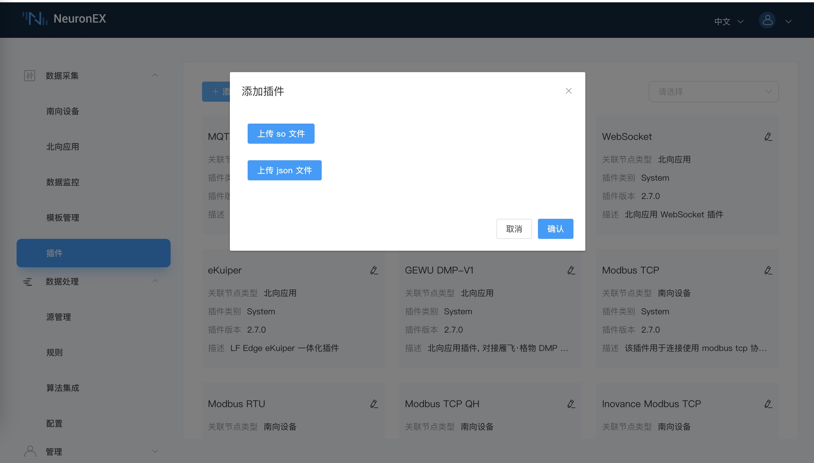
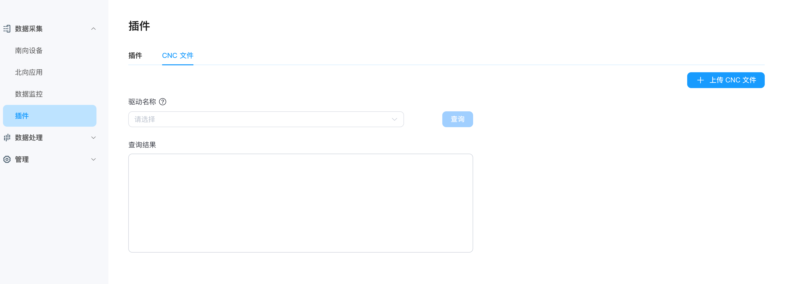

# 驱动与应用管理

登录 EMQX Neuron 后，进入 **数据采集** 下的驱动与应用管理页面，查看已安装的南向驱动和北向应用。二次开发见 [SDK 教程](../dev-guide/sdk-tutorial/sdk-tutorial.md)。

## 查看可用驱动与应用

管理页列出名称、类型、类别、版本和描述。可用下拉框筛选北向应用或南向驱动。

驱动与应用分为以下类型：

* **System**：产品自带，不可删除，可以替换升级。
* **Custom**：用户或定制开发，可删除，可以替换升级。

## 添加驱动或应用

使用左上角的添加功能，上传本地的 `.so` 和 `.json` 文件。

## 替换驱动或应用

在对应的驱动或应用卡片上使用替换功能，上传新的 `.so` 和 `.json`。替换官方驱动或应用请联系 [EMQ 商务](https://www.emqx.com/zh/contact?product=neuronex)。

## CNC 文件上传

南向 CNC 驱动支持把文件发送到设备侧。

