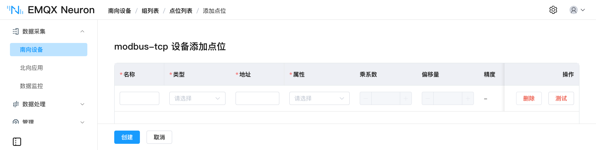
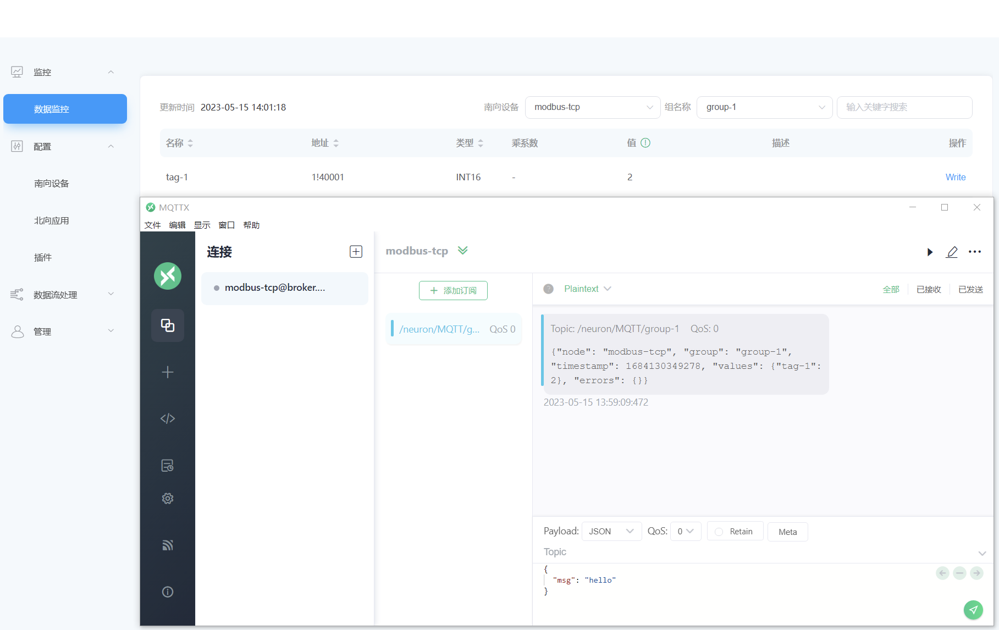
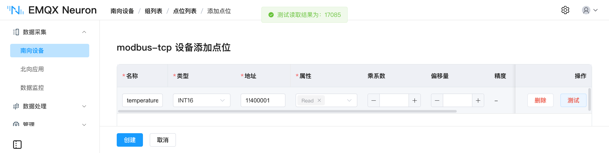

# 组与点位

**点位（Tag）** 是设备里的一个地址，带读写属性、数据类型和精度。**组（Group）** 是点位的集合，拥有独立的采集频率。

组是采集、上报和订阅的最小粒度：同一组内的点位按相同频率采集，一起打包成一条报文上报；北向应用也以组为单位订阅。因此**分组方式直接决定了上报的数据结构、报文大小和带宽占用**，在配置点位之前先想清楚怎么分组。

## 分组策略

**按采集频率分组**　最重要的一条。温度、液位这类慢变量每 5 秒采一次就够，而振动、电流可能需要 100 毫秒。把它们放进同一个组，慢变量会被按快频率反复采集——既增加设备负载，也让上报报文里塞满没有变化的数值。

**按上报去向分组**　北向应用按组订阅。如果一部分点位要上云、另一部分只供厂内 SCADA 读取，分成不同的组，订阅时才能分别指定。

**按设备或工艺段分组**　排障时以组为单位查看运行统计（`group_last_timer_ms`、`group_tags_total`），组的划分与现场结构一致会更容易定位问题。

**控制单组的点位数量**　组内点位一起上报成一条报文，组越大报文越大。运行后查看 `group_last_timer_ms`：该值接近或超过组的采集间隔，说明这一轮采集没能在一个周期内完成，需要拆分组或放宽间隔。

容量限制：单个南向驱动最多 **512** 个组，采集周期最快 **100 毫秒**。完整规格见[配置规范](../introduction.md#配置规范)。

## 创建组

点击驱动节点进入组列表，点击 **创建组**：

| 
字段
 | 说明 |
| --- | --- |
| **名称** | 组名称，最长 128 字符。会出现在默认上报主题和 OPC UA NodeId 中 |
| **时间间隔** | 该组点位的采集与上报周期，单位毫秒，最小 100 |

## 添加点位

点击组的 **点位列表** → **添加点位**：

| 
字段
 | 说明 |
| --- | --- |
| **名称** | 点位名称，最长 128 字符 |
| **属性** | `read`、`write`、`subscribe`，可多选，见[点位属性](#点位属性) |
| **类型** | 数据类型。各驱动支持的类型不同，见对应驱动页面 |
| **地址** | 地址格式因驱动而异。以 Modbus 为例，`1!40001` 中 `1` 为站点号，`40001` 为寄存器地址 |
| **乘系数** | 选填，见[数据加工](#数据加工) |
| **偏移量** | 选填，见[数据加工](#数据加工) |
| **精度** | 类型为 `float` 或 `double` 时可配置，范围 0～17 |
| **单位** | 选填，点位的工程单位，例如 `℃`、`kPa`。仅作标注，不参与换算 |
| **描述** | 选填，最长 256 字符 |

## 点位属性

| 属性 | 行为 |
| --- | --- |
| **read** | 按组的采集周期定时读取 |
| **write** | 允许从北向应用、数据监控页或 HTTP API 写入设备。缺少该属性时写操作返回错误 |
| **subscribe** | 仅在数值发生变化时向北向应用发送消息，无变化不发送 |

属性可多选。需要既采集又反控的点位，同时勾选 `read` 和 `write`。

`subscribe` 适用于开关量、状态位这类长期不变的点位：设备侧仍按组的周期被读取，但只有数值变化时才产生上报消息，可显著减少上行流量。例如某点位默认值为 0，改为 2 时才发送一条消息：

## 数据加工

设备里的原始值往往不是业务需要的值——寄存器里存的是放大 10 倍的整数，或者需要减去一个基准量。这类换算可以在采集侧完成，下游系统直接获得可用的数值。

| 参数 | 计算方式 | 限制 |
| --- | --- | --- |
| **乘系数** | 设备原始值 × 乘系数 = 上报值 | 仅在点位属性为 `read` 时生效 |
| **偏移量** | 设备原始值 + 偏移量 = 上报值 | 仅在点位属性为 `read` 时生效；点位含 `write` 属性时不可用；仅支持数值和浮点类型 |

### 精度

类型为 `float` 或 `double` 时可配置精度，范围 0～17：

- 未设置精度时，默认保留 5 位小数。
- 从小数第二位起，若连续两位为 `00` 或 `99`，则四舍五入。例如 `1.02990` 显示为 `1.03`，`1.80012` 显示为 `1.8`。
- 设置精度后，EMQX Neuron 不再执行上述四舍五入。

::: tip
需要更复杂的换算、过滤或聚合（例如多点位参与的公式、时间窗口内取均值），在[数据处理](../../streaming-processing/overview.md)中用 SQL 实现。
:::

## 验证

点位创建完成后，驱动节点的工作状态应为**运行中**、连接状态应为**已连接**。仍为**断开**时，见[连接排查](../south-devices/south-devices.md#连接排查)。

在 **添加点位** 页可以直接做读取测试，确认地址填写正确（目前仅支持 Modbus TCP 驱动）：

配置完成后，到[数据监控与反控](../../admin/monitoring.md)查看点位实时值。点位数量较多时，用 [Excel 批量导入](../import-export/import-export.md)替代逐个录入。
