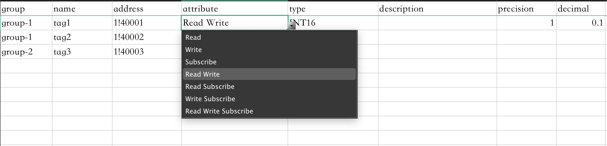

# 导入/导出点位配置

NeuronEX 提供以 Excel 表格方式批量导入和导出标签配置信息的功能，以加速数据标签的配置，同时实现将创建的数据标签信息保存到外部存储中。

## 配置导入

### 下载模版

在**南向设备 -> 组列表**将鼠标悬浮在`导入`上方，会出现`下载模版`的按键，点击`下载模版`按键，下载 Excel 表格。

### 填写 Excel 表格

按照表格格式，填写相应的信息，如下图所示。

* 必填，填写 Group 名称；
* 必填，填写 Tag 名称；
* 必填，填写 Tag 的地址；
* 必填，下拉框选择属性；
* 必填，下拉框选择数据类型；
* 选填，填写描述，可为空；
* 选填，用于设置读到数值的乘数，可为空；
* 选填，当数据类型为 float 或 double 时，用于设置精度。

### 导入 Excel 表格

点击`导入`按键，选择配置完成的 Excel 文件。

## 配置导出

* 选择需要导出的组，可以一键全选；
* 点击`导出`按键，组的名称包括组下的标签信息都将导出到一张 Excel 表格中。
