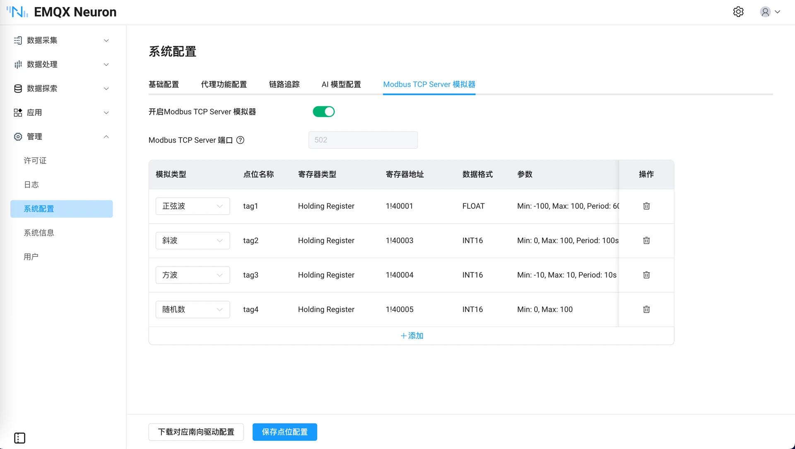

# 内置 Modbus TCP Server 模拟器

## 介绍

为了方便用户在 无硬件环境 下进行开发测试，3.8.0 版本内置了 Modbus TCP 模拟器。它具备以下特点：

- 一键启动 Modbus TCP 模拟器，无需安装第三方软件

- 点位可配置各类动态模拟数据

- 一键导出模拟器配置，配置导入到南向设备，可自动完成数据采集功能

典型应用场景：

- 开发测试：在没有真实 PLC 的情况下，快速验证数据采集逻辑

- 培训演示：无需硬件设备，即可演示 EMQX Neuron 的完整功能

- CI/CD 集成：在自动化测试流程中使用模拟器进行回归测试



## 使用方法

### 启动模拟器

在 NeuronEX 管理 -> 系统配置 页面中，选择 `内置 Modbus TCP Server 模拟器` 选项卡，点击 `启动模拟器` 按钮，即可启动模拟器。模拟器启动后，仍需要配置点位信息，请参考[添加模拟器中的点位](#添加模拟器中的点位)。

::: tip

NeuronEX 默认安装启动后，内置 Modbus TCP Server 模拟器是关闭状态，不会占用任何系统资源，需要手动启动。

:::


### 添加模拟器中的点位

模拟器支持配置最多 10 个点位，模拟类型包括`正弦波`、`斜波`、`方波`和`随机数`，每种模拟类型有固定的寄存器类型、数据格式和参数（不可修改）。点位地址会动态分配，无法手动修改。

### 保存点位配置

点击 `保存点未配置`，模拟器将以当前配置的点位信息，生成对应的动态模拟数据。此时模拟器已可正常运行。

### 下载对应南向驱动配置

模拟器正常运行后，可通过点击`下载对应南向驱动配置`按钮，下载对应南向驱动配置。

下载的配置文件中，已配置了模拟器中的点位信息，可直接在数据采集 -> 南向设备页面中导入，实现数据采集功能。并在数据采集 -> 数据监控页面查看模拟器中的数据。


### 配置模拟器端口(可选)

模拟器运行端口默认为`502`，一般情况下无需修改。端口暂不支持界面修改，调整端口通过系统配置文件设置。

通过修改 `/opt/neuronex/software/neuron/config/neuron.json` 文件中的 modbus_simulator 的`port`参数，修改模拟器运行端口。修改后需要重启 NeuronEX 生效。

```json
{
    "ip": "127.0.0.1",
    "port": 7000,
    "disable_auth": 0,
    "syslog_host": "",
    "syslog_port": 541,
    "sub_filter_error": 0,
    "modbus_simulator": {
        "port": 502
    }
}
```