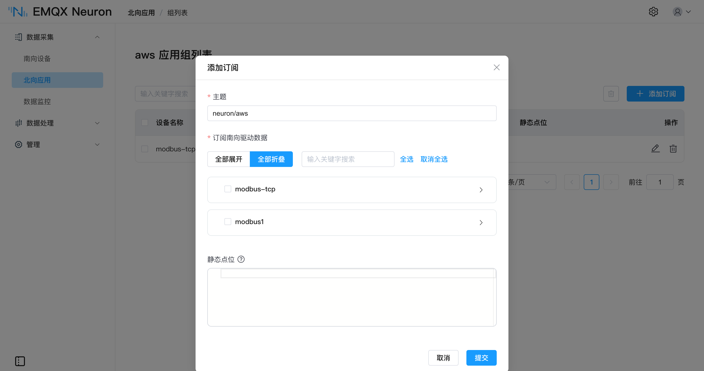

# AWS IoT

[AWS IoT Core] 为互联设备（如传感器、执行器、嵌入式设备、无线设备和智能设备）通过 MQTT 连接到 AWS 云提供了安全的双向通信。

EMQX Neuron 的 AWS IoT 应用基于 [MQTT 应用]，预置了 AWS IoT Core 的接入方式：填入设备数据终端节点，以及在 AWS IoT 控制台创建事物时生成的证书和私钥即可连接。MQTT 应用的上报格式、断网缓存和反控能力同样可用。

[MQTT 应用]: ../mqtt/overview.md
[AWS IoT Core]: https://docs.aws.amazon.com/iot/

## 添加应用

在**北向应用**标签页，点击 **添加应用** 添加节点。

## 应用配置

以下是使用 AWS IoT 应用配置节点时可用的参数：

| 字段               | 说明                                                         |
| ------------------ | ------------------------------------------------------------ |
| **客户端 ID**      | MQTT 通信的客户端 id，必填。                                 |
| **QoS 等级**       | MQTT 通信的服务质量等级，可选，默认为 QoS 0 。               |
| **上报数据格式**   | 上报数据的 JSON 格式： · *values-format*：数据被分成 `values` 和 `errors` 的子对象。 · *tags-format*：数据被放在一个数组中。关于通信数据格式，见 [数据上下行格式](../mqtt/api.md#数据上报) |
| **写请求主题**     | 接收点位写入请求的 MQTT 主题。关于通信数据格式，见 [数据上下行格式](../mqtt/api.md#写-tag) |
| **写响应主题**     | 发送点位写入响应的 MQTT 主题。                               |
| **离线缓存**       | 离线缓存开关。连接断开时缓存 MQTT 消息，连接重建时同步缓存的消息到服务器。见 [离线数据缓存](../mqtt/overview.md#离线数据缓存) |
| **缓存内存大小**   | 通信失败时内存消息缓存大小 (MB) 限制，必填；范围：[0, 1024]，不能大于缓存磁盘大小。 |
| **缓存磁盘大小**   | 通信失败时磁盘消息缓存大小 (MB) 限制，必填，范围：[0, 10240]。 设为非零值时，缓存内存大小也须为非零值。 |
| **缓存消息重传间隔** | 通信恢复、消息重传时每条消息之间的时间间隔 (MS)，必填；范围：[10, 120000] |
| **设备数据终端节点** | AWS IoT 设备数据终端节点。                                 |
| **根 CA 证书**     | AWS IoT 设备数据终端节点根 CA 证书"。                        |
| **设备证书**       | 在 AWS IoT 控制台中创建事物时创建的设备证书 。               |
| **私有私钥**       | 在 AWS IoT 控制台中创建事物时创建的私有密钥 。               |

## 添加订阅

完成应用配置后，通过订阅南向设备实现数据转发。在**北向应用**页，点击设备卡片/设备列进入**组列表**页，点击**添加订阅**：

填**主题**指定上报主题（例如 `/neuron/mqtt/upload`），不填则使用默认主题；在**订阅南向驱动数据**中展开驱动节点勾选要订阅的采集组。字段说明见[订阅南向数据](../../subscription.md#添加订阅)。

上报数据的确切格式由**上报数据格式**参数控制，行为与 MQTT 应用一样。更多详细信息，请参阅 [数据上下行格式](../mqtt/api.md#数据上报)。

## 教程

[使用 EMQX Neuron 将数据桥接到 AWS IoT](./example.md) 教程演示了如何使用 AWS IoT 应用连接 AWS IoT Core。
