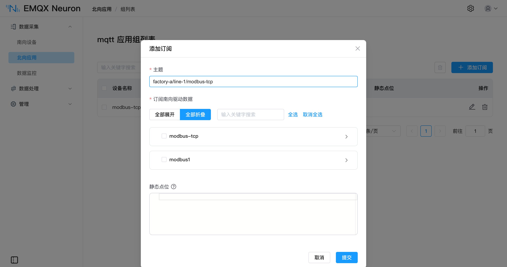

# 数据上云

将南向驱动采集到的点位数据上报至云平台或 MQTT Broker。协议转换在边缘侧完成，云端接收到的是结构统一的 JSON 报文。

## 选择应用

| <div style="width:70pt">应用</div> | 对接目标 | 认证方式 |
| --- | --- | --- |
| [MQTT](./mqtt/overview.md) | 任意 MQTT Broker：EMQX、[EMQX Cloud](./mqtt/overview.md#连接-emqx-cloud)、自建 Broker | 用户名密码、TLS 单向或双向认证 |
| [AWS IoT](./aws-iot/overview.md) | AWS IoT Core | 设备证书与私钥 |
| [Azure IoT](./azure-iot/overview.md) | Azure IoT Hub | SAS 令牌或 X.509 证书 |

三者均基于 MQTT 协议，配置参数大部分相同。AWS IoT 与 Azure IoT 内置了对应平台的主题规则与证书体系，配置时只需填写平台凭据。

::: tip
同一 EMQX Neuron 实例中不建议启用多个 MQTT 应用节点，可能导致性能下降与资源竞争。需要向多个目的地上报数据时，应在同一节点下添加多条订阅，或使用不同类型的北向应用。
:::

## 上报主题

上报主题在每条订阅中单独指定。未指定时使用默认主题：

```
/neuron/{北向应用名}/{南向驱动名}/{组名}
```

例如应用名为 `mqtt`、南向驱动为 `modbus-tcp-1`、组为 `group-1` 时，默认主题为 `/neuron/mqtt/modbus-tcp-1/group-1`。

存在多个工厂或产线时，建议自定义主题以体现层级结构，例如 `factory-a/line-1/modbus-tcp-1`，云端可通过主题通配符订阅。



## 上报格式

上报报文的 JSON 结构由**上报数据格式**参数控制，共四种：

| <div style="width:80pt">格式</div> | 结构 |
| --- | --- |
| `values-format` | 采集成功的点位置于 `values`，采集失败的点位置于 `errors` |
| `tags-format` | 全部点位置于同一数组，每个元素包含点位名与值 |
| `ECP-format` | 在 `tags-format` 基础上增加数据类型字段 |
| `Custom` | 自定义模板，可通过内置变量组织字段与嵌套结构 |

`values-format` 报文示例：

```json
{
    "timestamp": 1650006388943,
    "node": "modbus",
    "group": "grp",
    "values": { "tag0": 123 },
    "errors": { "tag1": 2014 },
    "metas": {}
}
```

点位采集失败时上报错误码，不上报数值。将**上报点位错误码**参数设为 `False` 后，错误点位将被过滤，不包含在报文中。

其余三种格式的报文与字段说明见[数据上下行格式](./mqtt/api.md#数据上报)。

### 静态点位

每个采集组可配置一组静态点位，以 JSON 键值对形式随采集数据一并上报，用于携带产线编号、设备序列号、安装位置等不随采集变化的属性：

```json
{ "location": "sh", "sn_number": "123456" }
```

支持布尔、整型、浮点、字符串四种数据类型，数组与结构体以字符串形式上报。静态点位命名不可与采集点位重名，否则在 `values-format` 下将覆盖采集值。

## 断网缓存

通信中断时，消息优先写入内存缓存，内存缓存写满后转入磁盘缓存；连接恢复后按先进先出顺序重传。

| 参数 | 取值范围 | 默认值 |
| --- | --- | --- |
| 离线缓存 | 开 / 关 | 关 |
| 缓存内存大小 | 1 – 1024 MB | 空 |
| 缓存磁盘大小 | 1 – 10240 MB | 空 |
| 缓存消息重传间隔 | 10 – 120000 ms | 100 |

缓存磁盘大小设为非零值时，缓存内存大小亦须为非零值；缓存内存大小不可大于缓存磁盘大小。不同点位数下的磁盘占用实测数据见[离线数据缓存](./mqtt/overview.md#离线数据缓存)。

MQTT、AWS IoT、Azure IoT 与 Sparkplug B 均支持该组参数，Kafka 与 WebSocket 不支持。

## 反控设备

云端向**写请求主题**发布 JSON 格式的写请求，EMQX Neuron 通过南向驱动写入设备，并将执行结果发布至**写响应主题**。

| 应用 | 写请求主题 |
| --- | --- |
| MQTT、AWS IoT | 可配置，默认 `neuron/${random_str}/write/req` |
| Azure IoT | 固定为 `devices/{设备 ID}/messages/devicebound/#`，执行结果发布至 `devices/{设备 ID}/messages/events/` |

目标点位须在南向驱动中配置 **write** 属性，见[组与点位 · 点位属性](../groups-tags/groups-tags.md#点位属性)。请求体格式与多点位写入见[数据上下行格式 · 写 Tag](./mqtt/api.md#写-tag)。

## 上报前的数据处理

点位数量较多或采集频率较高时，原始数据全量上报将占用较多上行带宽与云端存储。可先将南向数据接入[数据处理](../../streaming-processing/overview.md)引擎，经 SQL 过滤、降采样或聚合后再上报。两条路径可同时存在，选型依据见[接入大数据与边缘计算](./analytics.md)。

## 下一步

- [创建北向应用](./north-apps.md) → [订阅南向数据](../subscription.md)
- 南向驱动的运行状态可上报至指定主题，用于云端监控网关运行情况，见 [MQTT · 驱动状态上报](./mqtt/overview.md#驱动状态上报)
