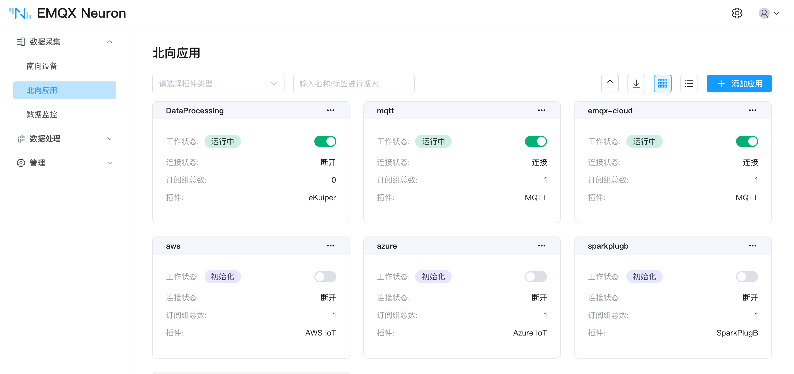
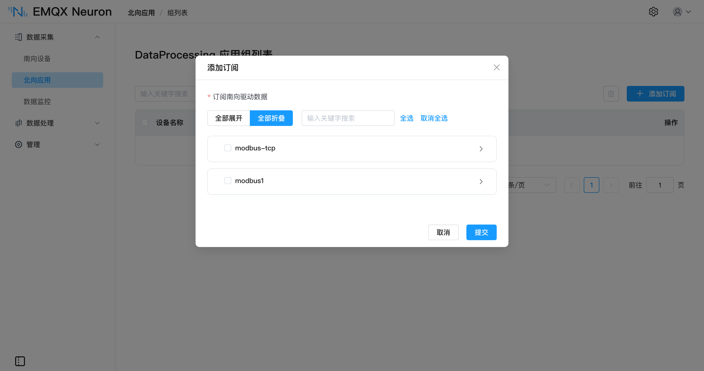

# 规则引擎应用

规则引擎应用用于将 EMQX Neuron 数采模块的数据发送到数据处理模块。

在 EMQX Neuron 的**北向应用** 页面已经默认配置的 **规则引擎应用** 类型的节点 `DataProcessing`，并做好了参数配置。用户只需要将南向驱动数据添加订阅到`DataProcessing`节点即可。



## 添加订阅

点击操作栏中的**添加订阅**，在**订阅南向驱动数据**中展开驱动节点，勾选要订阅的采集组：



规则引擎应用不需要填主题，数据直接进入数据处理模块。

至此，我们将能通过 DataProcessing 节点 将南向驱动`m1`的`group1`组中的数据，发送到数据处理模块的 `neuronStream`流里进行下一步处理。


有关在数据处理模块中的操作，见[neuronStream](../../../streaming-processing/neuron.md)。

:::tip 提示
当数据处理模块中的`neuronStream`流，在规则中使用并有数据流入后，`DataProcessing`节点的连接状态才会变为**已连接**。
:::

## 数据格式

通过 Dataprocessing 节点发送到`neuronStream`的消息为固定的 json 格式，如下所示： 

```json
{
  "timestamp": 1646125996000,
  "node_name": "node1", 
  "group_name": "group1",
  "values": {
    "tag_name1": 11.22,
    "tag_name2": "string"
  },
  "errors": {},
  "metas":{}
}
```


## 反向控制

数据处理模块通过`Neuron Sink`可以通过 DataProcessing 节点，向南向驱动下发写命令来控制设备。关于这部分的详细操作，见[Neuron Sink](../../../streaming-processing/sink/neuron.md)。


