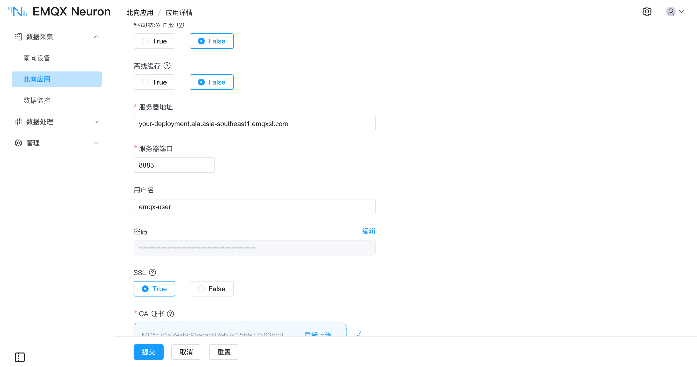
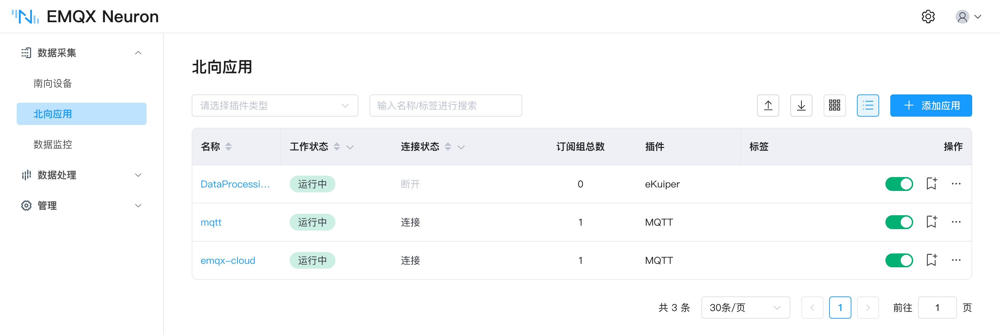
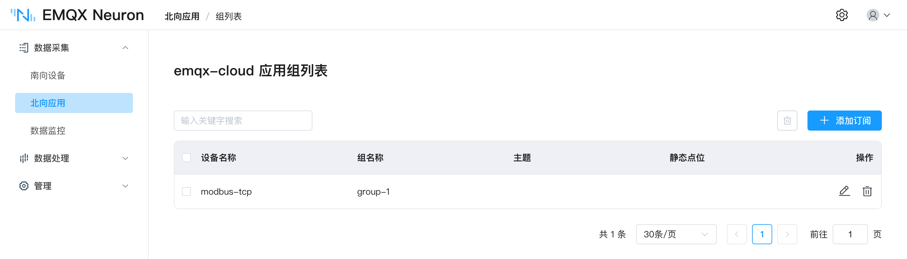
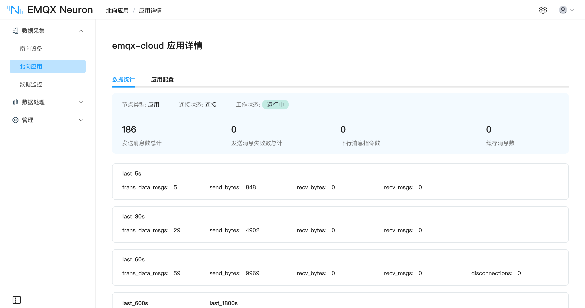

# EMQX Cloud

[EMQX Cloud](https://www.emqx.com/zh/cloud) 是 EMQ 提供的全托管 MQTT 云服务。EMQX Neuron 没有专门的 EMQX Cloud 应用，用 [MQTT 应用](../mqtt/overview.md)接入即可——EMQX Cloud 提供的就是标准 MQTT 接入点。

与连接自建 Broker 的差别集中在端口、认证和 TLS 三处，按部署类型不同。

## 连接参数

| 配置项 | Serverless 版 | 专有版 |
| --- | --- | --- |
| 服务器地址 | 部署的连接地址，在 EMQX Cloud 控制台的**部署管理**页查看 | 同左 |
| 服务器端口 | `8883`，不开放明文端口 | 默认 `1883`；配置 TLS 后可用 `8883` |
| SSL | 必须开启 | 使用 `8883` 时开启 |
| CA 证书 | 单向认证，[下载 CA](https://assets.emqx.com/data/emqxsl-ca.crt) 后上传 | 按所配置的证书填写 |
| 用户名、密码 | 在控制台**客户端认证 → 默认认证**中创建 | 同左 |

其余参数（上报格式、断网缓存、反控主题等）与 MQTT 应用一致，见 [MQTT · 应用配置](../mqtt/overview.md#应用配置)。

::: tip
Serverless 版对 SNI 有要求，**服务器地址**须填部署的完整域名，不能用 IP，否则连接会被拒绝。
:::

## 配置步骤

1. 在 EMQX Cloud 控制台创建部署，在**部署管理**页记下连接地址与端口。
2. 在**客户端认证 → 默认认证**中新建一组用户名密码。
3. 回到 EMQX Neuron，按[添加应用](../north-apps.md)创建一个 MQTT 类型的北向应用。
4. 在应用配置中填入上表的参数，Serverless 版需同时打开 **SSL** 并上传 CA 证书。



5. 提交后应用进入**运行中**，连接状态显示为**连接**。



6. [订阅南向数据](../../subscription.md)，指定要上报的采集组。



上报是否正常可在应用的**数据统计**页看发送消息数：



云端侧可在 EMQX Cloud 控制台的在线消息查看，或用 MQTTX 订阅对应主题验证，见 [MQTT · 使用 MQTTX 查看数据](../mqtt/overview.md#使用-mqttx-查看数据)。默认主题为 `/neuron/{应用名}/{驱动名}/{组名}`，报文示例：

```json
{
  "node": "modbus-tcp",
  "group": "group-1",
  "timestamp": 1790219933821,
  "values": { "sine": -15741, "square": -10, "random": 99, "setpoint": 68 },
  "errors": {},
  "metas": {}
}
```

## 继续流向数据仓库

数据进了 EMQX 之后，可由 EMQX 的数据集成直接写入 Snowflake、Databricks 等分析平台，边缘侧不需要改动。见[数据桥接到 Snowflake 与 Databricks](./datalake.md)。

## 延伸阅读

端口与认证的完整说明见 EMQX Cloud 文档的 [Serverless 连接指引](https://docs.emqx.com/zh/cloud/latest/deployments/port_guide_serverless.html)与[专有版连接指引](https://docs.emqx.com/zh/cloud/latest/deployments/port_guide_dedicated.html)。
