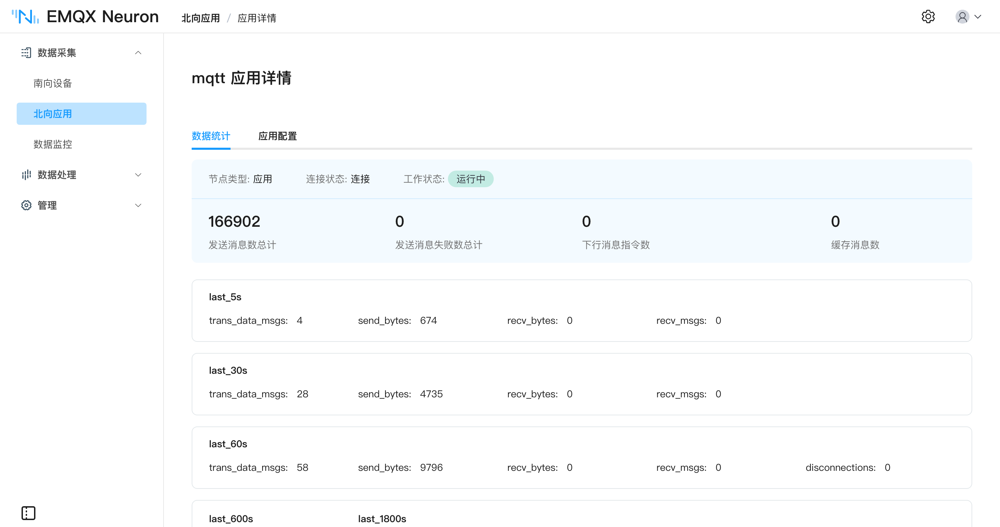

# 创建北向应用

南向点位采到之后，用北向应用把数据送到 MQTT、云或处理引擎。协议清单和参数见 [北向应用协议](./catalog.md)。

阅读顺序：

1. 本页：创建北向节点
2. [订阅南向数据](../subscription.md)：把南向组挂到该应用
3. [北向应用协议](./catalog.md)：MQTT、Sparkplug B、Kafka 等

本节以 MQTT 为例。

## 添加北向应用

在 **数据采集** -> **北向应用**，点击 **添加应用**：

* **名称**：应用节点名称，例如 `mqtt`。
* **应用**：选择 **MQTT**。

点击 **创建** 后进入应用配置页。也可以稍后在卡片上点 **应用配置**。

## 设置北向应用参数

在应用配置里填写连接参数。MQTT 各项说明见 [MQTT 应用](./mqtt/overview.md)。

点击 **提交** 后，卡片进入 **运行中**。

## 应用卡片

北向应用页右上角可在列表和卡片之间切换。卡片上的项：

* **名称**：北向应用的唯一名称。
* **应用配置**：填写连接参数。
* **编辑**：修改节点名称。
* **数据统计**：查看运行统计。
* **DEBUG 日志**：打印当前节点 DEBUG 日志，约十分钟后恢复默认级别。
* **删除**：从列表中删除该节点。
* **工作状态**：
  * **初始化**：刚添加。
  * **配置中**：正在填写配置。
  * **就绪**：配置成功。
  * **运行中**：正在运行。
  * **停止**：已停止。
* **工作状态切换**：打开后与对端建立连接并上报；关闭则断开。
* **连接状态**：与对端是否已连接。
* **应用**：该应用使用的应用名。

## 订阅南向数据

点位按组上报。创建北向应用后，需要订阅南向组，步骤见 [订阅南向数据](../subscription.md)。

## 运行与维护

### 数据统计

在卡片或列表中点击 **数据统计**。

| 参数 | 说明 |
| --- | --- |
| send_msgs_total | 发送消息总条数 |
| send_msg_errors_total | 发送失败总条数 |
| recv_msgs_total | 接收消息总条数 |
| link_state | 连接状态：DISCONNECTED = 0，CONNECTED = 1 |
| running_state | 节点状态：INIT = 1，READY = 2，RUNNING = 3，STOPPED = 4 |

### 故障诊断

若运行异常，点击 **DEBUG 日志**。系统会打印该节点 DEBUG 日志，约十分钟后切回默认级别。然后在**管理** -> **日志** 页面查看。详见 [管理日志](../../admin/log-management.md)。
