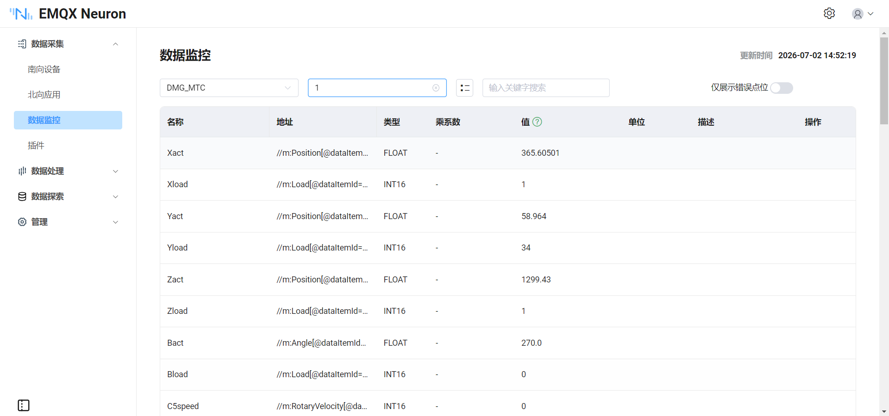

# 接入 DMG MORI 设备

本指南演示如何通过 MTConnect 协议将 DMG MORI CNC 接入 EMQX Neuron，以 MTConnect cppagent 作为中间代理。

## 架构概览

```
DMG MORI Machine 1 ──TCP:7878──┐
                               ├── MTConnect Agent (Docker) ──HTTP:5000── EMQX Neuron
DMG MORI Machine 2 ──TCP:7878──┘
```

每台 DMG MORI 机床运行一个适配器（Adapter）进程，通过 TCP 端口 7878 将实时运行数据推送至 MTConnect cppagent。Agent 聚合数据后通过 HTTP REST API（端口 5000）对外提供服务，EMQX Neuron 使用 MTConnect 驱动从中采集数据。

## 部署 MTConnect Agent

拉取 Agent Docker 镜像并启动容器。详细说明请参考 [cppagent](https://github.com/mtconnect/cppagent)。

```shell
docker pull mtconnect/agent:2.7
docker run -d --name mtcagent -it -p 5000:5000/tcp -v ./conf:/mtconnect/config mtconnect/agent:2.7
```

宿主机 `./conf` 目录中放置配置文件：`agent.cfg` 和 `Devices.xml`。

## 配置 agent.cfg

`agent.cfg` 指定适配器（DMG MORI 机床）、HTTP 端口及其他 Agent 设置：

```ini
Devices = Devices.xml
SchemaVersion = 2.7
WorkerThreads = 3
MonitorConfigFiles = yes
Port = 5000
JsonVersion = 2

MinCompressFileSize = 10k

Files {
  schemas {
    Path = ../data/schemas
    Location = /schemas/
  }
  styles {
    Path = ../data/styles
    Location = /styles/
  }
  Favicon {
      Path = ../data/styles/favicon.ico
      Location = /favicon.ico
  }
}

Directories {
  twin {
    Path = ../twin/
    Location = /twin/
    Default = index.html
  }
}

Sinks {
#  MqttService {
#  }
}

DevicesStyle { Location = /styles/styles.xsl }
StreamsStyle { Location = /styles/styles.xsl }

Adapters {
  DMG_MORI {
    Port = 7878
    Host = 172.16.146.145
  }
  DMG_MORI1 {
    Port = 7878
    Host = 172.16.146.135
  }
}

logger_config {
  output = file /tmp/agent.log
  level = debug
}
```

| 参数 | 说明 |
| ----------- | ---------------------------------------------------------- |
| `Devices` | 设备模型 XML 文件的路径。 |
| `Port` | Agent API 的 HTTP 端口（默认 5000）。 |
| `Adapters` | 定义向 Agent 推送数据的机床。每个条目指定适配器的 TCP 主机和端口。 |

## 配置 Devices.xml

`Devices.xml` 描述每台机床的数据模型——可用的数据项（坐标轴、控制器状态、主轴等）及其类型。该文件遵循 MTConnect Schema 规范，通常由设备供应商提供。本示例中定义了两台搭载 MAPPS 控制器的 DMG MORI 机床。

## EMQX Neuron 配置

### 添加设备

在 **数据采集 -> 南向设备** 点击**添加设备**，选择 **MTConnect** 驱动，配置以下参数：

| 参数 | 值 |
| ------------- | ----------------------------------------- |
| **host** | MTConnect Agent IP 地址 |
| **port** | 5000 |
| **ns_prefix** | m |
| **ns_uri** | `urn:mtconnect.org:MTConnectStreams:2.7` |

::: tip
`ns_uri` 最后的版本号应与 `agent.cfg` 中 `SchemaVersion` 的值保持一致。例如 `SchemaVersion = 2.7`，则使用 `MTConnectStreams:2.7`。
:::

### 设置组和点位

添加组并设定采集间隔（如 1000 ms），然后添加点位，使用 XPath 地址从 MTConnect 数据流中选择所需的数据项。

### 如何编写地址

可通过 Agent 的 `/current` 接口获取当前数据快照，在返回的 XML 中找到目标数据元素，据此编写地址。

```shell
wget http://$AGENT_IP:5000/current
```

例如 DMG MORI 设备的 `current` 返回内容可能包含以下片段：

```xml
<Samples>
  <Position dataItemId="DMGXact" name="Xact" timestamp="..." subType="ACTUAL">-40.139</Position>
  <Load dataItemId="DMGXload" name="Xload" timestamp="...">6</Load>
</Samples>
<Events>
  <Execution dataItemId="DMGexecution1" name="execution1" timestamp="...">ACTIVE</Execution>
  <PartCount dataItemId="DMGpart_count1" name="part_count1" timestamp="...">17</PartCount>
</Events>
<Condition>
  <Normal dataItemId="DMGmotion1" name="motion1" timestamp="..." type="MOTION_PROGRAM" />
</Condition>
```

编写地址的规则：
- 使用 `//m:` 开头，后跟 XML 元素名（如 `Position`、`Load`、`Execution`），加上 `[@dataItemId="..."]` 过滤条件。
- 对于有文本内容的元素，使用默认格式：`//m:元素名[@dataItemId="<id>"]`
- 对于自闭合标签（常见于 CONDITION 类型），添加 `node-name:` 前缀提取元素标签名：`node-name://m:*[@dataItemId="<id>"]`

| 采集数据 | 地址 |
| ----------------------------------- | --------------------------------------------------------------- |
| X 轴位置 (`DMGXact`) | `//m:Position[@dataItemId="DMGXact"]` |
| 运行状态 (`DMGexecution1`) | `//m:Execution[@dataItemId="DMGexecution1"]` |
| 报警/运动状态 (`DMGmotion1`) | `node-name://m:*[@dataItemId="DMGmotion1"]` |

## 地址格式

点位地址使用 XML XPath 表达式，以 `m:` 作为命名空间前缀，通过 `dataItemId` 属性选择数据项。

| 地址 | 数据类型 | 说明 |
| -------------------------------------------------------------- | --------- | -------------- |
| `//m:PartCount[@dataItemId="DMGpart_count1"]` | INT32 | 加工数 |
| `//m:LineLabel[@dataItemId="DMGline1"]` | STRING | 节拍 |
| `//m:Execution[@dataItemId="DMGexecution1"]` | STRING | 运行状态 |
| `//m:OperationMode[@dataItemId="DMGoperationmode1"]` | STRING | 模式 |
| `//m:ControllerMode[@dataItemId="DMGmode1"]` | STRING | 模式2 |
| `//m:PathFeedrateOverride[@dataItemId="DMGjogoverride1"]` | STRING | 进给倍率 |
| `//m:PathFeedrateOverride[@dataItemId="DMGrapidoverride1"]` | STRING | 快速进给倍率 |
| `//m:PathFeedrate[@dataItemId="DMGpath_feedrate1"]` | DOUBLE | 进给量 |
| `//m:RotaryVelocityOverride[@dataItemId="DMGspindleoverride5"]` | STRING | 主轴倍率 |
| `//m:RotaryVelocityOverride[@dataItemId="DMGspindleoverride8"]` | STRING | 主轴速度 |
| `//m:Load[@dataItemId="DMGXload"]` | INT32 | 伺服负载1 (X) |
| `//m:Load[@dataItemId="DMGYload"]` | INT32 | 伺服负载2 (Y) |
| `//m:Load[@dataItemId="DMGZload"]` | INT32 | 伺服负载3 (Z) |
| `//m:Load[@dataItemId="DMGBload"]` | INT32 | 伺服负载4 (B) |
| `//m:ToolNumber[@dataItemId="DMGtoolnumber1"]` | STRING | 刀具号 |
| `//m:Program[@dataItemId="DMGprogram1"]` | STRING | 当前程序号 |
| `//m:Block[@dataItemId="DMGblock1"]` | STRING | 当前程序名 |
| `node-name://m:*[@dataItemId="DMGmotion1"]` | STRING | 报警状态 |

::: tip
XPath 中的 `dataItemId` 属性值对应 `Devices.xml` 中定义的 `id` 值。请根据您的 `Devices.xml` 文件确定可用的数据项 ID。
:::

## 数据监控

完成点位配置后，您可点击 **数据采集 -> 数据监控** 查看从 DMG MORI 设备采集的实时数据。



具体可参考[数据监控](../../../admin/monitoring.md)。

## 附录：Devices.xml

```xml
<?xml version="1.0" encoding="utf-8"?>
<MTConnectDevices xmlns:mt="urn:mtconnect.org:MTConnectDevices:2.7"
  xmlns:xsi="http://www.w3.org/2001/XMLSchema-instance"
  xmlns="urn:mtconnect.org:MTConnectDevices:2.7"
  xsi:schemaLocation="urn:mtconnect.org:MTConnectDevices:2.7 ./schemas/MTConnectDevices_2.7.xsd">
  <Header deviceModelChangeTime="2022-06-17T16:33:21.188094Z" creationTime="2013-04-02T03:40:04Z"
    assetBufferSize="1024" sender="localhost" assetCount="0" version="2.0" instanceId="1"
    bufferSize="131072"/>
  <Devices>
		<Device id="d2" uuid="DMG_MORI" name="DMG_MORI">
			<Description manufacturer="DMG MORI" serialNumber="NHC50171001">DMG MORI with MAPPS controller</Description>
			<Configuration>
				<CoordinateSystems>
					<CoordinateSystem id="dm_base" type="BASE">
						<Origin>0 0 0</Origin>
					</CoordinateSystem>
					<CoordinateSystem id="dm_machine" type="MACHINE" parentIdRef="dm_base">
						<Transformation>
							<Translation>0 0 0</Translation>
							<Rotation>0 0 0</Rotation>
						</Transformation>
					</CoordinateSystem>
					<CoordinateSystem id="dm_work" type="OBJECT" parentIdRef="dm_machine">
						<Transformation>
							<Translation>0 0 0</Translation>
							<Rotation>0 0 0</Rotation>
						</Transformation>
					</CoordinateSystem>
				</CoordinateSystems>
			</Configuration>
			<DataItems>
				<DataItem category="EVENT" id="DMGavail" name="avail" type="AVAILABILITY"/>
				<DataItem category="EVENT" id="DMGestop" name="estop" type="EMERGENCY_STOP"/>
				<DataItem category="EVENT" id="DMGcoolant" name="coolant" type="x:COOLANT"/>
				<DataItem category="EVENT" id="DMGcutting1" name="cutting1" type="x:CUTTING_STATUS"/>
			</DataItems>
			<Components>
				<Axes id="dm_axes" name="axes">
					<Components>
						<Linear id="dm_x" name="X">
							<DataItems>
								<DataItem type="POSITION" subType="ACTUAL" category="SAMPLE" id="DMGXact" name="Xact" units="MILLIMETER" coordinateSystemIdRef="dm_machine"/>
								<DataItem type="LOAD" category="SAMPLE" id="DMGXload" name="Xload" units="PERCENT"/>
							</DataItems>
						</Linear>
						<Linear id="dm_y" name="Y">
							<DataItems>
								<DataItem type="POSITION" subType="ACTUAL" category="SAMPLE" id="DMGYact" name="Yact" units="MILLIMETER" coordinateSystemIdRef="dm_machine"/>
								<DataItem type="LOAD" category="SAMPLE" id="DMGYload" name="Yload" units="PERCENT"/>
							</DataItems>
						</Linear>
						<Linear id="dm_z" name="Z">
							<DataItems>
								<DataItem type="POSITION" subType="ACTUAL" category="SAMPLE" id="DMGZact" name="Zact" units="MILLIMETER" coordinateSystemIdRef="dm_machine"/>
								<DataItem type="LOAD" category="SAMPLE" id="DMGZload" name="Zload" units="PERCENT"/>
							</DataItems>
						</Linear>
						<Rotary id="dm_b" name="B">
							<DataItems>
								<DataItem type="ANGLE" subType="ACTUAL" category="SAMPLE" id="DMGBact" name="Bact" units="DEGREE" coordinateSystemIdRef="dm_machine"/>
								<DataItem type="LOAD" category="SAMPLE" id="DMGBload" name="Bload" units="PERCENT"/>
							</DataItems>
						</Rotary>
						<Rotary id="dm_c5" name="C5">
							<DataItems>
								<DataItem type="ROTARY_VELOCITY" subType="ACTUAL" category="SAMPLE" id="DMGC5speed" name="C5speed" units="REVOLUTION/MINUTE"/>
								<DataItem type="LOAD" category="SAMPLE" id="DMGC5load" name="C5load" units="PERCENT"/>
								<DataItem type="ROTARY_MODE" category="EVENT" id="DMGC5mode" name="C5mode"/>
								<DataItem type="ROTARY_VELOCITY_OVERRIDE" category="EVENT" id="DMGspindleoverride5" name="spindleoverride5" units="PERCENT"/>
								<DataItem type="x:SPINDLE_ROTATING" category="EVENT" id="DMGspindlerotating5" name="spindlerotating5"/>
							</DataItems>
						</Rotary>
						<Rotary id="dm_c6" name="C6">
							<DataItems>
								<DataItem type="ROTARY_VELOCITY" subType="ACTUAL" category="SAMPLE" id="DMGC6speed" name="C6speed" units="REVOLUTION/MINUTE"/>
								<DataItem type="LOAD" category="SAMPLE" id="DMGC6load" name="C6load" units="PERCENT"/>
								<DataItem type="ROTARY_MODE" category="EVENT" id="DMGC6mode" name="C6mode"/>
								<DataItem type="x:SPINDLE_ROTATING" category="EVENT" id="DMGspindlerotating6" name="spindlerotating6"/>
							</DataItems>
						</Rotary>
						<Rotary id="dm_c7" name="C7">
							<DataItems>
								<DataItem type="LOAD" category="SAMPLE" id="DMGC7load" name="C7load" units="PERCENT"/>
							</DataItems>
						</Rotary>
						<Rotary id="dm_c8" name="C8">
							<DataItems>
								<DataItem type="ROTARY_VELOCITY" subType="ACTUAL" category="SAMPLE" id="DMGC8speed" name="C8speed" units="REVOLUTION/MINUTE"/>
								<DataItem type="ROTARY_MODE" category="EVENT" id="DMGC8mode" name="C8mode"/>
								<DataItem type="ROTARY_VELOCITY_OVERRIDE" category="EVENT" id="DMGspindleoverride8" name="spindleoverride8" units="PERCENT"/>
								<DataItem type="x:SPINDLE_ROTATING" category="EVENT" id="DMGspindlerotating8" name="spindlerotating8"/>
							</DataItems>
						</Rotary>
						<Rotary id="dm_c9" name="C9">
							<DataItems>
								<DataItem type="ROTARY_VELOCITY" subType="ACTUAL" category="SAMPLE" id="DMGC9speed" name="C9speed" units="REVOLUTION/MINUTE"/>
								<DataItem type="ROTARY_MODE" category="EVENT" id="DMGC9mode" name="C9mode"/>
								<DataItem type="x:SPINDLE_ROTATING" category="EVENT" id="DMGspindlerotating9" name="spindlerotating9"/>
							</DataItems>
						</Rotary>
					</Components>
				</Axes>
				<Controller id="dm_ctrl" name="controller">
					<DataItems>
						<DataItem type="CONTROLLER_MODE" category="EVENT" id="DMGmode1" name="mode1"/>
						<DataItem type="x:OPERATION_MODE" category="EVENT" id="DMGoperationmode1" name="operationmode1"/>
						<DataItem type="EXECUTION" category="EVENT" id="DMGexecution1" name="execution1"/>
						<DataItem type="PROGRAM" category="EVENT" id="DMGprogram1" name="program1"/>
						<DataItem type="PROGRAM" subType="MAIN" category="EVENT" id="DMGmainprogram1" name="mainprogram1"/>
						<DataItem type="PART_COUNT" category="EVENT" id="DMGpart_count1" name="part_count1"/>
						<DataItem type="TOOL_NUMBER" category="EVENT" id="DMGtoolnumber1" name="toolnumber1"/>
						<DataItem type="x:RESET" category="EVENT" id="DMGreset1" name="reset1"/>
						<DataItem type="CONTROLLER_MODE_OVERRIDE" subType="OPTIONAL_STOP" category="EVENT" id="DMGoptionalstop1" name="optionalstop1"/>
						<DataItem type="CONTROLLER_MODE_OVERRIDE" subType="DRY_RUN" category="EVENT" id="DMGdryrun1" name="dryrun1"/>
						<DataItem type="x:BLOCK_DELETE" category="EVENT" id="DMGblockdelete1" name="blockdelete1"/>
						<DataItem type="PATH_FEEDRATE_OVERRIDE" subType="JOG" category="EVENT" id="DMGjogoverride1" name="jogoverride1" units="PERCENT"/>
						<DataItem type="PATH_FEEDRATE_OVERRIDE" subType="RAPID" category="EVENT" id="DMGrapidoverride1" name="rapidoverride1" units="PERCENT"/>
						<DataItem type="LOGIC_PROGRAM" category="CONDITION" id="DMGlogic1" name="logic1"/>
						<DataItem type="MOTION_PROGRAM" category="CONDITION" id="DMGmotion1" name="motion1"/>
						<DataItem type="LOGIC_PROGRAM" category="CONDITION" id="DMGlogic2" name="logic2"/>
						<DataItem type="MOTION_PROGRAM" category="CONDITION" id="DMGmotion2" name="motion2"/>
						<DataItem type="LOGIC_PROGRAM" category="CONDITION" id="DMGlogic3" name="logic3"/>
						<DataItem type="MOTION_PROGRAM" category="CONDITION" id="DMGmotion3" name="motion3"/>
						<DataItem type="LOGIC_PROGRAM" category="CONDITION" id="DMGlogic4" name="logic4"/>
						<DataItem type="MOTION_PROGRAM" category="CONDITION" id="DMGmotion4" name="motion4"/>
					</DataItems>
					<Components>
						<Path id="dm_path1" name="path">
							<DataItems>
								<DataItem type="PATH_FEEDRATE" subType="ACTUAL" category="SAMPLE" id="DMGpath_feedrate1" name="path_feedrate1" units="MILLIMETER/SECOND"/>
								<DataItem type="BLOCK" category="EVENT" id="DMGblock1" name="block1"/>
								<DataItem type="LINE_LABEL" category="EVENT" id="DMGline1" name="line1"/>
							</DataItems>
						</Path>
					</Components>
				</Controller>
			</Components>
		</Device>
		<Device id="d3" uuid="DMG_MORI1" name="DMG_MORI1">
			<Description manufacturer="DMG MORI" serialNumber="NHC50171001">DMG MORI with MAPPS controller</Description>
			<Configuration>
				<CoordinateSystems>
					<CoordinateSystem id="dm_base_1" type="BASE">
						<Origin>0 0 0</Origin>
					</CoordinateSystem>
					<CoordinateSystem id="dm_machine_1" type="MACHINE" parentIdRef="dm_base_1">
						<Transformation>
							<Translation>0 0 0</Translation>
							<Rotation>0 0 0</Rotation>
						</Transformation>
					</CoordinateSystem>
					<CoordinateSystem id="dm_work_1" type="OBJECT" parentIdRef="dm_machine_1">
						<Transformation>
							<Translation>0 0 0</Translation>
							<Rotation>0 0 0</Rotation>
						</Transformation>
					</CoordinateSystem>
				</CoordinateSystems>
			</Configuration>
			<DataItems>
				<DataItem category="EVENT" id="DMGavail_1" name="avail" type="AVAILABILITY"/>
				<DataItem category="EVENT" id="DMGestop_1" name="estop" type="EMERGENCY_STOP"/>
				<DataItem category="EVENT" id="DMGcoolant_1" name="coolant" type="x:COOLANT"/>
				<DataItem category="EVENT" id="DMGcutting1_1" name="cutting1" type="x:CUTTING_STATUS"/>
			</DataItems>
			<Components>
				<Axes id="dm_axes_1" name="axes">
					<Components>
						<Linear id="dm_x_1" name="X">
							<DataItems>
								<DataItem type="POSITION" subType="ACTUAL" category="SAMPLE" id="DMGXact_1" name="Xact" units="MILLIMETER" coordinateSystemIdRef="dm_machine_1"/>
								<DataItem type="LOAD" category="SAMPLE" id="DMGXload_1" name="Xload" units="PERCENT"/>
							</DataItems>
						</Linear>
						<Linear id="dm_y_1" name="Y">
							<DataItems>
								<DataItem type="POSITION" subType="ACTUAL" category="SAMPLE" id="DMGYact_1" name="Yact" units="MILLIMETER" coordinateSystemIdRef="dm_machine_1"/>
								<DataItem type="LOAD" category="SAMPLE" id="DMGYload_1" name="Yload" units="PERCENT"/>
							</DataItems>
						</Linear>
						<Linear id="dm_z_1" name="Z">
							<DataItems>
								<DataItem type="POSITION" subType="ACTUAL" category="SAMPLE" id="DMGZact_1" name="Zact" units="MILLIMETER" coordinateSystemIdRef="dm_machine_1"/>
								<DataItem type="LOAD" category="SAMPLE" id="DMGZload_1" name="Zload" units="PERCENT"/>
							</DataItems>
						</Linear>
						<Rotary id="dm_b_1" name="B">
							<DataItems>
								<DataItem type="ANGLE" subType="ACTUAL" category="SAMPLE" id="DMGBact_1" name="Bact" units="DEGREE" coordinateSystemIdRef="dm_machine_1"/>
								<DataItem type="LOAD" category="SAMPLE" id="DMGBload_1" name="Bload" units="PERCENT"/>
							</DataItems>
						</Rotary>
						<Rotary id="dm_c5_1" name="C5">
							<DataItems>
								<DataItem type="ROTARY_VELOCITY" subType="ACTUAL" category="SAMPLE" id="DMGC5speed_1" name="C5speed" units="REVOLUTION/MINUTE"/>
								<DataItem type="LOAD" category="SAMPLE" id="DMGC5load_1" name="C5load" units="PERCENT"/>
								<DataItem type="ROTARY_MODE" category="EVENT" id="DMGC5mode_1" name="C5mode"/>
								<DataItem type="ROTARY_VELOCITY_OVERRIDE" category="EVENT" id="DMGspindleoverride5_1" name="spindleoverride5" units="PERCENT"/>
								<DataItem type="x:SPINDLE_ROTATING" category="EVENT" id="DMGspindlerotating5_1" name="spindlerotating5"/>
							</DataItems>
						</Rotary>
						<Rotary id="dm_c6_1" name="C6">
							<DataItems>
								<DataItem type="ROTARY_VELOCITY" subType="ACTUAL" category="SAMPLE" id="DMGC6speed_1" name="C6speed" units="REVOLUTION/MINUTE"/>
								<DataItem type="LOAD" category="SAMPLE" id="DMGC6load_1" name="C6load" units="PERCENT"/>
								<DataItem type="ROTARY_MODE" category="EVENT" id="DMGC6mode_1" name="C6mode"/>
								<DataItem type="x:SPINDLE_ROTATING" category="EVENT" id="DMGspindlerotating6_1" name="spindlerotating6"/>
							</DataItems>
						</Rotary>
						<Rotary id="dm_c7_1" name="C7">
							<DataItems>
								<DataItem type="LOAD" category="SAMPLE" id="DMGC7load_1" name="C7load" units="PERCENT"/>
							</DataItems>
						</Rotary>
						<Rotary id="dm_c8_1" name="C8">
							<DataItems>
								<DataItem type="ROTARY_VELOCITY" subType="ACTUAL" category="SAMPLE" id="DMGC8speed_1" name="C8speed" units="REVOLUTION/MINUTE"/>
								<DataItem type="ROTARY_MODE" category="EVENT" id="DMGC8mode_1" name="C8mode"/>
								<DataItem type="ROTARY_VELOCITY_OVERRIDE" category="EVENT" id="DMGspindleoverride8_1" name="spindleoverride8" units="PERCENT"/>
								<DataItem type="x:SPINDLE_ROTATING" category="EVENT" id="DMGspindlerotating8_1" name="spindlerotating8"/>
							</DataItems>
						</Rotary>
						<Rotary id="dm_c9_1" name="C9">
							<DataItems>
								<DataItem type="ROTARY_VELOCITY" subType="ACTUAL" category="SAMPLE" id="DMGC9speed_1" name="C9speed" units="REVOLUTION/MINUTE"/>
								<DataItem type="ROTARY_MODE" category="EVENT" id="DMGC9mode_1" name="C9mode"/>
								<DataItem type="x:SPINDLE_ROTATING" category="EVENT" id="DMGspindlerotating9_1" name="spindlerotating9"/>
							</DataItems>
						</Rotary>
					</Components>
				</Axes>
				<Controller id="dm_ctrl_1" name="controller">
					<DataItems>
						<DataItem type="CONTROLLER_MODE" category="EVENT" id="DMGmode1_1" name="mode1"/>
						<DataItem type="x:OPERATION_MODE" category="EVENT" id="DMGoperationmode1_1" name="operationmode1"/>
						<DataItem type="EXECUTION" category="EVENT" id="DMGexecution1_1" name="execution1"/>
						<DataItem type="PROGRAM" category="EVENT" id="DMGprogram1_1" name="program1"/>
						<DataItem type="PROGRAM" subType="MAIN" category="EVENT" id="DMGmainprogram1_1" name="mainprogram1"/>
						<DataItem type="PART_COUNT" category="EVENT" id="DMGpart_count1_1" name="part_count1"/>
						<DataItem type="TOOL_NUMBER" category="EVENT" id="DMGtoolnumber1_1" name="toolnumber1"/>
						<DataItem type="x:RESET" category="EVENT" id="DMGreset1_1" name="reset1"/>
						<DataItem type="CONTROLLER_MODE_OVERRIDE" subType="OPTIONAL_STOP" category="EVENT" id="DMGoptionalstop1_1" name="optionalstop1"/>
						<DataItem type="CONTROLLER_MODE_OVERRIDE" subType="DRY_RUN" category="EVENT" id="DMGdryrun1_1" name="dryrun1"/>
						<DataItem type="x:BLOCK_DELETE" category="EVENT" id="DMGblockdelete1_1" name="blockdelete1"/>
						<DataItem type="PATH_FEEDRATE_OVERRIDE" subType="JOG" category="EVENT" id="DMGjogoverride1_1" name="jogoverride1" units="PERCENT"/>
						<DataItem type="PATH_FEEDRATE_OVERRIDE" subType="RAPID" category="EVENT" id="DMGrapidoverride1_1" name="rapidoverride1" units="PERCENT"/>
						<DataItem type="LOGIC_PROGRAM" category="CONDITION" id="DMGlogic1_1" name="logic1"/>
						<DataItem type="MOTION_PROGRAM" category="CONDITION" id="DMGmotion1_1" name="motion1"/>
						<DataItem type="LOGIC_PROGRAM" category="CONDITION" id="DMGlogic2_1" name="logic2"/>
						<DataItem type="MOTION_PROGRAM" category="CONDITION" id="DMGmotion2_1" name="motion2"/>
						<DataItem type="LOGIC_PROGRAM" category="CONDITION" id="DMGlogic3_1" name="logic3"/>
						<DataItem type="MOTION_PROGRAM" category="CONDITION" id="DMGmotion3_1" name="motion3"/>
						<DataItem type="LOGIC_PROGRAM" category="CONDITION" id="DMGlogic4_1" name="logic4"/>
						<DataItem type="MOTION_PROGRAM" category="CONDITION" id="DMGmotion4_1" name="motion4"/>
					</DataItems>
					<Components>
						<Path id="dm_path1_1" name="path">
							<DataItems>
								<DataItem type="PATH_FEEDRATE" subType="ACTUAL" category="SAMPLE" id="DMGpath_feedrate1_1" name="path_feedrate1" units="MILLIMETER/SECOND"/>
								<DataItem type="BLOCK" category="EVENT" id="DMGblock1_1" name="block1"/>
								<DataItem type="LINE_LABEL" category="EVENT" id="DMGline1_1" name="line1"/>
							</DataItems>
						</Path>
					</Components>
				</Controller>
			</Components>
		</Device>
  </Devices>
</MTConnectDevices>
```
