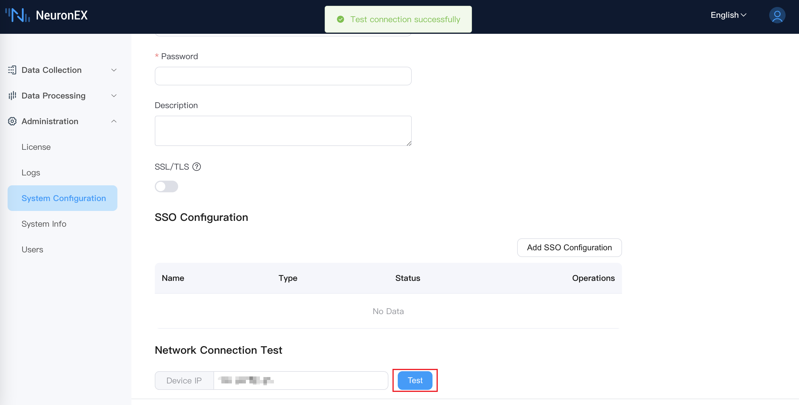

# 创建南向驱动

本章以 **Modbus TCP** 为例，说明如何在 EMQX Neuron 中添加南向驱动节点。组和点位的配置见 [组与点位](../groups-tags/groups-tags.md)。

## 添加南向设备

在 **数据采集** -> **南向设备**，点击 **添加设备**。本例选择 **Modbus TCP**。

* **名称**：设备名称，例如 `modbus-tcp-1`。
* **驱动**：选择 **Modbus TCP**。
* **连接模式**：以太网 TCP 时，EMQX Neuron 可作为客户端或服务端。
* **最大重试次数**：读指令失败后的最大重试次数。
* **指令发送间隔**：读写指令之间的等待时间，单位毫秒。间隔过短时，部分串口设备可能丢指令。
* **字节序**：默认 `1234`。
* **开始地址**：Modbus 地址从 1 开始或从 0 开始。
* **IP 地址**：目标设备 IP。
* **端口号**：Modbus 端口，默认 502。
* **连接超时时间**：单位 ms，默认 3000。超时未收到响应则报错。

点击 **添加设备** 完成。


添加后，南向设备页出现驱动卡片，含工作状态、连接状态和操作。

## 驱动卡片

右上角可在列表和卡片之间切换。卡片上的项：

* **名称**：南向设备的唯一名称。
* **组列表**：进入该设备的采集组。
* **编辑设备**：修改设备名称。
* **数据统计**：驱动运行信息。
* **设备配置**：连接设备所需的参数。
* **开启 DEBUG 日志**：打开当前节点 DEBUG 日志，再点一次关闭。
* **复制**：复制节点，含配置和点位。
* **下载驱动日志**：下载该节点日志。
* **删除**：从南向列表删除该节点。
* **工作状态**：
    * **初始化**：配置有误，无法运行。
    * **运行中**：正常运行。
    * **停止**：已停止。
* **工作状态切换**：打开后连接设备并采集；关闭则断开。
* **连接状态**：组和点位配好后，能连上则为 **连接**，否则为 **断开**。
* **延时**：发送和接收指令之间的时间。
* **驱动**：该设备使用的驱动名。


## 创建采集组和点位

添加驱动后，为节点配置组和点位，步骤见 [组与点位](../groups-tags/groups-tags.md)。也可用 Excel [批量导入](../import-export/import-export.md)。配好后到 [数据监控](../../admin/monitoring.md) 查看实时值。

## 驱动连接测试

若连接状态仍为 **未连接**，先确认网络可达。以太网可用：

```bash
$ telnet <设备 IP> <端口>
```

也可以在 **管理** -> **系统配置** 输入设备 IP，测试 EMQX Neuron 运行环境能否访问该地址：



:::tip
确认设备配置中的 IP 与端口正确，并关闭防火墙。
:::

## 南向设备导入导出

南向设备页右上角的 **导入** / **导出** 可备份或恢复驱动配置和点位。

## 驱动节点数据统计

在卡片或列表中点击 **数据统计**。


| 参数 | 说明 |
| --- | --- |
| last_rtt_ms | 发送和接收指令的间隔，单位毫秒 |
| send_bytes | 已发送指令总字节 |
| recv_bytes | 已接收指令总字节 |
| tag_reads_total | 读指令总数，含失败 |
| tag_read_errors_total | 读指令失败数 |
| group_tags_total | 组内点位数 |
| group_last_send_msgs | 一次组定时器触发发送的消息数 |
| group_last_timer_ms | 一次组定时器耗时，单位毫秒 |
| link_state | 连接状态：DISCONNECTED = 0，CONNECTED = 1 |
| running_state | 节点状态：INIT = 1，READY = 2，RUNNING = 3，STOPPED = 4 |
