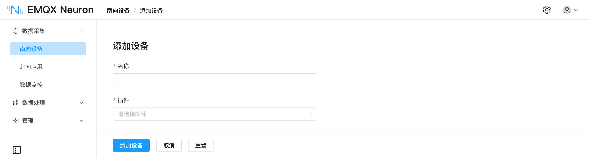
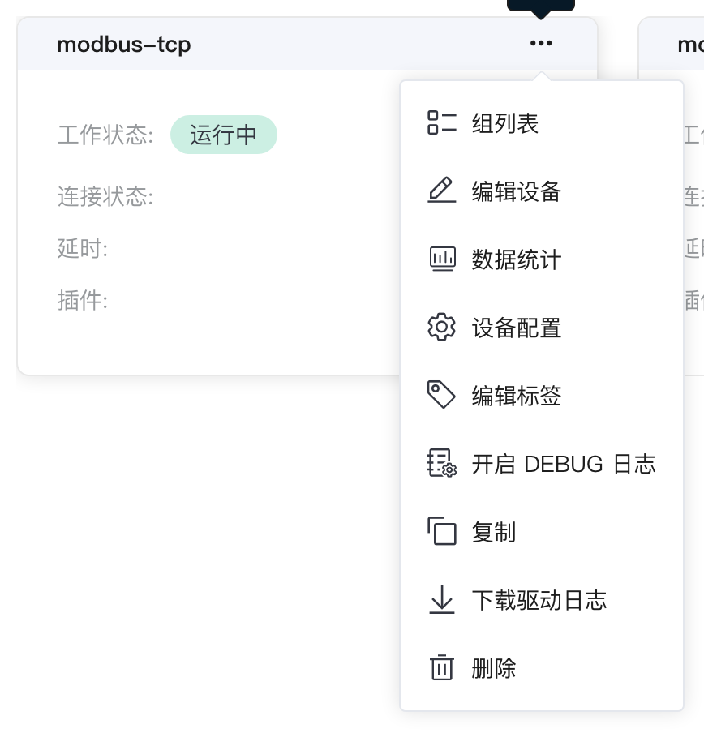
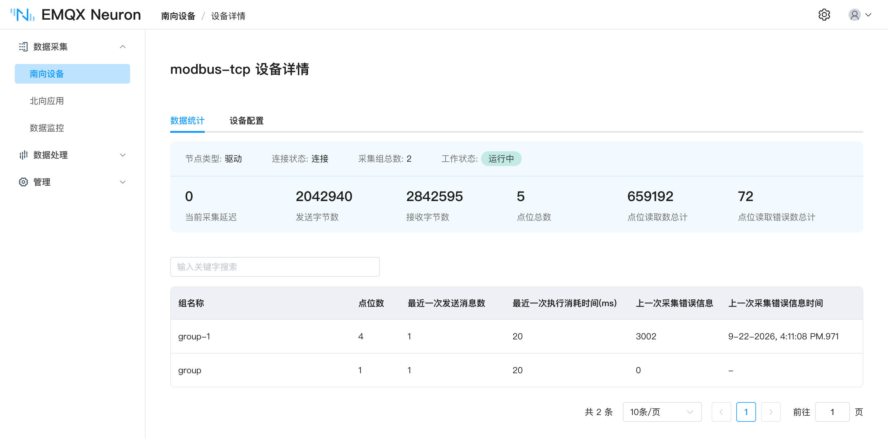

# 添加南向驱动

南向驱动是 EMQX Neuron 与现场设备之间的协议实现，一个驱动节点对应一台或一组设备。

本页讲所有驱动通用的部分：节点怎么建、状态怎么读、运行指标怎么看、连不上怎么查。各协议特有的连接参数、支持的数据类型和地址格式，见[南向驱动](../../introduction/driver-list/driver-list.md)。需要一次建立大量节点或点位，见[批量配置与迁移](../bulk-config.md)。

## 添加驱动节点

在 **数据采集 → 南向设备** 页点击 **添加设备**：

| <div style="width:60pt">字段</div> | 说明 |
| --- | --- |
| **名称** | 节点名称，实例内唯一，最长 128 字符 |
| **驱动** | 按设备使用的协议选择 |



节点名称会出现在默认上报主题 `/neuron/{应用名}/{驱动名}/{组名}`、OPC UA Server 的 NodeId 以及规则 SQL 中，建议使用设备位号一类的稳定标识，不要用临时名称。

创建后节点出现在南向设备页。点击卡片进入**设备配置**填写连接参数，这部分因协议而异。

## 工作状态与连接状态

两个状态相互独立，卡片上分别显示。

| 工作状态 | 含义 |
| --- | --- |
| **初始化** | 节点已创建，驱动尚未完成初始化，或配置不完整 |
| **就绪** | 配置校验通过，尚未启动 |
| **运行中** | 已启动，按组的采集周期向设备发送读指令 |
| **停止** | 已手动停止，不再发送指令 |

| 连接状态 | 含义 |
| --- | --- |
| **已连接** | 与设备的链路正常，读指令有响应 |
| **断开** | 链路未建立，或设备无响应 |

::: tip
新建的驱动在配置点位之前，连接状态始终为**断开**，属正常现象。EMQX Neuron 只在有点位需要采集时才向设备发起读请求。
:::

## 驱动卡片

页面右上角可在卡片视图与列表视图之间切换，节点较多时列表视图更便于查找。

| 功能 | 用途 |
| --- | --- |
| **组列表** | 进入该节点的采集组，配置组与点位 |
| **设备配置** | 修改连接参数 |
| **编辑设备** | 修改节点名称 |
| **数据统计** | 查看采集量、错误数与链路延迟 |
| **开启 DEBUG 日志** | 打印该节点的指令收发明细，再点一次关闭 |
| **下载驱动日志** | 导出该节点日志，用于离线分析或提交工单 |
| **复制** | 生成一个包含全部配置与点位的新节点，见[驱动复制](../bulk-config.md#驱动复制) |
| **工作状态切换** | 打开后连接设备并开始采集，关闭则断开 |
| **删除** | 删除该节点及其全部组和点位 |



卡片上还会显示**延时**（发送与接收指令之间的时间）和该节点使用的**驱动**名称。

## 运行统计

在卡片或列表中点击 **数据统计**：



| 指标 | 说明 | 异常时的表现 |
| --- | --- | --- |
| `last_rtt_ms` | 最近一次指令的往返时间，单位毫秒 | 持续偏高说明链路或设备响应慢，应放宽组的采集间隔 |
| `tag_reads_total` | 读指令总数，含失败 | — |
| `tag_read_errors_total` | 读指令失败数 | 与 `tag_reads_total` 的比值持续上升，通常是点位地址配错或设备不支持该地址 |
| `group_tags_total` | 组内点位数 | — |
| `group_last_send_msgs` | 一次组定时器触发发送的消息数 | — |
| `group_last_timer_ms` | 一次组定时器耗时，单位毫秒 | 接近或超过该组的采集间隔时，说明组内点位过多，应拆分组或放宽间隔 |
| `send_bytes` / `recv_bytes` | 已发送 / 已接收指令总字节 | — |
| `link_state` | 连接状态：DISCONNECTED = 0，CONNECTED = 1 | — |
| `running_state` | 节点状态：INIT = 1，READY = 2，RUNNING = 3，STOPPED = 4 | — |

## 连接排查

连接状态持续为**断开**时，按以下顺序排查。

**1. 确认网络可达**

在 EMQX Neuron 的运行环境中执行：

```bash
telnet <设备 IP> <端口>
```

容器部署时须在容器内执行：

```bash
docker exec -it neuronex telnet <设备 IP> <端口>
```

**2. 确认已配置点位**　没有点位时不会发起读请求，连接状态保持断开。

**3. 核对连接参数**　IP、端口、站点号、字节序、起始地址（从 0 还是从 1）。字节序或起始地址配错时，连接状态可能显示为已连接，但采到的数值不正确。

**4. 检查设备端配置**　部分协议需要在设备侧开启服务或授权，例如西门子 S7 需要在 PLC 中启用 PUT/GET 并关闭优化块访问。见对应的驱动页面。

**5. 查看 DEBUG 日志**　点击卡片上的 **开启 DEBUG 日志**，在 **管理 → 日志** 页面查看实际收发的指令，详见[日志管理](../../admin/log-management.md)。

**6. 检查防火墙**　确认设备侧和 EMQX Neuron 侧均已放行对应端口。

## 下一步

- [组与点位](../groups-tags/groups-tags.md)：划分采集组、配置点位地址与数据加工
- [批量配置与迁移](../bulk-config.md)：一次建立大量节点或点位
- [数据监控与反控](../../admin/monitoring.md)：确认采集结果，并向设备下发指令
