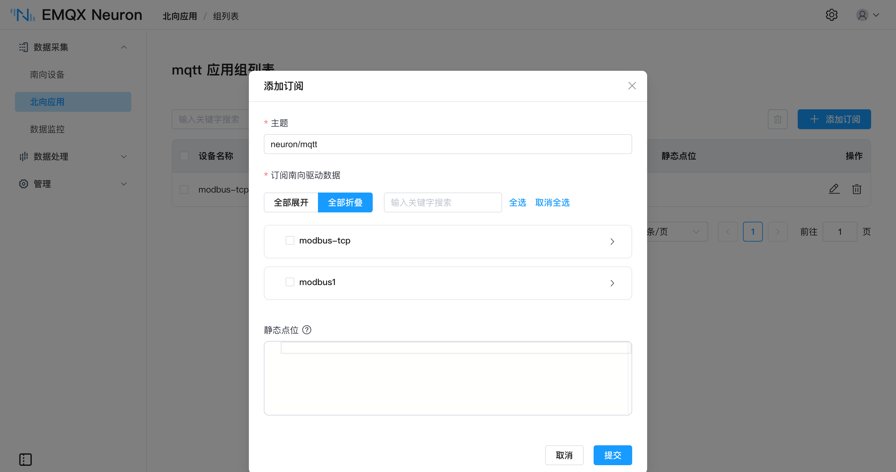

# 订阅南向数据

北向应用创建之后不会自动收到数据，需要显式订阅南向采集组。订阅建立后，该组的数据会按组的采集周期持续发布到这个北向应用。

**订阅以组为单位**，不能只订阅组内的部分点位。需要分开上报时，在南向侧拆分成不同的组，见[分组策略](./groups-tags/groups-tags.md#分组策略)。

## 添加订阅

点击北向应用卡片进入**组列表**页，点击 **添加订阅**：

| 
字段
 | 说明 |
| --- | --- |
| **主题** | 上报主题。仅 MQTT 类应用和 Kafka 需要，不填时使用默认值 |
| **订阅南向驱动数据** | 勾选要订阅的采集组。展开驱动节点后逐个勾选，也可以跨驱动多选，一次提交建立多条订阅 |
| **静态点位** | 选填。随该组数据一并上报的固定属性，填 JSON 键值对，见[静态点位](./north-apps/mqtt/api.md#静态点位) |

MQTT、AWS IoT 的默认上报主题为 `/neuron/{北向应用名}/{南向驱动名}/{组名}`；Kafka 不指定 Topic 时使用应用配置中的**默认 Topic**；Azure IoT、Sparkplug B、OPC UA Server 和 WebSocket 的主题或节点路径由协议规范决定，不在订阅中指定。

## 订阅关系

订阅由「南向驱动 + 组 + 北向应用」三者确定，因此：

- **一个北向应用可以订阅多个组**，来自不同驱动的组也可以。
- **一个组可以被多个北向应用订阅**，同一份采集数据可以同时上云、供上位系统读取并写入数据平台，彼此互不影响。
- 同一个北向应用对同一个组只能订阅一次。

删除订阅后，该组的数据不再发布到这个北向应用，南向侧的采集不受影响。

## 验证

订阅建立后，在北向应用卡片点击**数据统计**，`send_msgs_total` 应持续增长。该值不变时依次确认：南向驱动处于**运行中**且**已连接**、北向应用处于**运行中**、订阅已建立。统计字段说明见[创建北向应用](./north-apps/north-apps.md#数据统计)。
