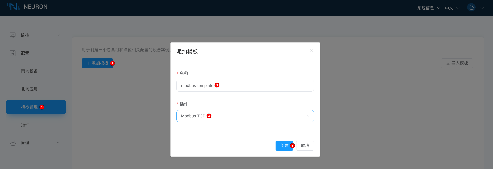
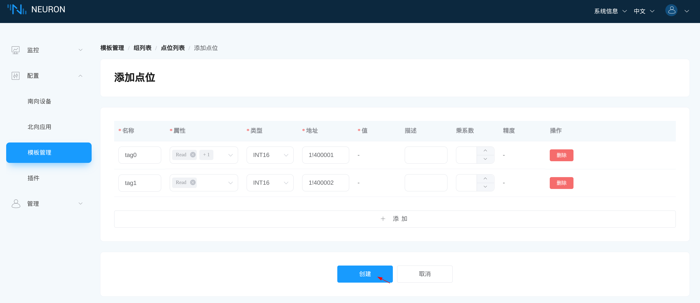
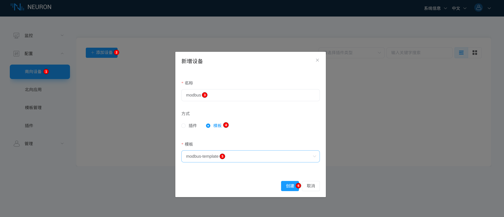
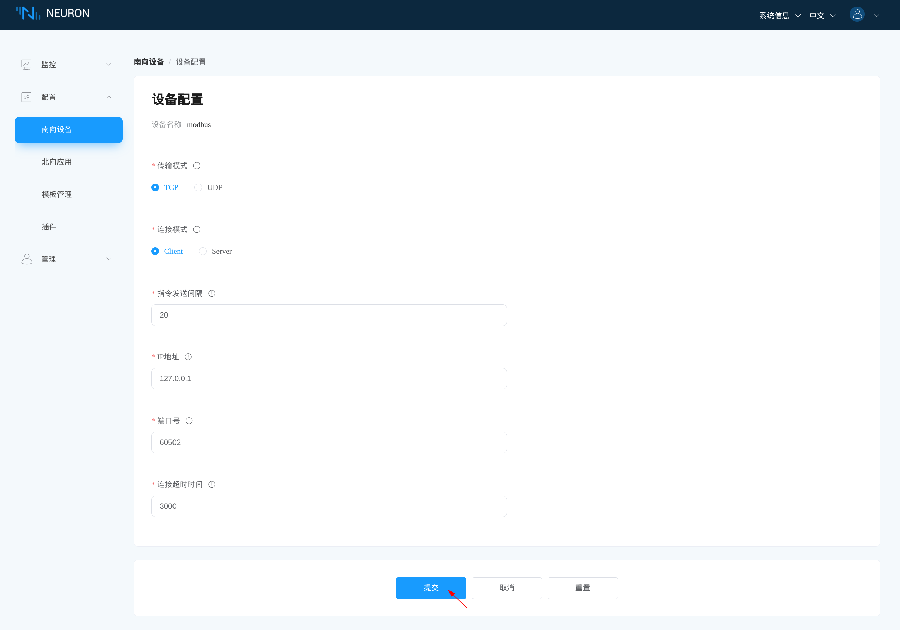
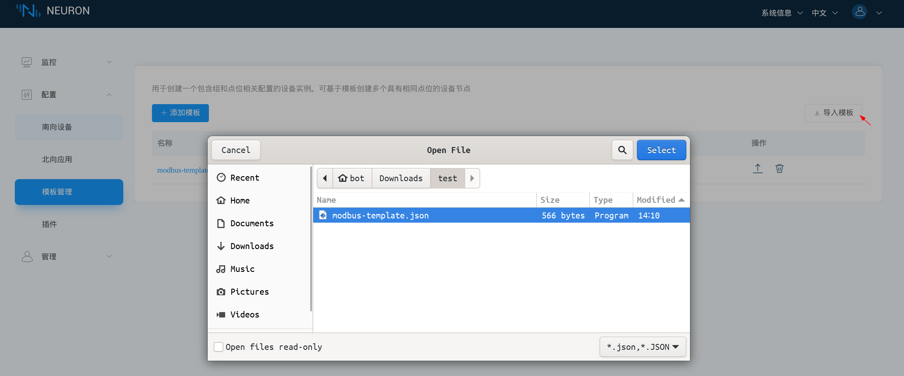

# 基于模板配置

实际使用场景中， NeuronEX 用户经常需要创建大量配置相似的节点。
这是个耗时且容易出现错误的过程，特别是在大规模部署中。

NeuronEX 的模板功能允许用户创建带有指定插件和配置（包括组和标签）的模板。
然后，用户可以以该模板为基础创建新节点。
通过使用模板，用户可以快速、轻松地创建具有相似配置的新节点，从而节省时间和精力。

::: tip
NeuronEX 模板功能只支持南向插件。
:::

## 创建模板

### 添加模板

点击**配置 -> 模板管理 -> 添加模板**打开**添加模板**对话框。

  

填写模板名称并选择插件，然后点击**创建**按钮。
创建成功后就可以在**模板管理**标签页看到新建的模板。

  

### 添加模板数据组

至此，模板中还没有配置数据。
点击新建的模板打开**组列表**页面。

  

为模板添加数据组的操作流程基本与[配置采集数据组和点位](../south-devices/south-devices.md#设置组和点位)中的相同。
此处我们添加一个名为 *grp* 的数据组，时间间隔为 *3000* 。

  

### 添加模板数据点

点击新建的 *grp* 数据组进入**点位列表**页面。

 

点击**创建**按钮进入**添加点位**页面。

  

简单起见，这里我们只添加两个数据点。
点击**创建**按钮提交点位数据，如**点位列表**页面所示。

  

## 基于模版新增设备

点击**配置 -> 南向设备 -> 添加设备**打开**新增设备**对话框。

  

填写设备名称，然后选择**模板**模式和之前创建的模板。
点击**创建**按钮进入**设备配置**页面。

  

填写配置项然后点击**提交**。
如果操作成功，**南向设备**标签页会显示新增的南向设备。

  

点击创建完成的南向设备进入**组列表**页面。
该南向设备与实例化的模板一样有一个名为 *grp* 的数据组，时间间隔为 *3000* 。

  

点击 *grp* 数据组，进入**点位列表**页面。可以看到列表中有两个点位，与模板一样。

  

## 导出与导入模板

### 导出模板

在**模板**标签页，点击想要导出的模板上的**导出**按钮，就可将模板导出为 JSON 文件。

  

### 导入模板

在**模板**标签页，点击**导入模板**，提供想要导入的 JSON 文件。

  

在**导入模板**对话框中，用户可以修改模板名字。
点击**创建**按钮完成导入操作。

  

在**模板标签页**中可以看到导入成功的模板。

  
