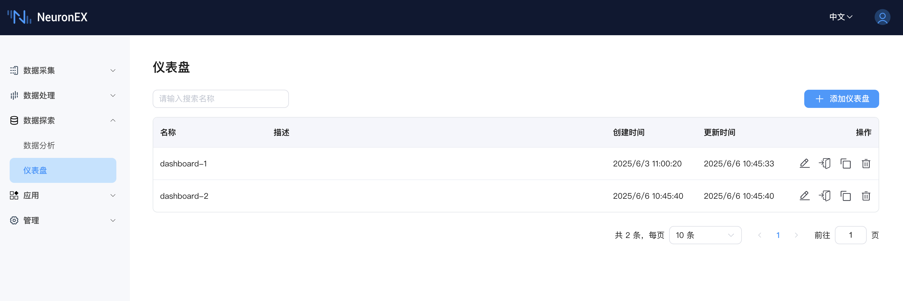
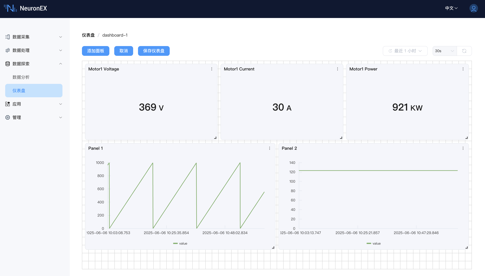
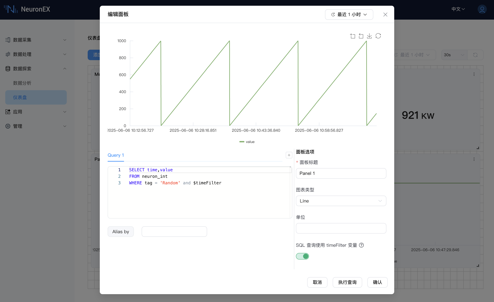

# 仪表盘 (Dashboards)

仪表盘是 NeuronEX 数据探索模块中用于集中展示和监控关键数据的可视化工具。它允许您创建高度可定制的视图，将来自存储到时序数据库 Datalayers 中的数据，以直观的图表、统计值或表格形式呈现，帮助您实时掌握生产运营状态、追踪核心 KPI 并快速响应异常情况。

## 主要功能特性

### 1. 仪表盘主页面管理

当您导航到“仪表盘”功能时，会看到一个主页面，集中管理您创建的所有仪表盘。

 

*   **列表展示:** 以列表形式清晰展示所有已创建的仪表盘，包含以下列信息：
    *   **名称 (Name):** 仪表盘的自定义名称。
    *   **描述 (Description):** 对仪表盘用途或内容的简要说明。
    *   **创建时间 (Created At):** 仪表盘的创建日期和时间。
    *   **更新时间 (Updated At):** 仪表盘最后一次修改的日期和时间。
    *   **操作 (Operations):** 对每个仪表盘可执行的操作。
        *   **编辑 (Edit):** 点击图标，修改现有仪表盘的名称、描述等基本信息。
        *   **进入仪表盘(Enter):** 点击图表，即可进入该仪表盘的详细视图。
        *   **复制 (Copy):** 点击图标，快速复制一个现有的仪表盘作为新仪表盘的模板。
        *   **删除 (Delete):** 点击图标，删除不再需要的仪表盘。

### 2. 仪表盘内部视图与交互

进入单个仪表盘后，您将看到一个可交互的界面，用于展示和配置数据。

 

#### 2.1 顶部操作栏

*   **进入编辑模式（Enter Edit Mode）:** 点击进入编辑模式。
*   **添加面板 (Add Panel):** 点击左上角的 `添加面板` 按钮，向当前仪表盘中添加新的数据展示单元 (Panel)。
*   **取消 (Cancel):** 如果对仪表盘的布局或 Panel 进行了修改但不想保存，可以点击 `取消` 按钮放弃更改。
*   **保存仪表盘 (Save Dashboard):** 对仪表盘的任何修改（如添加/删除 Panel、调整布局、更改 Panel 配置）都需要点击 `保存仪表盘` 按钮才会生效。

#### 2.2 全局时间与刷新控制

位于仪表盘右上角，用于控制整个仪表盘的数据展示范围和刷新频率。

*   **时间范围选择器 (Time Range Selector):**
    *   **全局控制:** 定义所有 Panel 中数据的查询时间跨度。
    *   **预设范围:** 提供多种常用的预设时间范围（例如截图中的“最近1小时”）。
    *   **自定义时间段:** 允许用户选择精确的开始和结束日期与时间。
*   **刷新机制 (Refresh Mechanism):**
    *   **自动刷新间隔 (Auto-refresh Interval):** 选择一个预设的自动刷新时间间隔（例如截图中的“30s”），仪表盘将按此频率自动更新数据。
    *   **手动刷新 (Manual Refresh):** 点击刷新图标，立即获取最新数据并更新所有 Panel。

#### 2.3 Panel 管理与布局

Panel 是仪表盘上显示单个图表、统计值或表格的基本单元。

*   **拖拽调整:** 支持在仪表盘上通过拖拽 Panel 的右下角控制点来调整其大小，或拖动 Panel 头部调整其位置，灵活定制布局。
*   **网格对齐:** 仪表盘使用网格系统（如截图背景所示的虚线网格），帮助 Panel 自动对齐，使布局更加整洁美观。
*   **Panel 操作菜单:** 每个 Panel 的右上角通常会有一个三点菜单图标，点击后可对该 Panel 进行编辑、复制、删除等操作。

 

#### 2.4 添加与配置 Panel

点击仪表盘视图中的 `添加面板` 按钮后，会弹出一个“添加面板”对话框，用于详细配置新的 Panel。

*   **对话框布局:**
    *   **左侧 - 查询配置区 (Query Configuration):**
        *   **Query Tabs (例如 "Query 1"):** 允许为一个 Panel (除 Table 类型外) 配置多个数据查询。每个查询对应图表中的一个系列。可以通过点击 `+` 来增加新的 Query。
        *   **SQL 输入区:** 为当前选中的 Query Tab 输入 SQL 查询语句。
        *   **Alias by:** 为当前 Query 的结果系列指定一个显示别名。这对于区分 Panel 中的多条曲线非常有用。通常要求 SQL 查询结果包含时间戳和单个值列。
    *   **右侧 - 面板选项 (Panel Options):**
        *   **面板标题 (Panel Title):** （必填项）为该 Panel 指定一个有意义的名称。
        *   **图表类型 (Chart Type):** 选择数据的展示方式，当前版本支持：
            *   **Line (折线图):** 适用于展示时序数据的趋势。
            *   **Bar (柱状图):** 适用于比较不同类别或时间点的数据量。
            *   **Stat (统计值):** 以醒目的方式显示单个关键数值。
            *   **Table (表格):** 以表格形式展示详细数据 (Table 类型只支持一个 Query)。
        *   **单位 (Unit):** 例如 `°C`, `RPM`, `MPa` 等。此信息会显示在图表上或作为数值的后缀。
    *   **底部选项:**
        *   **SQL 查询使用 $timeFilter 变量 (SQL Query Use $timeFilter variable):**
            *   **启用/禁用开关:** 控制是否在 SQL 查询中启用 `$timeFilter` 变量。
            *   **启用时:** 用户的 SQL 语句中 **必须包含** `$timeFilter` (例如 `WHERE $timeFilter` 或 `AND $timeFilter`)。NeuronEX 会将其替换为基于仪表盘全局时间或该 Panel 预览时间选择器所选定的时间范围条件。
            *   **禁用时:** NeuronEX 会自动在用户 SQL 的基础上拼接时间范围条件。
    *   **对话框顶部控制:**
        *   该对话框内也可能包含独立的时间范围选择器和执行查询/刷新按钮，用于在确认添加 Panel 前，针对当前配置的 Query 进行数据预览和测试。
    *   **对话框操作按钮 (Dialog Action Buttons):**
        *   **取消 (Cancel):** 关闭“添加面板”对话框，不保存任何配置。
        *   **执行查询 (Execute Queries):** （在截图底部，也可能在对话框顶部）执行当前配置的 SQL 查询，并在对话框内预览结果，帮助用户验证查询的正确性。
        *   **确认 (Confirm):** 保存 Panel 配置，并将其添加到仪表盘上。

 

## 使用场景示例

*   **生产监控大屏:** 将关键设备的运行参数（温度、压力、转速）、产量、能耗等指标集中展示，实时了解产线状态。
*   **KPI 追踪:** 创建专门的仪表盘来可视化 OEE (Overall Equipment Effectiveness)、设备故障率、能耗指标等关键绩效指标。
*   **质量分析:** 展示产品关键质量参数的趋势图和统计数据，帮助监控质量波动。
*   **告警与事件概览:** 结合数据分析结果，展示近期重要告警的数量、类型和趋势。

## 使用前提

*   NeuronEX 已启用并配置了 [集成时序数据存储 (Datalayers)](../admin/sys-configuration.md#数据存储配置)。
*   至少有一个南向驱动的点位数据已被订阅到北向 DataStorage 插件，并且数据已成功写入 Datalayers。
*   为了获得最佳体验，建议对需要展示的数据点位预先进行分析，明确其数据类型和常见的查询需求。

通过 NeuronEX 的仪表盘功能，您可以将复杂的数据转化为直观的洞察，赋能您的日常运营和决策制定。