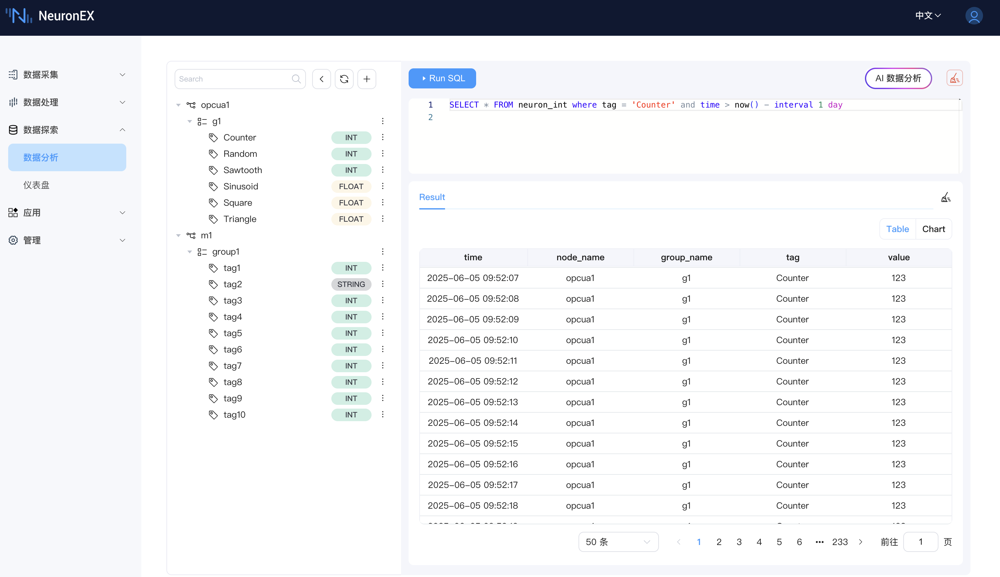
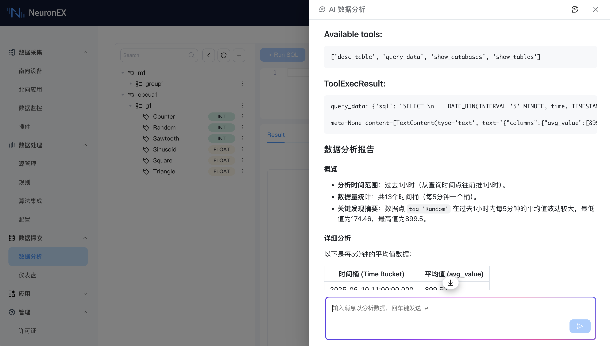

# 数据分析 (Data Analysis)

数据分析是 NeuronEX 数据探索模块的核心交互界面，为您提供了从浏览数据源、构建查询到分析结果的完整工作流。

## 主要功能特性

 

### 1. 统一入口与界面布局

*   **统一入口:** 所有数据浏览、SQL 查询及结果展示功能均整合在统一的“数据分析”页面内。
*   **清晰布局:** 页面通常划分为：
    *   **左侧数据源导航区:** 以树形结构展示数据。
    *   **右上 SQL 输入与配置区:** 用于编写和执行 SQL 查询。
    *   **下方结果展示区:** 显示查询结果（表格或图表）。

### 2. 数据源树形目录

*   **结构化展示:** 左侧以树形结构清晰列出已开启 Datalayers 存储的南向驱动、其下的采集组以及具体的数据点位。
*   **类型显示:** 每个点位后会明确标注其在 Datalayers 中存储的数据类型 (例如: `Int`, `Float`, `Bool`, `String`)，帮助用户构建正确的查询。
*   **便捷操作:**
    *   **刷新:** 支持手动刷新树形目录，获取最新的驱动/组/点位信息。
    *   **点位搜索:** 提供点位名称搜索功能，快速定位目标点位。
    *   **SQL 查询示例:** 选中某个数据点位后，系统会自动提供常用 SQL 查询示例，例如：
        *   `Query Column`: 查询该点位的最近 100 条数据。
        *   `Query Period`: 查询该点位过去一天的数据。
        *   `Query Max`: 查询该点位的最大值。
        用户可以直接使用这些示例或在此基础上进行修改。
    *   **AI Query (与 LLM 集成):**
        *   选中点位后，可选择“AI Query”功能。
        *   系统会将点位名称和对应数据表信息（例如 `neuron_float`, `tag='your_tag_name'`）自动预填充到 AI 交互框或作为上下文传递给 AI。
        *   用户可以通过**自然语言**描述查询需求（例如“查询这个点位过去一天每小时的平均值”），由集成的 LLM 生成复杂的 SQL 查询语句。

### 3. 智能 SQL 输入区

*   **辅助编写:**
    *   **关键字提示:** 输入 SQL 时，提供常见的 SQL 关键字自动补全提示。
    *   **语法高亮:** 对 SQL 语句进行语法高亮，提高可读性。
    *   **行号显示:** 便于定位和调试。
*   **查询限制:**
    *   **单条查询:** 目前支持执行单条 SQL 查询语句。
    *   **查询类限定:** **仅接收查询类 SQL 语句 (SELECT)**。为保证数据安全和系统稳定，**不支持** `CREATE TABLE`, `INSERT`, `DELETE`, `UPDATE` 等数据定义或修改操作。

### 4. 结果展示区

*   **多视图展示:** 每个成功执行的 SQL 查询结果，都会在该区域以表格 (Table) 或图表 (Chart) 的形式进行展示。
*   **表格 (Table) 显示:**
    *   默认展示方式，以行列结构清晰呈现查询返回的数据。
    *   支持分页、排序等基本表格操作（具体功能视前端表格组件而定）。
*   **图表 (Chart) 显示:**
    *   **支持条件:** 如果 SQL 查询结果中包含时间戳字段和数值字段，系统会自动支持将结果切换到图表视图。
    *   **图表类型:**
        *   **折线图 (Line Chart):** 适用于展示时序数据的趋势变化。
        *   **柱状图 (Bar Chart):** 适用于比较不同类别或时间点的数据量。
    *   **交互功能:**
        *   **图表缩放:** 支持对图表进行局部放大查看细节。
        *   **保存下载:** 支持将当前图表保存为图片文件 (如 PNG) 下载到本地。
        *   **图例交互:** （通常图表库会支持）点击图例可以显示/隐藏对应的系列，方便聚焦分析。

### 5. AI 数据分析助手集成

“数据分析”页面深度集成了 AI 数据分析助手，旨在帮助用户更轻松地构建和优化 SQL 查询。

*   **UI 入口:**
    *   通过页面右上角的`AI 数据分析`按钮，点击可打开 AI 交互对话框。
    *   如前所述，点位操作项中也提供了`AI Query`的快捷入口。
*   **AI 交互框:**
    *   **默认页面引导:** 当从主入口打开 AI 对话框时，会提供引导性提示，告知用户 NeuronEX 按数据类型分表存储 (`neuron_float`, `neuron_int`, `neuron_bool`, `neuron_string`)，并建议用户在提问时提供点位名和数据类型。同时，提供可点击的查询示例，帮助用户快速上手。
    *   **点位上下文预填充:** 从点位“AI Query”入口进入时，点位名称和对应的数据表（例如 `neuron_float`, `tag='tag1'`）会自动预填充到对话框或作为上下文传递。
*   **AI 核心能力:**
    *   **自然语言转 SQL:** 将用户的自然语言查询需求转换为正确的 SQL 语句。
    *   **SQL 迭代修正:** 当生成的 SQL 执行出错时，AI 能够智能分析错误原因，并利用系统提供的工具（如查询表结构）进行多轮迭代修正，直至生成可成功执行的 SQL。
*   **上下文限制:** 当前版本主要利用 AI 辅助 SQL 生成与修正，由于LLM Token上限的限制，只会将部分查询结果发送给 AI 进行分析确认。
*   **配置与依赖:** 使用此功能需要先在系统配置中开启 AI Agent 服务、配置 AI 模型，并确保运行环境（特别是使用非 AI 特定 Docker 镜像时）已正确安装所需的 Python 依赖库。详情请参考 [AI 功能环境配置指南](../admin/sys-configuration.md#ai-功能环境配置指南)。

 

## 使用前提

*   NeuronEX 已启用并配置了 [集成时序数据存储 (Datalayers)](../admin/sys-configuration.md#数据存储配置)。
*   至少有一个南向驱动的点位已被添加订阅到北向 DataStorage 插件。
*   若需使用 AI Query 功能，请确保 AI 相关服务和模型已正确配置。

通过“数据分析”页面，您可以充分利用 SQL 的强大能力和 AI 的智能辅助，深入探索您的工业数据。